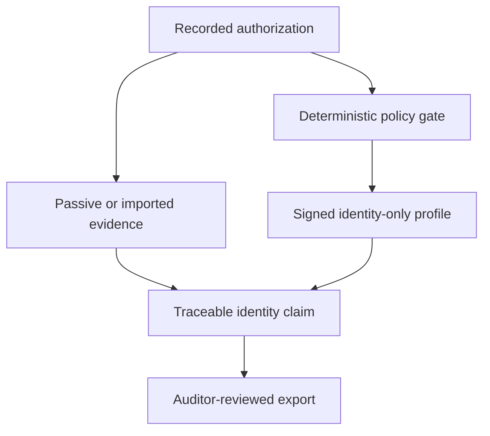

# Atlas OT Scout

> Research toward a controlled mobile evidence instrument for authorized industrial audit teams.

Atlas OT Scout explores whether an Android phone and approved capture hardware can collect traceable Ethernet, Wi-Fi and Bluetooth evidence for OT/IoT inventories. No production scanner exists.

## What public evidence supports

- Morocco's DGSSI recognizes industrial-systems audit as a qualification domain and publicly lists qualified providers.
- Public ONEE and National Ports Agency records show automata maintenance, telemanagement, VTS, surveillance, electrical and network-system work.
- Moroccan employer records from Renault Group, Suprajit, Givaudan, OPmobility, Jibal and others explicitly name PLC/SCADA platforms and protocols including Modbus, PROFIBUS, PROFINET and EtherNet/IP.
- Android provides USB host and Bluetooth APIs, but a USB Ethernet adapter alone does not provide whole-segment visibility.

## What remains unknown

Market size, accepted price, customer preference for mobile tooling, time saving, Bluetooth demand, supported hardware combinations, identification accuracy and field safety are unproven. They are prototype questions, not product claims.

## Start with the evidence

- [Evidence-only diligence index](docs/diligence/README.md)
- [Executive business case](docs/diligence/EXECUTIVE-BUSINESS-CASE.md)
- [Unsupported-assumption audit](docs/diligence/ASSUMPTION-AUDIT.md)
- [Behavioral evidence ledger](docs/diligence/data/behavioral-evidence.csv)
- [Morocco technology evidence matrix](docs/diligence/TECHNOLOGY-EVIDENCE-MATRIX.md)
- [Evidence-grounded StoryBrand](docs/diligence/STORYBRAND-GTM-PLAN.md)
- [Observable market evidence](docs/diligence/MARKET-AND-ECONOMIC-MODEL.md)
- [Research dashboard](docs/diligence/RESEARCH-DASHBOARD.md)

## Evidence-backed initial customer

The strongest first research set is the small group of providers visibly qualified by DGSSI for industrial-systems audits. The product would support their methodology; it would not claim to replace a qualified audit or to be DGSSI approved.

## Safety boundary

Exploitation, credential attacks, fuzzing, control writes and autonomous packet generation are outside scope. An AI may summarize evidence but cannot transmit OT traffic.

## Engineering and governance

- [Requirements](docs/REQUIREMENTS.md)
- [Architecture](docs/wiki/Technical-Architecture.md)
- [Safety and privacy](docs/wiki/Safety-and-Ethics.md)
- [Secure development lifecycle](docs/wiki/SDLC.md)
- [Roadmap](ROADMAP.md)
- [Contributing](CONTRIBUTING.md)
- [Security policy](SECURITY.md)

## License

No project license has been selected. Until one is added, normal copyright applies and reuse is not granted.
