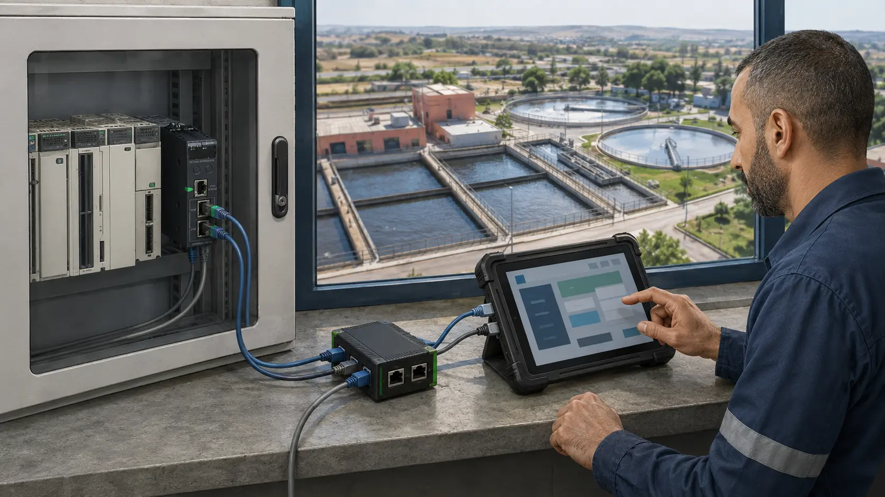

# Atlas OT Scout

**A guided, offline OT evidence and assessment appliance for authorized water and wastewater work.**

[Project website](https://charifmahmoudi.github.io/mobile-ot-security-assessment/) · [Operator and evaluation Wiki](https://github.com/charifmahmoudi/mobile-ot-security-assessment/wiki) · [Current implementation](IMPLEMENTATION.md)

[](https://github.com/charifmahmoudi/mobile-ot-security-assessment/actions/workflows/android-ci.yml)
[](https://github.com/charifmahmoudi/mobile-ot-security-assessment/actions/workflows/documentation.yml)

Atlas helps an authorized assessor turn incomplete inventories and bounded field evidence into a reviewed operating baseline. It is designed around one question: **is the available evidence strong enough to support an inventory, risk, remediation or handover decision for this exact process area?**

The first product pack is **P0-WATER**, for one bounded drinking-water or wastewater control segment. Atlas is not a general-purpose scanner, exploitation framework, certification service or continuous-monitoring platform.

This repository is a research prototype. The authoritative current capability matrix is [IMPLEMENTATION.md](IMPLEMENTATION.md); planned work and release gates are in [ROADMAP.md](ROADMAP.md). Do not infer implementation status from design, user, demo or commercial documents.

## Maintenance starts tomorrow


The purpose is not inventory accuracy for its own sake. Atlas is intended to expose an equipment-identity discrepancy while there is still time to confirm the target, adapt the procedure, parts or expertise, or postpone the action before taking a pump out of service.

| Bounded evidence | Reviewed handoff |
|---|---|
|  |  |
| Preserve what was declared, observed and protocol-identified without silently merging them. | Hand over the evidence, unresolved discrepancy and decision before the maintenance window begins. |

These illustrations explain the intended workflow. They are not customer evidence or proof that the pictured hardware combination is qualified. See the [compatibility matrix](docs/appliance/COMPATIBILITY-MATRIX.md) and [current implementation](IMPLEMENTATION.md) for tested boundaries.

## How Atlas approaches an assessment

1. Establish the authorized site, process boundary and decision.
2. Use the least intrusive useful evidence source.
3. Preserve source provenance and visibility limitations.
4. Review observations before they change the accepted inventory.
5. Keep conflicts and unknowns visible instead of converting them into certainty.
6. Hand off a reviewed evidence model and explicit next actions.

The normative assessment contract is [P0-WATER](docs/poc/WATER-WASTEWATER-POC.md), and the assessment method is [ASSESSMENT-METHOD.md](docs/poc/ASSESSMENT-METHOD.md).

## Documentation routes

| Need | Authoritative route |
|---|---|
| What executes today | [Implementation](IMPLEMENTATION.md) |
| What is planned | [Roadmap](ROADMAP.md) |
| Product requirements | [Requirements](docs/REQUIREMENTS.md) |
| P0-WATER product contract | [P0 specification](docs/poc/WATER-WASTEWATER-POC.md) |
| Assessment procedure and evidence rules | [Assessment method](docs/poc/ASSESSMENT-METHOD.md) |
| Deployment and trust boundaries | [System architecture](docs/architecture/SYSTEM-AND-DEPLOYMENT.md) |
| Exact active/passive network behavior | [Network execution](docs/architecture/NETWORK-EXECUTION.md) |
| Evidence and report data model | [Evidence model](docs/architecture/EVIDENCE-DATA-MODEL.md) |
| Threats and controls | [Security model](docs/architecture/SECURITY-AND-THREAT-MODEL.md) |
| Operate the current application | [User guide](docs/user-guide/README.md) |
| Verification evidence | [Testing](docs/testing/README.md) |
| Morocco commercial research and execution | [Business development](docs/business-development/README.md) |
| Prospect presentation | [Pitch](docs/pitch/README.md) and [guided demo](docs/demo/README.md) |
| Complete documentation map | [Documentation index](docs/README.md) |
| Concise operating and evaluation guide | [GitHub Wiki](https://github.com/charifmahmoudi/mobile-ot-security-assessment/wiki) |
| Public project story and methodology-fit route | [Project website](https://charifmahmoudi.github.io/mobile-ot-security-assessment/) |

## Product principles

- **Authorization before transmission.** Active network behavior is constrained by the network-execution contract.
- **Passive first.** Imported or mirrored evidence is preferred when it can answer the question.
- **Evidence before inventory mutation.** Raw observations remain separate until reviewed.
- **Offline by design.** The assessment workflow does not depend on a cloud service.
- **Explicit limitations.** Visibility, confidence and unresolved evidence remain part of the result.

## Build and verify

Prerequisites: JDK 17, Android SDK, Python 3 and Gradle 8.13.

```bash
python3 tools/verify_documentation.py
python3 tools/verify_architecture.py
bash tools/fetch_research_pcaps.sh
bash tools/test_capture_daemon.sh

gradle --no-daemon \
  :core-domain:test \
  :case-app:testDebugUnitTest \
  :network-broker:testDebugUnitTest \
  :capture-broker:testDebugUnitTest \
  lintDebug assembleDebug
```

Device and emulator acceptance paths are defined by [.github/workflows/android-ci.yml](.github/workflows/android-ci.yml).

## Repository policy

- [Contributing](CONTRIBUTING.md)
- [Governance](GOVERNANCE.md)
- [Security policy](SECURITY.md)
