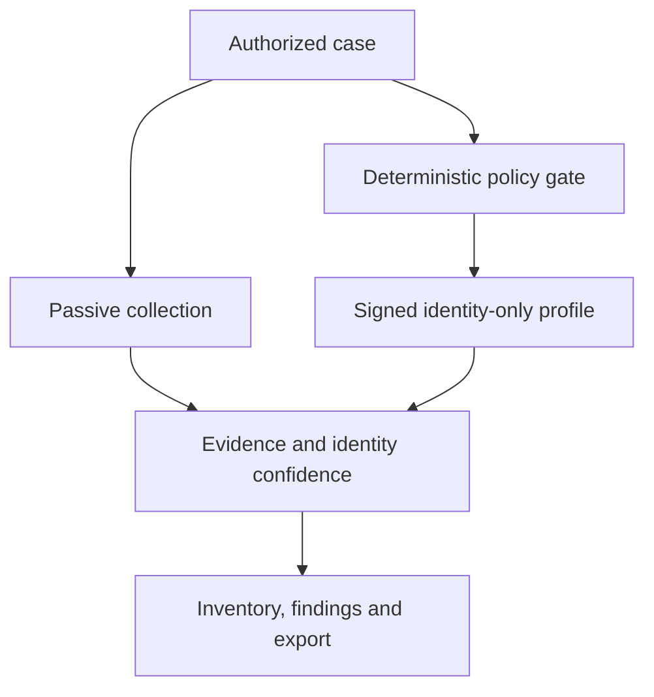

# Atlas OT Scout

> Offline-first mobile OT/IoT asset discovery and assessment—Morocco first, designed for industrial markets where permanent enterprise tooling is not always practical.

Atlas OT Scout is a research-and-design project for turning an Android phone and an approved field kit into a governed workspace for wired Ethernet, Wi-Fi and Bluetooth evidence collection. It targets industrial teams, integrators and assessors who need a defensible baseline without deploying a server or exporting sensitive plant data to a cloud service.

**Status:** due diligence, requirements, architecture and safety engineering. No production-ready scanner exists.

## Decision corpus

The [due-diligence index](docs/diligence/README.md) is the primary starting point. It contains:

- [investment and product thesis](docs/diligence/EXECUTIVE-BUSINESS-CASE.md);
- [bottom-up Morocco market, pricing and unit economics](docs/diligence/MARKET-AND-ECONOMIC-MODEL.md);
- [competitive teardown](docs/diligence/COMPETITIVE-TEARDOWN.md);
- [Morocco sector dossiers](docs/diligence/MOROCCO-SECTOR-DOSSIERS.md);
- [priority-account dossiers](docs/diligence/ACCOUNT-DOSSIERS.md);
- [customer organization and ethical outreach model](docs/diligence/CUSTOMER-ORGANIZATION-AND-OUTREACH.md);
- [technology/protocol evidence matrix](docs/diligence/TECHNOLOGY-EVIDENCE-MATRIX.md);
- [open-source and PentAGI due diligence](docs/diligence/OPEN-SOURCE-DUE-DILIGENCE.md);
- [complete StoryBrand go-to-market plan](docs/diligence/STORYBRAND-GTM-PLAN.md);
- [validation plan without interviews](docs/diligence/VALIDATION-WITHOUT-INTERVIEWS.md);
- [global expansion scorecard](docs/diligence/GLOBAL-EXPANSION-FRAMEWORK.md);
- [risk register](docs/diligence/RISK-REGISTER.md);
- machine-readable [claim ledger](docs/diligence/data/claim-ledger.csv), [market model](docs/diligence/data/market-model.csv) and [library decisions](docs/diligence/data/protocol-library-decisions.csv).

## Business thesis

The initial wedge is not continuous monitoring. It is the controlled field baseline used for brownfield inventory, contractor handover, site onboarding, audit preparation, incident triage and pre-deployment discovery.

The best first customer is an integrator, MSSP, audit firm or multi-site industrial owner that repeats this work. The first commercial offer should be a fixed-scope paid baseline; software licensing follows demonstrated repeat use.

The Morocco base scenario models MAD 13.33m in annual software opportunity from 350 serviceable sites and 30 partner organizations. This is explicitly a planning hypothesis—not a market-size fact—and every variable is exposed for replacement.

## Product truth

- USB-C Ethernet provides connectivity; it does **not** automatically expose third-party switched traffic. Mirrored capture requires TAP/SPAN or an approved accessory.
- Ordinary Android applications do not have universal Wi-Fi monitor mode.
- “Exhaustive OT vendor coverage” is a maintained evidence and testing program, not a credible one-time promise.
- A verified Moroccan factory and a verified vendor protocol manual do not prove that factory uses that vendor.
- Exploitation, credential attacks, fuzzing, control writes and autonomous pentesting are outside the product boundary.
- An AI may propose or summarize. It never directly transmits OT traffic or bypasses the deterministic action gate.

## Architecture boundary

## Research evidence

The initial account universe contains 30 named Moroccan organizations across nine OT-heavy sectors. Material facts are recorded in the claim ledger. Unknown installed technologies remain unknown until supported by tenders, OEM case studies, credible job evidence, lab devices or authorized observation.

Primary references include Morocco's Ministry of Industry, DGSSI, CNDP, industrial operators, NIST, CISA, Android/OEM documentation and original open-source repositories.

## Engineering and governance

- [Requirements](docs/REQUIREMENTS.md)
- [Requirements traceability](docs/diligence/REQUIREMENTS-TRACEABILITY.md)
- [Technical architecture](docs/wiki/Technical-Architecture.md)
- [Safety and privacy](docs/wiki/Safety-and-Ethics.md)
- [Secure development lifecycle](docs/wiki/SDLC.md)
- [Roadmap](ROADMAP.md)
- [Architecture decisions](docs/adr/)
- [Contributing](CONTRIBUTING.md)
- [Security policy](SECURITY.md)
- [Governance](GOVERNANCE.md)

## License

No project license has been selected. This remains a deliberate gate while the open-core/commercial model and dependency boundaries are evaluated. Until a license is added, normal copyright applies and reuse is not granted.
