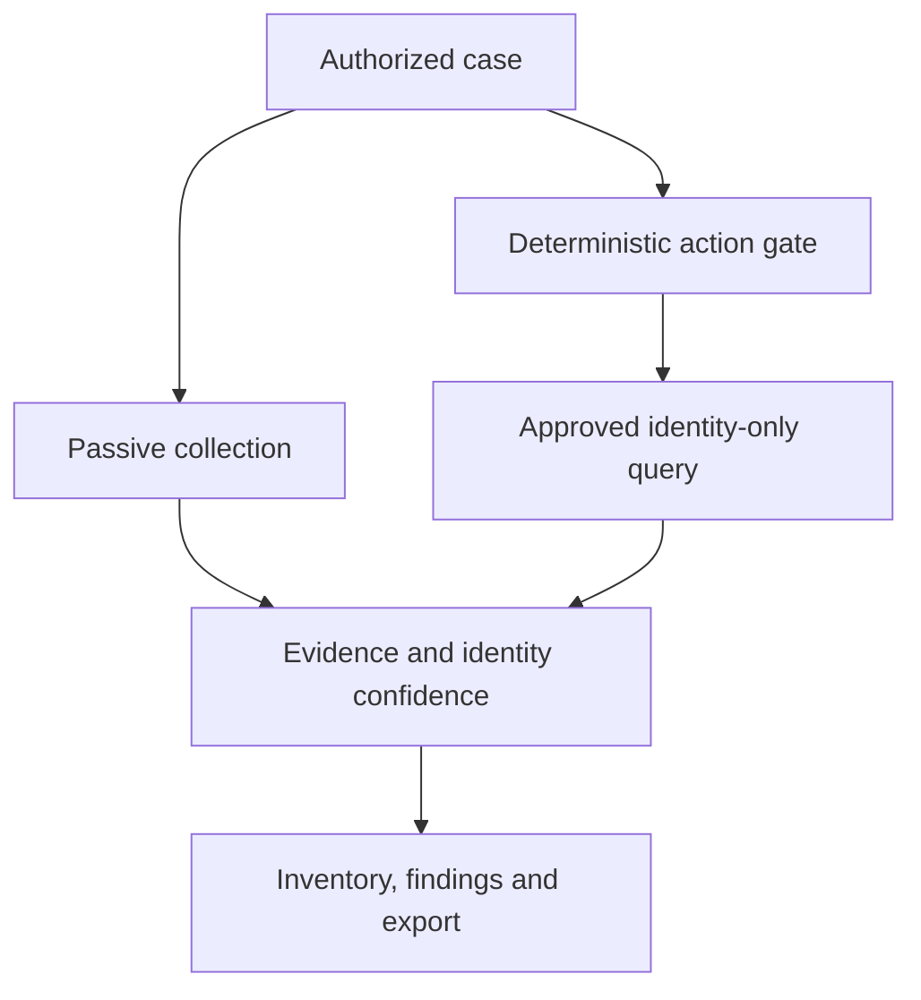

# Atlas OT Scout

> A research-and-design project for an offline-first mobile OT/IoT asset discovery and security-assessment platform.

Atlas OT Scout turns an Android phone and an approved field kit into a controlled workspace for Bluetooth, Wi-Fi and wired Ethernet assessments. It is designed for industrial teams, integrators and assessors who need defensible asset evidence without deploying a server or exporting plant data to the cloud.

**Current phase:** due diligence, requirements, architecture and safety engineering. There is no production-ready scanner in this repository.

## Why this project

Morocco is the first market case, not the limit. Its industrial base spans automotive, phosphate/chemicals, mining, power and water, ports, food, cement, aerospace and pharmaceuticals. The product thesis is that many industrial markets need a lower-cost, portable bridge between spreadsheets/general network utilities and permanent enterprise OT-monitoring platforms.

The product is differentiated by:

- offline, encrypted cases and reports;
- USB-C Ethernet, Wi-Fi and BLE workflows;
- passive observation before active discovery;
- narrowly bounded, signed identity-query profiles;
- evidence-linked identity confidence rather than unsupported certainty;
- local language, regulation and integrator-channel fit;
- imports from existing inventories and normalized exports.

## Reality checks

- A USB-C Ethernet adapter provides a network interface; it does **not** automatically expose all segment traffic. Third-party wired capture requires a TAP, SPAN/mirror port or approved capture accessory.
- Ordinary Android apps do not get universal Wi-Fi monitor mode.
- “Exhaustive vendor coverage” is a maintained knowledge program, not a one-time feature.
- The prototype excludes exploits, credential attacks, fuzzing, control writes and autonomous pentesting.
- A named Moroccan factory plus a vendor's protocol manual does not prove that factory uses that vendor. The documentation keeps those evidence chains separate.

## Research baseline

The initial target universe contains **30 named Moroccan organizations across nine OT-heavy sectors**. It is a transparent desk-research sample, not a market-share estimate. The source register includes Moroccan ministry/regulator material, operator and manufacturer pages, NIST/CISA guidance, Android documentation, OEM protocol documentation and original open-source repositories.

## Repository map

- [Research and design wiki](docs/wiki/Home.md)
- [Product vision](docs/wiki/Product-Vision.md)
- [Business case and competition](docs/wiki/Business-Case.md)
- [Morocco market and buying centers](docs/wiki/Morocco-Market.md)
- [30-account research sample](docs/research/target-accounts.csv)
- [Vendor/device/protocol catalog](docs/wiki/Device-Protocol-Catalog.md)
- [Open-source and PentAGI assessment](docs/wiki/Open-Source-Assessment.md)
- [Technical architecture](docs/wiki/Technical-Architecture.md)
- [Safety, authorization and privacy](docs/wiki/Safety-and-Ethics.md)
- [StoryBrand marketing plan](docs/wiki/StoryBrand-Marketing.md)
- [Research method](docs/wiki/Research-Methodology.md)
- [Source register](docs/research/Sources.md)
- [Secure development lifecycle](docs/wiki/SDLC.md)
- [Roadmap](ROADMAP.md)
- [Architecture decisions](docs/adr/)

## Proposed product boundary

An AI assistant may organize work and summarize evidence. It never bypasses the deterministic action gate or directly controls production OT traffic.

## Candidate open-source building blocks

Strong candidates for controlled evaluation include open62541, libmodbus and libplctag. PCAPdroid, Wireshark, Zeek/ICSNPP, Malcolm, Nmap and PentAGI are useful references or lab tools, but each has platform, safety, footprint or licensing implications. No dependency is approved until its pinned version passes license, security, ARM64, malformed-input and cancellation review.

## How to contribute

Research and design contributions are welcome through evidence-backed issues and pull requests. Read [CONTRIBUTING.md](CONTRIBUTING.md) and [SECURITY.md](SECURITY.md). Do not publish customer captures, credentials, guessed emails or personal lead lists.

## License

No project license has been selected. That is deliberate during the product/open-core and dependency-license decision. Until a license is added, normal copyright applies and reuse is not granted.
