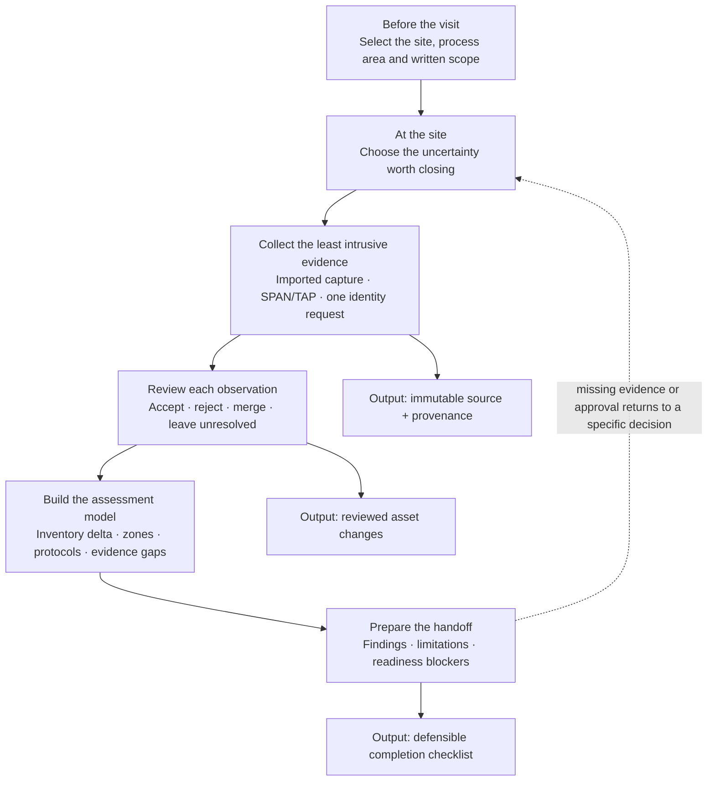
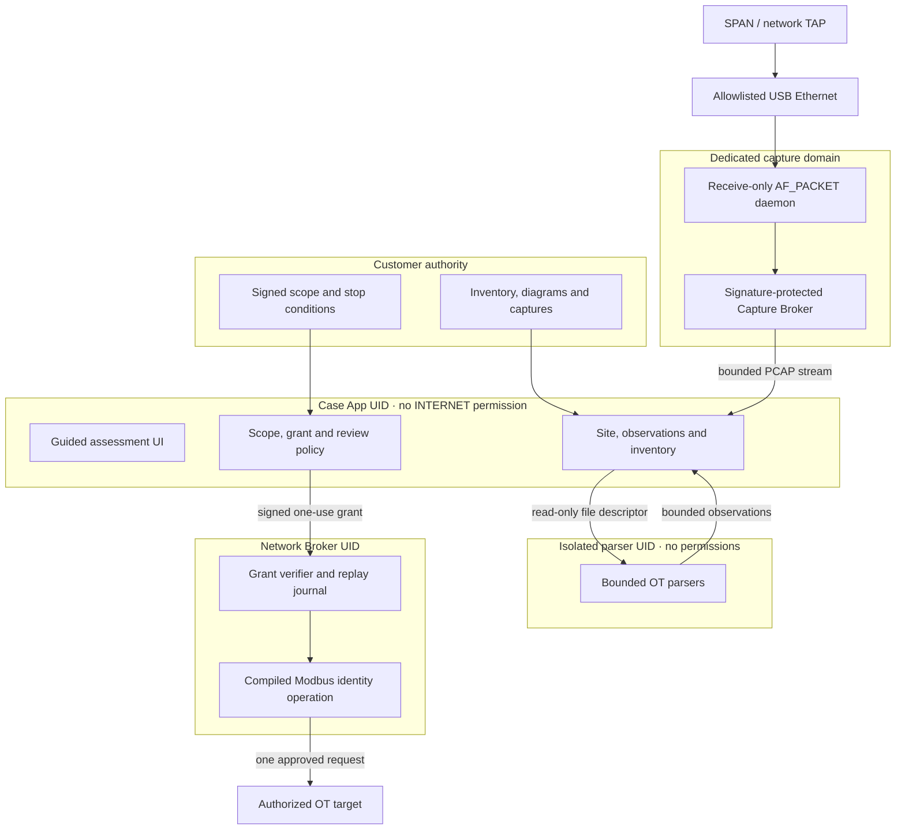
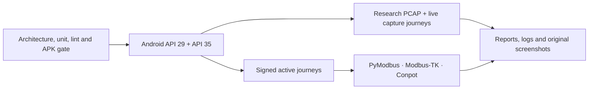

# Atlas OT Scout

**A dedicated Android field instrument for safe, evidence-led OT asset assessment.**

[](https://github.com/charifmahmoudi/mobile-ot-security-assessment/actions/workflows/android-ci.yml)

Atlas OT Scout helps an authorized assessor build a defensible view of one industrial site: establish the site and scope, collect passive or tightly bounded active evidence, review observations, reconcile an asset inventory, reason about findings, and prepare a controlled handoff.

The first product pack is **P0-WATER**, a proof of concept for one water or wastewater control segment. It is deliberately not a general-purpose network scanner, exploitation tool, certification audit, or continuous-monitoring platform.

> **Current status:** the guided Android workflow, passive PCAP/PCAPNG analysis, rooted capture boundary, review-first inventory, and one-target Modbus/TCP identity operation are executable and green in [CI run #37](https://github.com/charifmahmoudi/mobile-ot-security-assessment/actions/runs/33351078321). Physical phone, USB-NIC and TAP qualification remains a release gate.

## Watch and present the PoC

| Asset | Use |
|---|---|
| [Live emulator demonstration video](docs/demo/atlas-ot-scout-emulator-demo.mp4) | Continuous Android 15 / API 35 `adb screenrecord` capture of the running application; not a screenshot slideshow |
| [Buyer pitch and demonstration deck](docs/pitch/Atlas-OT-Scout-Pitch-and-Demo.pptx) | Ten-slide editable presentation covering the decision problem, product journey, safeguards, proof boundary and pilot proposal |
| [PDF presentation](docs/pitch/Atlas-OT-Scout-Pitch-and-Demo.pdf) | Portable ten-page export of the buyer deck |
| [Presenter storyline and reproducible live capture](docs/demo/VIDEO-SCRIPT.md) | Talk track, provenance statement and local/CI recording workflow |

The video and deck state that the current evidence comes from a controlled emulator and CI environment. Neither asset presents emulation as proof of physical Samsung, USB-Ethernet, TAP, PLC or production-network compatibility.

## The value in one field visit

Industrial teams rarely need another device-count screen. They need to know what changed, which identities remain uncertain, how each claim was established, and whether the evidence is strong enough for an audit or handover decision.

| Starting situation | Atlas decision support | Customer-facing outcome |
|---|---|---|
| Spreadsheet inventory may be stale | Compare imported records with passive and approved identity evidence | Assets corroborated, missing from evidence, unexpected or conflicting |
| A switched segment is not visible from the phone | Use a supplied capture or receive-only SPAN/TAP path | Protocol and endpoint observations with capture limitations attached |
| One critical controller remains unidentified | Authorize one exact Modbus identity request | Confirmed identity or conservative service-only result—never a guessed model |
| Protocol presence is being mistaken for risk | Separate observation confidence from operational consequence | Reviewable finding drafts with required validation stated |
| The assessment is incomplete | Make authorization, evidence and reviewer gaps visible | A blocked report with a precise completion checklist |

The PoC demonstrates this outcome on one water-treatment segment: a site-centered inventory, an identity-review queue, a communication picture, evidence-linked draft findings and explicit report-readiness blockers.

## A field assessor's journey

The journey follows the questions an assessor must answer, with an observable output at every stage.



The application does not ask the user to “scan a network.” A three-step site wizard establishes context first; the workspace then asks what decision is needed, recommends the safest evidence source, and carries the result into the next review queue. A visible stage rail and persistent **Overview**, **Collect**, **Assets**, **Findings** and **Report** destinations show where the assessor is and what remains.

| Site context | Guided assessment | Evidence model |
|---|---|---|
|  |  |  |

## What works today

| Capability | Executable behavior | Assurance |
|---|---|---|
| Site onboarding | Three short steps capture the process boundary, optional vendor context, then language and retention | Android API 29 and 35 journeys |
| Guided workflow | Overview → Collect → Assets → Findings → Report, with one recommended next action | Stable navigation contracts and instrumentation tests |
| Passive file analysis | Import bounded PCAP/PCAPNG through Android's document picker; hash, parse and review before inventory mutation | Modbus/TCP, DNP3, IEC-104 and BACnet research captures in CI |
| Dedicated passive capture | Signature-protected Capture Broker streams a bounded native `AF_PACKET` capture over a file descriptor | Virtual SPAN test plus zero transmission-syscall trace |
| Active identity | One signed, expiring and non-replayable Modbus FC 43 / MEI 14 request to one authorized target | PyModbus identity plus Modbus-TK and Conpot service-only outcomes |
| Inventory reasoning | Search/filter assets, inspect provenance and confidence, and navigate a functional zone model | Android journeys and persisted demonstration site |
| Findings and report readiness | Create conservative evidence-linked drafts and show explicit finalization blockers | Guided-stage instrumentation; final export remains blocked |

### What does not work yet

- No subnet, port, unit-ID, credential or vulnerability sweep.
- No register read/write, control action, exploitation or packet crafting.
- No qualified physical Samsung/USB-Ethernet/TAP combination yet.
- No production SQLCipher case vault, multi-user authorization record, reviewer signature or deterministic final PDF package yet.
- Wi-Fi, BLE and serial collection remain planned packs, not demonstrated capabilities.

## Security architecture

Root access is treated as a deployment privilege to remove from applications—not as a feature exposed to the assessor. The production direction is a signed, locked appliance image with SELinux enforcing and a narrowly privileged capture daemon. A general-purpose root manager, terminal, arbitrary shell API or packet-injection endpoint is outside the design.



This separation produces enforceable properties:

1. The data-rich Case App cannot open Internet sockets because its manifest does not request `INTERNET`.
2. The Network Broker has no site database, generic socket API or arbitrary request-byte interface.
3. Active execution requires a signed, short-lived, one-use grant with exact target, scope, interface and resource ceilings.
4. Untrusted capture parsing runs without network or database permissions.
5. The capture daemon binds one allowlisted interface and has no packet-transmission path.
6. An observation never becomes an accepted asset or finding without an explicit analyst decision.

The implementation-level model, sequences and enforcement map are in the [architecture overview](docs/wiki/Technical-Architecture.md).

## Passive and active modes

### Passive by default

Use an imported capture whenever the phone cannot safely observe the required traffic. On the dedicated appliance path, an approved SPAN/TAP feed reaches an allowlisted USB Ethernet interface and the confined receive-only daemon. Both sources enter the same hash → parse → review → inventory flow.

| Rooted capture ready | Passive result |
|---|---|
|  |  |

### Active only for a documented identity gap

The PoC exposes one operation: Modbus/TCP Read Device Identification, basic objects only. The operator must provide the case reference, process area, exact target, CIDR and unit ID, then explicitly attest authorization. An out-of-scope target is rejected in the Case App before the broker is contacted.

| Exact authorization | Local scope stop | Confirmed identity |
|---|---|---|
|  |  |  |

## End-to-end proof

The GitHub Actions pipeline is an acceptance harness, not merely a build check.



The full device, emulator and process topology is specified in the [end-to-end test architecture](docs/testing/E2E-ACCEPTANCE.md). The current reference is [run #36](https://github.com/charifmahmoudi/mobile-ot-security-assessment/actions/runs/33350379673) at [`bd1860e`](https://github.com/charifmahmoudi/mobile-ot-security-assessment/commit/bd1860e9601b2433b41bf9ef42c9e09577c1aef0):

- package/permission isolation, unit tests, lint and all debug APKs;
- Android 10 / API 29 and Android 15 / API 35 guided UI journeys;
- content-URI analysis of sourced Modbus, DNP3, IEC-104 and BACnet captures;
- PCAPNG normalization and malformed/truncated-input rejection;
- native AF_PACKET capture over a virtual SPAN/veth link;
- static and runtime proof that the daemon invokes no packet-send syscall;
- signed Case App → Network Broker → TCP/502 → emulator → evidence UI journeys against three independent OT implementations.

Emulation does not prove physical USB selection, Samsung image compatibility, packet loss at production rates or behavior of real PLC firmware. Those are explicit hardware acceptance gates.

## Demonstrate the PoC

The shortest coherent demonstration takes 7–9 minutes:

1. Select the sample water-treatment site and explain why evidence needs operating context.
2. Show the dashboard's progress and recommended next action.
3. Open **Collect** and explain why passive is the safe default.
4. Import the supplied Modbus capture and review proposed observations before inventory acceptance.
5. Show the exact active-authorization form and local out-of-scope rejection.
6. Run the PyModbus testbed to demonstrate one authorized identity result.
7. Navigate the inventory, open **Findings**, then finish with the report-readiness blockers.

Use the [guided user manual](docs/user-guide/USER-MANUAL.md) for operator steps, the [live emulator video](docs/demo/atlas-ot-scout-emulator-demo.mp4) for a self-contained walkthrough, and the [PowerPoint](docs/pitch/Atlas-OT-Scout-Pitch-and-Demo.pptx) or [PDF deck](docs/pitch/Atlas-OT-Scout-Pitch-and-Demo.pdf) for a buyer meeting.

## Build and verify

Prerequisites: JDK 17, Android SDK and Gradle 8.13.

```bash
gradle --no-daemon \
  :core-domain:test \
  :case-app:testDebugUnitTest \
  :network-broker:testDebugUnitTest \
  :capture-broker:testDebugUnitTest \
  lintDebug assembleDebug
```

Run the non-Android security gates:

```bash
python3 tools/verify_architecture.py
bash tools/fetch_research_pcaps.sh
bash tools/test_capture_daemon.sh
```

The Android and active-emulator journeys are defined in `.github/workflows/android-ci.yml`. CI artifacts contain the APKs, original emulator screenshots, Android test reports and emulator logs.

## Documentation map

Start with the document matching the decision you need to make:

| If you need to… | Read |
|---|---|
| Use or demonstrate the application | [Guided user manual](docs/user-guide/USER-MANUAL.md) |
| Understand processes, permissions and trust boundaries | [Architecture overview](docs/wiki/Technical-Architecture.md) |
| Review exactly what P0-WATER must deliver | [P0-WATER product contract](docs/poc/WATER-WASTEWATER-POC.md) |
| Audit devices, emulators and what CI proves | [End-to-end test architecture](docs/testing/E2E-ACCEPTANCE.md) |
| Review the interaction and visual rules | [Product UX contract](docs/product/OPEN-SOURCE-AND-UX-IMPLEMENTATION.md) |
| Review rooted-image and hardware assumptions | [Dedicated Android appliance](docs/architecture/DEDICATED-ANDROID-APPLIANCE.md) |
| See implemented versus deferred capability | [Implementation status](IMPLEMENTATION.md) |
| Investigate Morocco target accounts and entry paths | [Account intelligence](docs/accounts/README.md) |

## Responsible use and license

Use the active mode only on systems for which you have explicit written authorization. Do not broaden target, CIDR, unit ID or collection method to make a test pass.

No project license has been selected. Until one is added, copyright remains with the repository owner and reuse is not granted.
