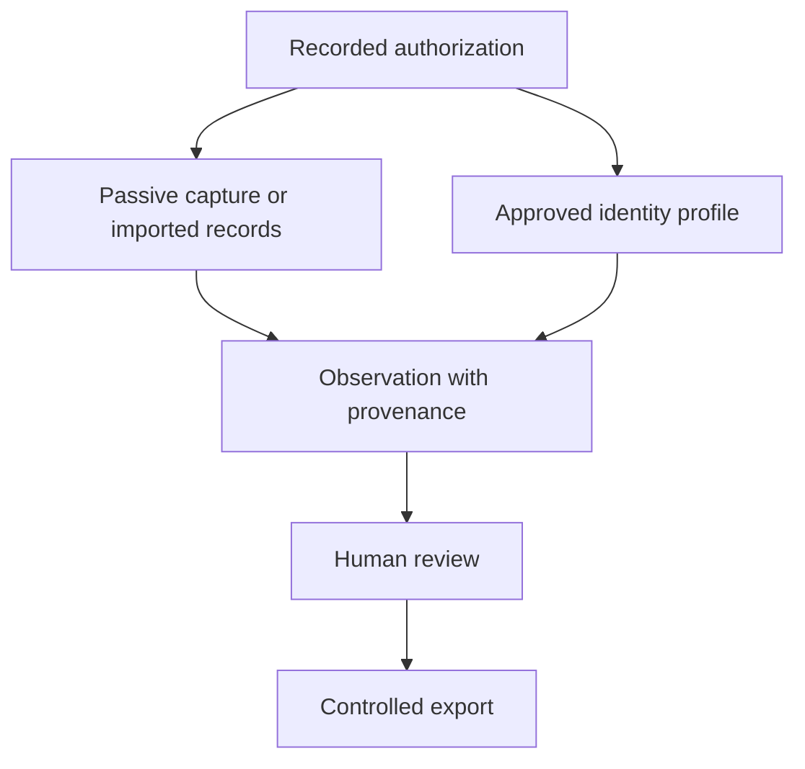

# Atlas OT Scout

Atlas OT Scout is a research project for a self-contained Android field instrument that helps authorized industrial teams collect and reconcile asset information across wired Ethernet, Wi-Fi and Bluetooth.

The intended workflow is deliberately narrower than a mobile pentesting suite. An engineer records the approved scope, imports existing inventory, collects passive observations, and—only when an approved profile allows it—uses a bounded identity query. Every result retains its source and confidence so a reviewer can decide what enters the customer's inventory or audit file.

No production application exists yet. The repository currently contains market research, account intelligence, product boundaries, requirements and the secure development plan needed to decide whether a prototype deserves to be built.

## Why a phone

A phone can combine a camera, local encrypted database, Wi-Fi and Bluetooth radios, and USB host support in equipment that field engineers already understand. With an approved USB-C Ethernet interface it can observe traffic addressed to the device; whole-segment capture still requires a mirror port, network TAP or capture file supplied by the customer. Android and an adapter do not bypass switched-network visibility or site policy.

## Where the initial opportunity is

Morocco is the first operating case. Public regulator, procurement, employer and company material shows an established industrial-audit market, multi-site operators, active factory and infrastructure expansion, and real use of PLC, DCS, SCADA and industrial network technology.

The strongest first user is an authorized OT auditor, integrator or operator team performing a workflow it already owns: commissioning handover, maintenance walkdown, audit collection or inventory reconciliation. The first benchmark should occur in a lab, training cell or tightly controlled maintenance window—not as unsolicited scanning on a production network.

## Research map

- [Morocco account intelligence](docs/accounts/README.md) — OCP, Renault, Stellantis, Tanger Med, ONEE, Managem, Safran and Cosumar
- [Account engagement playbook](docs/accounts/ENGAGEMENT-PLAYBOOK.md) — approval paths, partner routes, events and qualification gates
- [Public professional role map](docs/accounts/public-professional-role-map.csv) — named public roles with source links; no inferred email addresses
- [Go-to-market narrative](docs/diligence/STORYBRAND-GTM-PLAN.md) — customer, problem, benchmark and message
- [Executive business case](docs/diligence/EXECUTIVE-BUSINESS-CASE.md)
- [Morocco technology matrix](docs/diligence/TECHNOLOGY-EVIDENCE-MATRIX.md)
- [Market and economic model](docs/diligence/MARKET-AND-ECONOMIC-MODEL.md)
- [Open questions and assumption audit](docs/diligence/ASSUMPTION-AUDIT.md)

## Product boundary

Exploitation, credential attacks, fuzzing, autonomous packet generation and control writes are outside scope. An AI component may organize or summarize collected records; it must not decide to transmit on an OT network.

## Engineering and governance

- [Requirements](docs/REQUIREMENTS.md)
- [Technical architecture](docs/wiki/Technical-Architecture.md)
- [Safety and privacy](docs/wiki/Safety-and-Ethics.md)
- [Secure development lifecycle](docs/wiki/SDLC.md)
- [Roadmap](ROADMAP.md)
- [Contributing](CONTRIBUTING.md)
- [Security policy](SECURITY.md)

## License

No project license has been selected. Until one is added, copyright remains with the repository owner and reuse is not granted.
