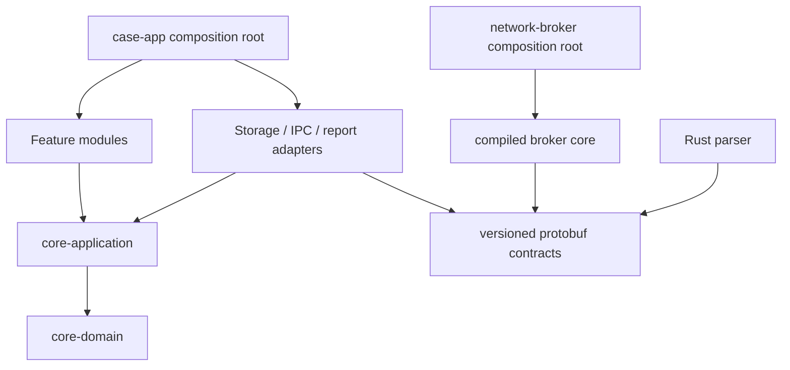
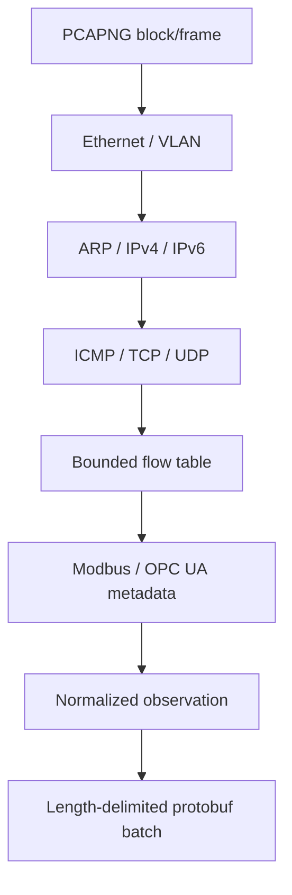

# Component Contracts and Code Architecture

_Status: normative implementation decomposition for P0-WATER._

## 1. Repository layout

```text
android/
  settings.gradle.kts
  build-logic/
  case-app/
  network-broker/
  core-domain/
  core-application/
  adapter-sqlcipher/
  adapter-artifact-vault/
  adapter-parser-ipc/
  adapter-broker-ipc/
  adapter-pack/
  adapter-report/
  feature-case/
  feature-walkdown/
  feature-collection/
  feature-reconciliation/
  feature-findings/
  feature-report/
native/
  parser-core/
  parser-ffi/
proto/
  parser.proto
  broker.proto
  evidence.proto
packs/
  water/
  query/
schemas/
tools/
  atlas-verify/
testdata/
  pcapng/
  inventories/
  golden/
```

Build dependencies point inward:



`core-domain` is Kotlin/JVM-only and has no Android, SQL, JSON, JNI, Compose or network dependencies.

## 2. Application ports

### Case lifecycle

```kotlin
interface CaseRepository {
    suspend fun create(command: CreateCase): CaseId
    suspend fun get(id: CaseId): CaseAggregate
    suspend fun transact(id: CaseId, expectedVersion: Long, command: CaseCommand): CaseAggregate
    fun observe(id: CaseId): Flow<CaseAggregate>
}

interface AuthorizationService {
    suspend fun validate(case: CaseAggregate, now: Instant): AuthorizationDecision
    suspend fun authorize(caseId: CaseId, approvals: Set<Approval>): AuthorizedCase
    suspend fun expireDueCases(now: Instant): List<CaseId>
}
```

All commands carry `actorId`, `actorRole`, `occurredAt` and a unique command ID. Repository transactions use optimistic aggregate versioning; command IDs make retries idempotent.

### Artifact vault

```kotlin
interface ArtifactVault {
    suspend fun begin(caseId: CaseId, descriptor: ArtifactDescriptor): ArtifactWriter
    suspend fun seal(handle: ArtifactWriter): SealedArtifact
    suspend fun openReadOnly(caseId: CaseId, hash: Sha256): ParcelFileDescriptor
    suspend fun verify(caseId: CaseId, hash: Sha256): IntegrityResult
    suspend fun destroyCaseKey(caseId: CaseId, approval: DeletionApproval)
}
```

`ArtifactWriter` is append-only, enforces declared maximum size and cannot read. `seal` fsyncs, hashes, atomically renames and records one DB transaction. A hash collision with unequal length is a fatal integrity event.

### Parser

```kotlin
interface EvidenceParser {
    fun parse(request: ParseRequest): Flow<ParseBatch>
}

data class ParseRequest(
    val artifact: ArtifactRef,
    val expectedSha256: Sha256,
    val linkType: LinkType?,
    val parserPack: PackRef,
    val limits: ParserLimits
)
```

`ParseBatch` carries batch number, observations, warnings, metrics and rolling output hash. The final batch carries input hash and final output hash. The adapter rejects out-of-order batches, duplicate IDs and totals beyond the request limits.

### Asset resolution

```kotlin
interface AssetResolver {
    suspend fun propose(caseId: CaseId, policy: ResolutionPolicy): ResolutionSet
    suspend fun accept(caseId: CaseId, proposalId: ProposalId, reviewer: Actor): AssetRevision
    suspend fun reject(caseId: CaseId, proposalId: ProposalId, reason: String, reviewer: Actor)
    suspend fun split(caseId: CaseId, assetId: AssetId, endpointIds: Set<EndpointId>, reviewer: Actor): List<AssetRevision>
}
```

Proposal computation is pure and deterministic for `caseSnapshotHash + policyHash`. Only reviewer commands alter accepted asset groupings.

### Rules and findings

```kotlin
interface AssessmentEngine {
    suspend fun evaluate(snapshot: CaseSnapshot, pack: RulePack): EvaluationResult
}

interface FindingReviewService {
    suspend fun decide(findingId: FindingId, decision: FindingDecision, reviewer: Actor): FindingRevision
    suspend fun setTreatment(findingId: FindingId, owner: String?, due: LocalDate?, action: String, reviewer: Actor)
}
```

A rule cannot mutate assets or observations. It emits a candidate finding with explicit evidence IDs. Reviewer acceptance creates the reportable finding revision.

### Export

```kotlin
interface AssessmentExporter {
    suspend fun prepare(caseId: CaseId): FinalizationPreview
    suspend fun finalize(caseId: CaseId, reviewerApproval: Approval): FinalizedSnapshot
    suspend fun export(snapshotId: SnapshotId, policy: ExportPolicy, destination: Uri): ExportReceipt
}
```

Finalization freezes the exact database revision, active pack hashes and audit head. Rendering reads only this snapshot.

## 3. IPC contracts

### Case App → Network Broker

AIDL transports only protobuf bytes and `ParcelFileDescriptor` pipes:

```aidl
interface IAtlasNetworkBroker {
  byte[] inspectInterfaces(in byte[] signedRequest);
  byte[] execute(in byte[] signedGrant, in ParcelFileDescriptor writeSide);
  byte[] capture(in byte[] signedGrant, in ParcelFileDescriptor writeSide);
  byte[] emergencyStop(in byte[] signedStop);
}
```

Constraints:

- explicit package/component binding;
- signature-protected service;
- Binder caller UID and certificate check;
- protobuf maximum 64 KiB;
- no Bundle, Serializable, URI, path or Intent supplied by caller;
- result pipe maximum enforced by grant;
- caller closes unread pipe on cancellation, which the broker treats as stop.

### Case App → Parser Worker

```aidl
interface IAtlasParser {
  void parse(in byte[] request, in ParcelFileDescriptor artifact, in ParcelFileDescriptor resultPipe);
  void cancel(in String requestId);
}
```

The isolated parser gets a read-only descriptor positioned at byte 0. The result pipe is length-delimited protobuf; main app caps batch and total size. Binder death yields `PARSER_PROCESS_DIED`.

## 4. Parser pipeline



Each stage returns `Parsed`, `Unsupported`, `Malformed` or `LimitExceeded`; there is no exception-based control flow across JNI.

Rust crate boundaries:

- `atlas-bytes`: checked cursors and bounded strings;
- `atlas-pcapng`: section/interface/enhanced-packet blocks;
- `atlas-net`: L2–L4;
- `atlas-flow`: bounded TCP reassembly;
- `atlas-modbus`;
- `atlas-opcua-discovery`;
- `atlas-observation`: protobuf mapping;
- `atlas-parser-cli`: host fuzz/test harness;
- `atlas-parser-ffi`: minimal JNI.

No parser uses unsafe Rust except reviewed FFI glue. Any `unsafe` requires a local safety comment and dedicated test.

## 5. Domain aggregates

| Aggregate | Consistency boundary | Invariants |
|---|---|---|
| Case | state, scope, authorization, active window | no collection before authorization; finalized immutable |
| Artifact | content and provenance | write once; hash/length fixed after seal |
| Asset | accepted endpoint/claim grouping | every accepted relation reviewed or deterministic strong-key rule |
| Execution | one network action | one grant, target, profile, receipt and evidence stream |
| Finding | condition, evidence, risk, decision | accepted finding has evidence, reviewer and recommendation |
| PackActivation | trusted active pack | valid signature, compatible schema/build and no rollback |
| FinalizedSnapshot | report input | exact DB revision, pack hashes and audit head |

## 6. Command/event model

Mutating use cases append an audit event in the same database transaction as state change.

```text
Command -> validate aggregate version/invariants
        -> write domain rows
        -> append canonical audit event
        -> update case aggregate version
        -> commit
        -> publish in-process notification
```

Notifications are hints, not durable truth. On restart, workers query durable job state.

## 7. Background work

| Work | Mechanism | Restart behavior |
|---|---|---|
| Small DB/import operations | Coroutine in application scope | transaction rollback/retry |
| Long offline parse | persistent job row + bound isolated service | restart from artifact; observations staged by job ID |
| Report render | WorkManager with finalized snapshot ID | safe retry |
| H1/H2 network | Network Broker foreground service | never auto-resume |
| Retention deletion | WorkManager, charging preference | idempotent key deletion/file cleanup |

Parsing uses staging tables. Only a complete final batch with matching output hash is promoted atomically into canonical observations.

## 8. Error taxonomy

```kotlin
sealed interface AtlasError {
    data class Authorization(val code: AuthCode): AtlasError
    data class Scope(val code: ScopeCode, val field: String): AtlasError
    data class Interface(val code: InterfaceCode): AtlasError
    data class Broker(val code: BrokerCode, val receiptId: String?): AtlasError
    data class Evidence(val code: EvidenceCode, val artifact: Sha256?): AtlasError
    data class Parse(val code: ParseCode, val offset: Long?): AtlasError
    data class Storage(val code: StorageCode, val recoverable: Boolean): AtlasError
    data class Integrity(val code: IntegrityCode): AtlasError
    data class Export(val code: ExportCode): AtlasError
}
```

User-visible errors include safe next action and whether evidence was sealed. Logs contain IDs and codes, never packet payload, credentials, serial numbers or full customer paths.

## 9. Determinism

Normative outputs are deterministic for:

```text
finalized DB snapshot
+ artifact hashes
+ parser/rule/knowledge pack hashes
+ application build
+ export policy
```

Canonical JSON uses UTF-8, lexicographically ordered object keys, normalized numbers, explicit UTC timestamps and stable array sort rules. PDF is not used for hash comparison; HTML/JSON are normative.

## 10. Testing seams

Every port has an in-memory fake. The Case App instrumentation tests use a fake Network Broker incapable of sockets. Real broker tests run only in the isolated lab. Parser host CLI and Android isolated service must produce identical observation hashes for the golden corpus.
