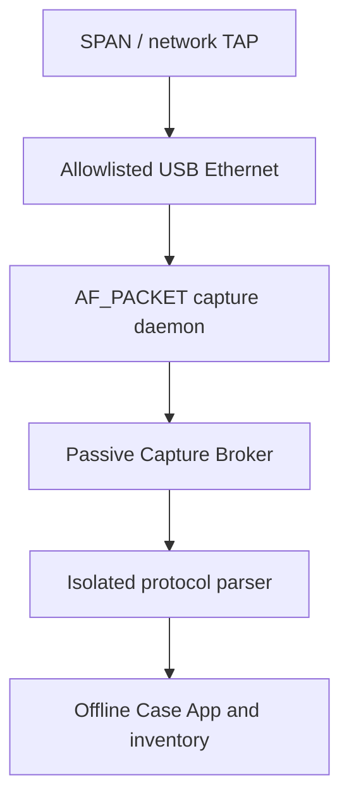

# Dedicated Android security appliance architecture

## Decision

Atlas OT Scout will support a dedicated Android appliance profile. The product profile is **not** a consumer ROM with unrestricted application root. It is a signed Android system image with a locked bootloader, SELinux enforcing, a narrowly privileged native packet-capture daemon and three separately signed application identities.

Imported PCAP remains mandatory as the universal fallback. The existing unrooted build remains a supported compatibility profile.

The selected laboratory platform and exact Samsung/emulator compatibility are specified in:

- `docs/appliance/ROOTED-ANDROID-POC.md`;
- `docs/appliance/COMPATIBILITY-MATRIX.md`.

## Deployment profiles

| Profile | Passive source | Active source | Claim permitted |
|---|---|---|---|
| Compatibility Android | Imported PCAP/PCAPNG | Signed Network Broker | Offline analysis and bounded identity |
| Rooted development device | USB Ethernet through experimental native daemon | Signed Network Broker | Laboratory feasibility only |
| Dedicated appliance | Qualified SPAN/TAP adapter through confined daemon | Signed Network Broker | Live passive collection after hardware acceptance |

An unlocked rooted development device must never be reported as the production security boundary.

## Runtime boundaries

| Component | Permitted | Forbidden |
|---|---|---|
| Case App | Site workflow, evidence review, inventory, report state | Internet permission, raw sockets, arbitrary commands |
| Passive Capture Broker | Capability inspection, one bounded capture request, FD streaming | Internet permission, shell interface, arbitrary file paths |
| Native capture daemon | `AF_PACKET` receive on one allowlisted interface, PCAP framing | Packet send API, IP configuration, routing, DNS, general filesystem |
| Network Broker | Signed active profiles on selected Android network | Passive evidence storage, generic scanner socket |
| Parser | Bounded untrusted packet parsing | Network and customer database access |

## Live capture contract

The Android AIDL contract exposes only:

- `inspectInterfaces()`;
- `startPassiveCapture(interfaceId, maxBytes, durationMs, sinkFd)`;
- `stopCapture()`.

There is no command string, BPF text supplied by the UI, output pathname, packet-injection method or generic socket handle. The broker returns bytes through a pipe owned by the Case App; those bytes enter the same parser and analyst-review flow as an imported PCAP.

## Interface acceptance invariants

Before the product enables **Start passive sample**, the appliance backend must establish:

1. interface is on the signed allowlist;
2. link is Ethernet and operational;
3. no IPv4 address is assigned;
4. no IPv6 address, including link-local, is assigned;
5. Android connectivity management does not own the interface;
6. kernel egress policy is installed;
7. transmit counter has not increased since passive mode began;
8. capture byte and duration limits are valid;
9. only one capture is active;
10. output sink is a broker-provided file descriptor.

The current Android CI backend returns a visibly labeled `EMULATED_APPLIANCE` interface. Release builds return unavailable until the native backend attests these conditions.

## Native capture daemon

`appliance/capture-daemon/atlas_capture.c` is the first executable backend. It:

- opens one `AF_PACKET/SOCK_RAW` socket;
- binds it to the exact interface index;
- requests promiscuous membership;
- writes bounded classic PCAP with timestamps;
- stops on duration, byte limit or signal;
- creates a new mode-0600 output without following symlinks;
- contains no `send`, `sendto` or `sendmsg` call.

The virtual-SPAN CI gate compiles the daemon, rejects transmission symbols, creates a veth pair, injects frames from the peer, validates the resulting PCAP and asserts that the capture-side transmit counter does not increase.

This software assertion does not replace physical hardware acceptance. A receive-only TAP remains the highest-assurance collection topology.

## Product image requirements

- Android Verified Boot using product-controlled signing keys.
- Bootloader relocked after provisioning on supported hardware.
- A/B signed OTA with rollback behavior.
- SELinux globally enforcing.
- Dedicated daemon domain with only packet receive, required interface ioctls and broker IPC.
- Case, capture and active-broker keys protected by Android Keystore/TEE where available.
- No general-purpose root manager, terminal or package sideloading in field mode.
- USB debugging disabled outside maintenance mode.
- Measured device/build identity recorded in every case export.

## Hardware release gate

For every supported phone/NIC/TAP combination, verify VLAN preservation, Ethernet link stability, timestamp quality, packet loss at target load, suspend behavior, thermal behavior, power budget, maximum capture duration, zero interface egress and recovery after disconnect. Until this matrix passes, live capture is a laboratory capability, not a supported field claim.
