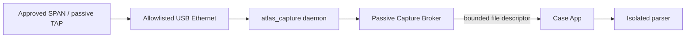

# Dedicated Android passive-capture appliance

This document owns the **dedicated Android live-passive architecture and physical acceptance invariants**. It replaces the former external Raspberry-Pi capture-accessory design as the target P0 passive path. Current executable coverage is reported only in [IMPLEMENTATION.md](../../IMPLEMENTATION.md).

The appliance is not a consumer phone with unrestricted root. The target is a signed Android system image containing a narrowly privileged receive-only daemon plus separately constrained application components.

Laboratory platform/model selection belongs in [ROOTED-ANDROID-POC.md](../appliance/ROOTED-ANDROID-POC.md), and measured hardware evidence belongs in [COMPATIBILITY-MATRIX.md](../appliance/COMPATIBILITY-MATRIX.md).

## Runtime path



| Component | Permitted | Forbidden |
|---|---|---|
| Case App | Request a bounded passive sample and review evidence | Raw packet socket, shell/root command, generic network capture API |
| Capture Broker | Inspect allowlisted interface capability; start/stop one bounded capture; stream bytes by FD | Internet access, arbitrary output paths, packet injection, shell command |
| `atlas_capture` daemon | `AF_PACKET` receive on one allowlisted interface and bounded PCAP creation | Packet-send operation, general IP/routing service, application UI |
| Parser | Bounded parsing of sealed capture bytes | Network authority and direct access to customer case keys |

Active identity remains a separate Network Broker concern; it is not added to the passive daemon.

## Capture Broker contract

The application-facing passive API contains only:

```text
inspectInterfaces()
startPassiveCapture(interfaceId, maxBytes, durationMs, sinkFd)
stopCapture()
```

No UI-supplied BPF expression, arbitrary pathname, raw command, packet-injection operation or generic socket handle is accepted.

The exact packet-receiving contract is maintained in [NETWORK-EXECUTION.md](NETWORK-EXECUTION.md).

## Native daemon contract

`appliance/capture-daemon/atlas_capture.c` is the reference receive backend. The production integration must preserve these constraints:

- open one `AF_PACKET/SOCK_RAW` socket;
- bind to the selected interface index;
- enable promiscuous receive membership only for that interface;
- receive frames delivered by the interface;
- write bounded PCAP with timestamps;
- stop at byte/time limits or local stop signal;
- create private output without following symlinks;
- expose no packet-send operation.

Promiscuous mode is not a visibility guarantee. An ordinary switch access port still does not deliver unrelated unicast frames; whole-segment evidence requires an approved SPAN/mirror port or passive TAP.

## Interface acceptance invariants

Before live passive capture is represented as supported, the appliance must establish and test:

1. exact interface is allowlisted for the installed appliance build;
2. Ethernet link and driver identity match a qualified combination;
3. OT-facing capture interface has no IPv4 address;
4. OT-facing capture interface has no IPv6 address, including link-local;
5. Android connectivity management does not select it as a normal data network;
6. egress prevention is active;
7. transmit counters remain unchanged during passive operation;
8. requested byte/time limits are inside compiled maxima;
9. only one capture is active;
10. bytes return only through the broker-owned file-descriptor path;
11. packet loss and capture source/visibility are measured and preserved in evidence.

A software zero-send assertion is necessary but not sufficient; each supported physical phone/NIC/hub/TAP combination requires independent zero-egress and visibility verification.

## Product image requirements

The field appliance target requires:

- product-controlled image and package signing;
- SELinux enforcing with a dedicated capture-daemon domain;
- no general-purpose root manager or field terminal;
- USB debugging and maintenance functions disabled outside controlled maintenance mode;
- Keystore/TEE use where available for product/case keys;
- signed update and rollback/recovery process;
- recorded device/build identity in assessment evidence;
- a boot-integrity story appropriate to the selected production hardware.

An unlocked `userdebug` laboratory device is evidence of feasibility, not evidence of the final production trust boundary.

## Hardware acceptance

For every supported combination, measure at least:

- exact phone/OS build and USB host behavior;
- powered-hub stability and power budget;
- USB NIC driver, VLAN preservation and link recovery;
- SPAN/TAP visibility and receive-only behavior;
- timestamp quality and packet loss under target load;
- suspend/resume and disconnect recovery;
- thermal behavior and sustained capture duration;
- zero interface egress;
- recovery after interrupted capture.

The canonical results are recorded in [COMPATIBILITY-MATRIX.md](../appliance/COMPATIBILITY-MATRIX.md). Until those gates pass, live passive capture cannot be represented as hardware-qualified.
