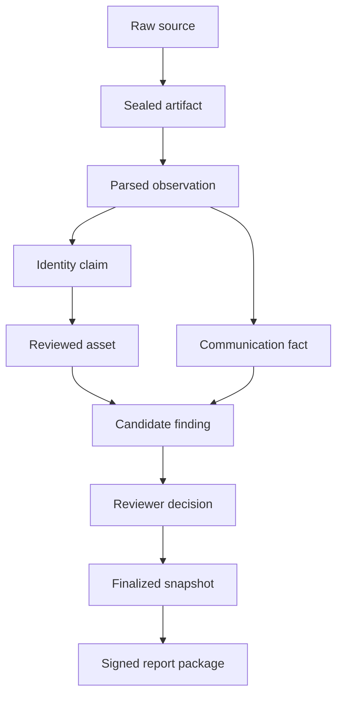
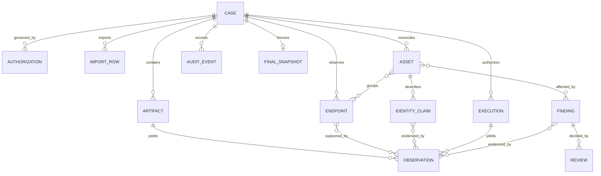
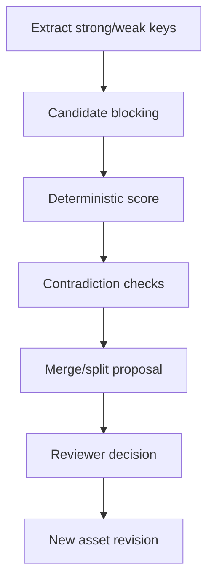
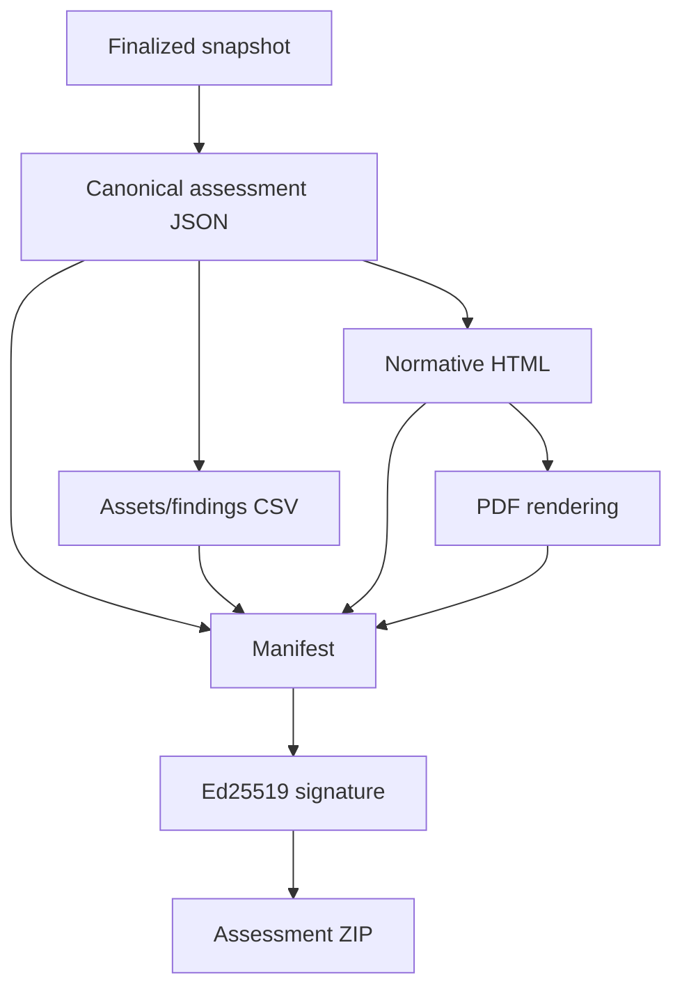

# Evidence, Data and Reporting Architecture

_Status: normative data design for P0-WATER._

## 1. Evidence lineage



A later layer never replaces an earlier layer. Reports refer to findings; findings refer to evidence; evidence resolves to an immutable artifact and byte range or physical record.

## 2. Logical model



## 3. Physical storage

### SQLCipher database

One database per installation, with `case_id` on every case-owned table. SQLCipher uses a random 256-bit database key wrapped by an Android Keystore key. The current `sqlcipher-android` package is required; the legacy Android package is not allowed.

The executable M1 foundation currently uses an encrypted `professional_cases` aggregate-checkpoint table containing a bounded deterministic representation of the complete `AssessmentCase`. That table exists to provide durable lifecycle restoration, optimistic version enforcement and integrity testing while the normalized schema is being built. It is **not** the target report/evidence schema, and report generation must not treat the checkpoint blob as a substitute for normalized professional records.

The target normalized tables and essential indexes are:

| Table | Primary/indexes |
|---|---|
| `cases` | PK `id`; unique `case_number,revision`; index state/end |
| `authorizations` | PK; unique artifact hash per case |
| `scope_targets` | PK; indexes normalized IP/MAC/CIDR and exclusion |
| `artifacts` | PK; unique `case_id,sha256`; index kind/sealed_at |
| `parser_jobs` | PK; unique artifact/parser hash; index state |
| `observations` | PK; indexes artifact+offset, subject key, protocol+time |
| `endpoints` | PK; indexes normalized MAC/IP, first/last seen |
| `endpoint_observations` | composite PK |
| `assets` | PK; index customer asset ID/status/class |
| `asset_endpoints` | composite PK plus review revision |
| `identity_claims` | PK; index asset/attribute/review/confidence |
| `claim_evidence` | composite PK |
| `flows` | PK; unique normalized tuple+time bucket; indexes source/destination |
| `executions` | PK; unique grant ID/nonce; index case/time |
| `findings` | PK; index rule/severity/review |
| `finding_evidence` | composite PK |
| `reviews` | PK; index object type/id/time |
| `audit_events` | PK sequence per case; unique event hash |
| `pack_activations` | PK; unique pack ID/version/hash |
| `final_snapshots` | PK; unique case/revision |
| `export_receipts` | PK; index snapshot/destination hash |

Foreign keys and deferred constraints are enabled. Deleting a parent row is restricted except through the retention workflow.

### Artifact vault

```text
files/cases/<opaque-case-dir>/
  artifacts/sha256/ab/cd/<full-hash>.blob
  staging/<random>.partial
  exports/<snapshot-id>/<export-id>.zip
```

Paths contain no customer/site/asset names. Blob encryption uses a per-case data key and AES-256-GCM with random 96-bit nonce. Header contains version, algorithm, nonce, plaintext length and authenticated case/artifact IDs. The artifact SHA-256 is over plaintext; encrypted-blob integrity is also verified by GCM.

## 4. Source preservation

Customer CSV import stores:

1. sealed original artifact;
2. import metadata and mapping version;
3. one `import_row` with source row number and canonical row hash;
4. normalized proposed fields;
5. row acceptance/rejection and reason.

Changing a mapping creates a new import job; it never mutates original rows.

PCAPNG observations store artifact hash, section/interface ID, packet block offset, captured length, original length and parser version. Where protocol value spans reassembled frames, evidence stores all contributing packet offsets.

Physical records store photo artifact hash, assessor transcription, OCR suggestion separately, timestamp, location text and review decision.

## 5. Endpoint and asset identity

### Endpoint key

An endpoint is case-local and may contain MAC, VLAN, IPs and protocol identities. IP changes create endpoint-address history; they do not overwrite.

### Claim model

```text
claim_id
subject_asset_or_endpoint
attribute                  # vendor, model, serial, firmware, role, location
typed_value
normalized_value
source_class               # E1..E6
confidence
rule_id/version
created_at
valid_from/to
review_state
contradiction_group
evidence_ids[]
```

### Resolver pipeline



Strong key agreement raises score; material serial/model contradiction caps it below automatic acceptance. OUI/IP/hostname cannot independently cross the probable threshold.

Every asset revision retains prior membership. The report uses the revision frozen in the final snapshot.

## 6. Communication model

A flow is an aggregation of observations with:

```text
source_endpoint, destination_endpoint,
source/destination zone if reviewed,
IP protocol, source/destination port,
application protocol,
first_seen, last_seen, packet_count, byte_count,
direction, capture_visibility, evidence sample IDs,
declared conduit, reviewer expectation
```

Time-bucket default is five minutes. Aggregation preserves at least the first, last and up to five representative evidence samples. A finding about unexpected conduit requires reviewer-confirmed zones and policy; flow alone is not sufficient.

## 7. Finding revisions

Candidate evaluation result:

```text
rule hash + snapshot hash + affected objects + evidence IDs
+ condition + suggested recommendation + confidence basis
```

Reviewer adds consequence, confirms exposure, decision, owner and due date. Any evidence/score/text change creates a new finding revision. Executive totals include only latest accepted revisions.

Risk arithmetic is validated:

```text
risk_score = consequence * exposure
1..5          1..5          1..25
```

Severity is derived, not editable independently.

## 8. Audit chain


Canonical event fields:

```text
sequence, case_id, at_utc, monotonic_ms, command_id,
actor_id, actor_role, action, object_type, object_id,
details_hash, previous_hash
```

`event_hash = SHA256(previous_hash || canonical_event_without_event_hash)`.

The DB administrator can still delete the database; the chain detects alteration inside an exported case, not physical erasure. The signed final manifest provides external anchoring.

## 9. Finalization transaction

Finalization is one SQL transaction:

1. verify case state is `READY_TO_FINALIZE` and the retained case review is accepted;
2. verify authorization and collection ledger;
3. require decisions for configured claim/finding gates;
4. compute inventory and report metrics;
5. record active parser/rule/knowledge/query pack hashes;
6. record every artifact hash/inclusion policy;
7. compute snapshot content hash;
8. append `CASE_FINALIZED` audit event;
9. record audit head;
10. insert immutable `final_snapshot`;
11. change case state to `FINALIZED`;
12. commit.

Report generation cannot query live mutable tables; it reads the materialized snapshot/export views.

## 10. Report construction



PDF pagination differences do not alter assessment semantics. The verification CLI validates signature, hashes, schema and audit chain, and reports omitted raw artifacts.

## 11. Retention and deletion

Retention state: `active -> due -> approved -> key_destroyed -> files_cleaned`.

Two authorized actors are required for early deletion of a finalized case. Scheduled expiry follows the case policy and notifies before key destruction. Destroying the per-case key is the primary cryptographic erase; cleanup retries remove ciphertext and exports. Audit evidence of deletion can be exported before key destruction if policy permits.

## 12. Backup and recovery

Android automatic backup is disabled. P0 has no cloud backup. A customer-controlled encrypted export is the recovery artifact. An unfinished case can optionally export an encrypted checkpoint only when authorization permits; checkpoint restore verifies original device/app signatures and creates a new audit event.
