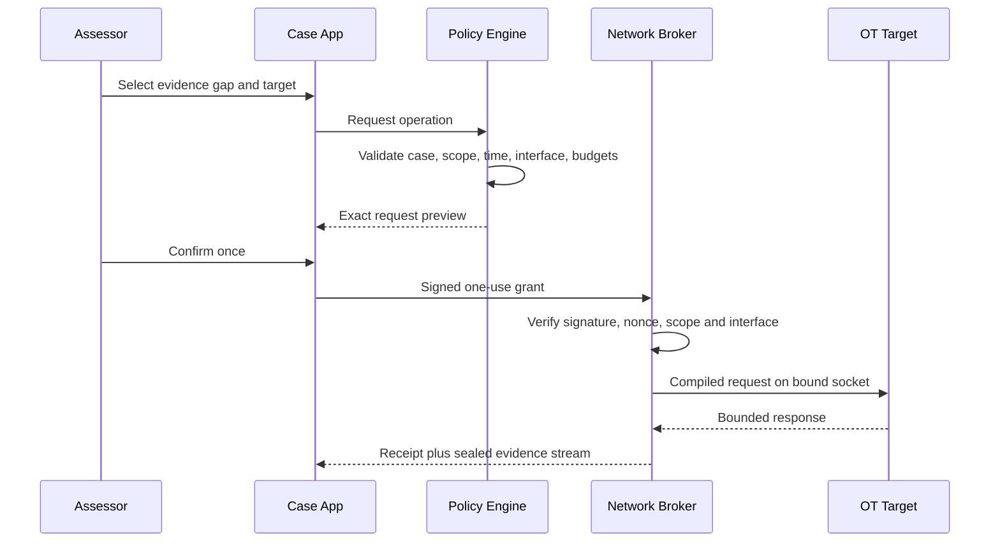
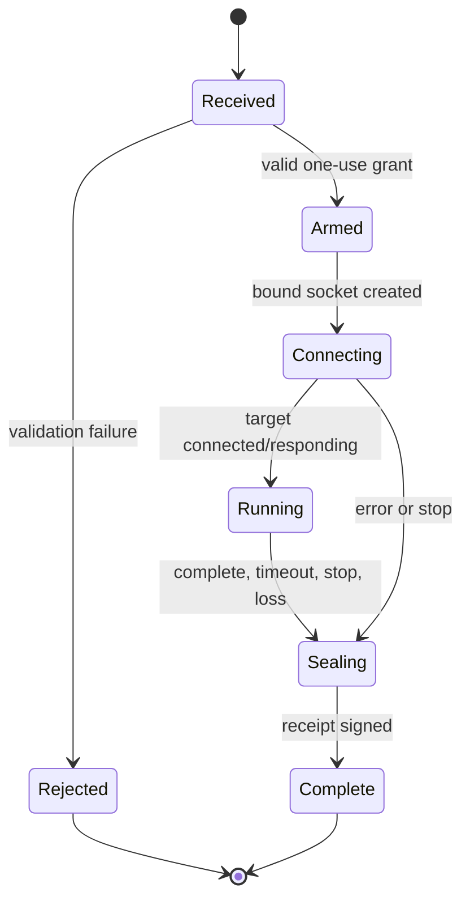
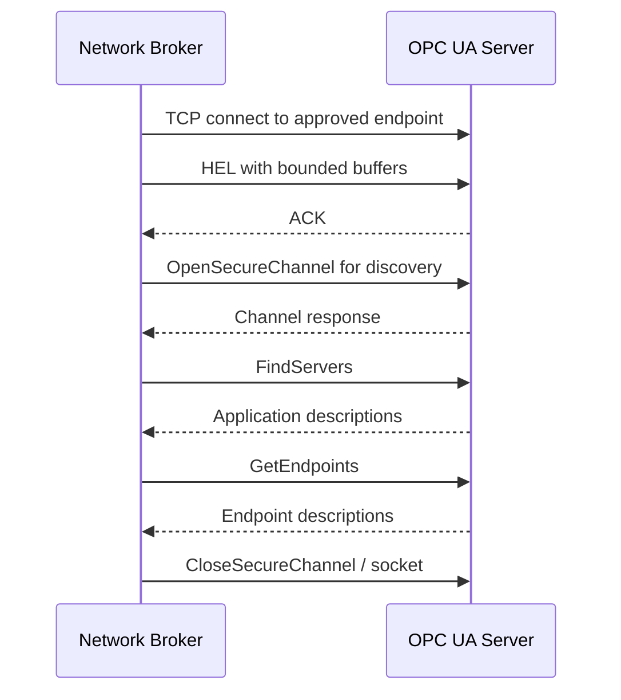
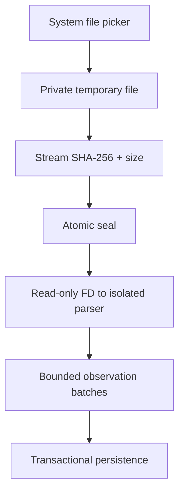

# Network Execution and Capture Architecture

_Status: normative for every packet-producing or packet-receiving P0 operation._

## 1. Non-bypassable path

Only `atlas-netbroker.apk` has Android network permission. It exposes one signature-protected bound service. Its public API has four calls:

```kotlin
interface NetworkBroker {
    fun inspectInterfaces(request: InterfaceInspection): InterfaceSnapshot
    fun execute(grant: SignedExecutionGrant, sink: ParcelFileDescriptor): ExecutionReceipt
    fun capture(grant: SignedCaptureGrant, sink: ParcelFileDescriptor): CaptureReceipt
    fun emergencyStop(caseId: String, reason: String): StopReceipt
}
```

There is no API accepting raw bytes, shell commands, scripts, port ranges, arbitrary URLs or generic sockets.

## 2. Grant creation and validation



### Signed execution grant

```protobuf
message ExecutionGrant {
  string grant_id = 1;
  string case_id = 2;
  bytes authorization_sha256 = 3;
  bytes profile_sha256 = 4;
  string implementation_id = 5;
  string android_network_handle = 6;
  string interface_fingerprint = 7;
  string target_ip = 8;
  uint32 target_port = 9;
  optional uint32 unit_id = 10;
  uint32 max_packets = 11;
  uint64 max_bytes = 12;
  uint32 max_retries = 13;
  uint32 timeout_ms = 14;
  int64 issued_at_epoch_ms = 15;
  int64 expires_at_epoch_ms = 16;
  bytes nonce = 17;
  bytes case_app_signature = 18;
}
```

The signed bytes use deterministic protobuf serialization. The broker verifies:

1. trusted Case App certificate and Binder caller UID;
2. Ed25519 grant signature;
3. unused 128-bit nonce;
4. issue/expiry and monotonic maximum lifetime of 60 seconds;
5. authorization/profile hashes are present in the signed local broker cache;
6. implementation ID is compiled and enabled;
7. target is one exact unicast address in scope and not excluded;
8. port/unit ID match the profile;
9. ceilings do not exceed compiled maxima;
10. selected Android network still has the approved interface fingerprint;
11. no other execution is active for the case.

Any failure returns a typed rejection and produces no socket.

## 3. Interface identity

`interface_fingerprint` is:

```text
SHA256(transport || interface_name || MAC_if_available ||
       link_addresses || routes || DNS || USB_VID_PID_serial ||
       android_network_handle || captured_at)
```

Before each socket:

- retrieve current `NetworkCapabilities` and `LinkProperties`;
- require Ethernet transport for H1;
- reject VPN and cellular transports;
- require target route on the selected network;
- reject default-route-only ambiguity;
- bind socket with `Network.bindSocket` before connect;
- re-read interface state immediately after binding;
- attach a network callback; loss/change triggers socket closure.

The Android NDK equivalent `android_setsocknetwork` is used for native sockets ([Android NDK networking](https://developer.android.com/ndk/reference/group/networking)).

## 4. Broker execution state



The nonce is marked consumed before socket creation in an fsync-backed broker journal. A broker crash cannot replay the grant.

## 5. Modbus/TCP A1 implementation

Profile: `modbus.read-device-id.basic.v1`.

Request PDU:

```text
Function       0x2B
MEI type       0x0E
ReadDevId code 0x01   # basic
Object ID      0x00
```

MBAP:

```text
Transaction ID: broker-generated 16-bit value
Protocol ID:    0x0000
Length:         0x0005
Unit ID:        exact authorized value
```

Full request template:

```text
TT TT 00 00 00 05 UU 2B 0E 01 00
```

Allowed response fields: conformity level, more-follows, next-object ID and basic object IDs 0x00–0x02 (vendor name, product code, revision). The parser rejects mismatched transaction/protocol/unit/function/MEI fields, oversized object counts, duplicate object IDs and strings over 248 bytes.

Ceilings:

- one target, one unit ID;
- one request; one retry only on timeout;
- 1500 ms each;
- concurrency one;
- maximum response 512 bytes;
- no exception-response retry;
- no unit-ID discovery;
- no register/diagnostic function available in code.

## 6. OPC UA A1 implementation

Profile: `opcua.discovery.v1`.



No user session, ActivateSession, Browse, Read, Write, subscription or Method call is compiled into P0. OPC Foundation defines FindServers and GetEndpoints as discovery services ([FindServers](https://reference.opcfoundation.org/specs/OPC-10000-4/5.5.2), [GetEndpoints](https://reference.opcfoundation.org/specs/OPC-10000-4/5.5.4)).

Ceilings:

- exact approved hostname/IP and port;
- one TCP connection;
- 3 s connect, 3 s service deadline;
- 8 MiB total response/reassembly cap;
- endpoint count 256;
- string length 16 KiB;
- certificate length 1 MiB;
- no retry by default;
- DNS prohibited unless the authorization includes exact DNS server and expected address result; IP literal is default.

## 7. H2 passive capture

```mermaid
sequenceDiagram
  participant C as Case App
  participant B as Network Broker
  participant H as H2 Appliance
  participant S as SPAN/TAP
  C->>B: Signed capture grant + write pipe
  B->>H: mTLS prepare(case limits)
  H->>S: Receive only; no transmit
  S-->>H: Mirrored frames
  H-->>B: PCAPNG chunks + signed manifest
  B-->>C: Byte stream and broker receipt
  C->>C: Hash, seal, then parse
```

The Network Broker does not parse PCAPNG. It validates TLS peer, case binding, length ceilings, chunk hash and appliance manifest signature, then copies bytes to the Case App pipe. The Case App independently hashes and seals bytes.

### Capture grant

```protobuf
message CaptureGrant {
  string grant_id = 1;
  string case_id = 2;
  bytes authorization_sha256 = 3;
  bytes appliance_key_fingerprint = 4;
  uint32 duration_seconds = 5;
  uint64 rotation_bytes = 6;
  uint32 rotation_seconds = 7;
  uint64 maximum_case_bytes = 8;
  uint32 phone_disconnect_grace_seconds = 9;
  int64 expires_at_epoch_ms = 10;
  bytes nonce = 11;
  bytes case_app_signature = 12;
}
```

No arbitrary BPF string is accepted in P0. The compiled mode is full-frame receive with PCAPNG rotation.

## 8. H3 import path



The original is immutable. Parsing never writes into it. Archive files are not accepted as captures; the user imports individual supported files to avoid archive traversal/bomb risks.

## 9. Wi-Fi and BLE

Wi-Fi and BLE adapters run in the Case App because they use Android’s high-level scan APIs and do not produce OT protocol packets.

Wi-Fi record: scan timestamp, SSID (possibly redacted), BSSID, security capability string, frequency/channel, width, RSSI and OS scan-throttling/permission state.

BLE record: scan timestamp/window, address and address type when exposed, advertised name, service UUIDs, manufacturer ID/data hash, TX power, RSSI and duplicate count.

P0 exposes no Wi-Fi association API, raw 802.11 interface, deauthentication, BLE connection, GATT read/write or pairing.

## 10. Emergency stop

Emergency stop has three paths:

1. persistent Android foreground-notification action to Network Broker;
2. in-app stop via bound service;
3. H2 accessory power removal.

On stop, broker atomically sets case stop flag, closes every file descriptor/socket, cancels timers, asks H2 to stop if reachable, signs a receipt and refuses new grants until the Case App records a new explicit re-arm approval.

Measured requirement: last outbound H1 application packet and last accepted H2 chunk occur within one second of broker stop receipt. Network-level in-flight frames may still arrive and are labeled.

## 11. Packet-safety proof

The lab uses an independent recorder between phone/accessory and test target. For each profile the release stores:

- signed grant;
- broker audit receipt;
- full external PCAPNG;
- expected packet template;
- diff result;
- cancellation/timeout trace;
- negative tests for out-of-scope target, replay, route change and altered profile.

P0 field release is blocked unless emitted traffic matches the compiled profile and grant in every golden and negative test.
