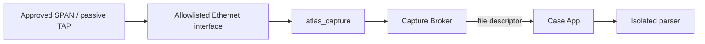

# Network execution and capture contract

_Status: normative for P0 packet-producing and live packet-receiving behavior. Current executable coverage is reported in [IMPLEMENTATION.md](../../IMPLEMENTATION.md)._

This document is the single authority for active grants, the initial Modbus operation, passive Capture Broker semantics and emergency-stop behavior. Other documents should link here rather than restating cryptographic or packet details.

## 1. Non-bypassable boundaries

- The Case App does not own a generic active-network API.
- Active OT traffic is emitted only by the **Network Broker** through compiled operations.
- Live raw Ethernet capture is performed only by the dedicated passive daemon behind the **Capture Broker**.
- Neither broker accepts shell commands, scripts, arbitrary packet bytes, port ranges or generic socket handles from the Case App.

The component/permission topology is defined in [SYSTEM-AND-DEPLOYMENT.md](SYSTEM-AND-DEPLOYMENT.md).

## 2. Active execution grant

The current grant model contains:

```text
grantId
caseId
authorizationHash
operation
networkHandle
targetIp
targetPort
unitId
scopeCidrs[]
exclusions[]
maxPackets
maxBytes
retries
timeoutMs
concurrency
issuedAt
expiresAt
nonce
```

Grant canonicalization is domain-separated with `ATLAS-GRANT-V1` and deterministic field ordering.

### Signature algorithm

Execution grants use an Android Keystore **EC P-256 (`secp256r1`) key** and **`SHA256withECDSA`**. The Network Broker is provisioned with the corresponding EC public key and verifies the signature before policy evaluation.

This is the canonical grant-signature definition. Ed25519 remains appropriate for content/signing uses where separately specified, but it is **not** the execution-grant algorithm.

### Grant policy

Before a socket is created, the Network Broker must reject a grant when any applicable condition fails. The initial P0 policy enforces:

- current time is inside the signed window;
- signed lifetime is no more than 60 seconds;
- nonce has not previously been consumed;
- operation is the compiled Modbus basic device-identification operation;
- target is a canonical IPv4 literal;
- TCP port is 502;
- unit ID is 0–247;
- exact target lies within at least one signed CIDR scope;
- exact target is not explicitly excluded;
- packet/byte/retry/timeout/concurrency ceilings are within compiled maxima;
- an approved Android `Network` handle is supplied.

The nonce is consumed before an allowed operation is released to the network path. Production durability/integrity of the replay record is a release concern; the current storage mechanism is reported only in [IMPLEMENTATION.md](../../IMPLEMENTATION.md).

## 3. Initial P0 active operation

Operation: `MODBUS_DEVICE_ID_BASIC`.

The request PDU is:

```text
Function       0x2B
MEI type       0x0E
ReadDevId code 0x01
Object ID      0x00
```

The MBAP/request template is:

```text
TT TT 00 00 00 05 UU 2B 0E 01 00
```

where `TT TT` is a broker-generated transaction ID and `UU` is the exact authorized unit ID.

The broker:

1. creates a socket only after grant validation;
2. binds the socket to `Network.fromNetworkHandle(grant.networkHandle)` with `Network.bindSocket`;
3. connects only to the signed target/port;
4. emits the compiled request;
5. accepts a bounded response;
6. validates transaction, protocol, unit, function, MEI, object IDs and declared lengths;
7. returns raw bounded evidence bytes to the Case App through a file descriptor;
8. closes the socket.

Basic response objects are limited to IDs `0x00`–`0x02` (vendor name, product code and revision). Response size is bounded to 512 bytes by the profile/policy.

The initial implementation has no subnet scan, port scan, unit-ID discovery, register operation, diagnostic function, credential path or arbitrary Modbus request API.

## 4. Emergency stop for active execution

The Network Broker maintains the active socket set and exposes an emergency-stop operation that closes active sockets. A stop does not expand or renew authorization; new execution requires a new valid grant.

The P0 acceptance plan defines the witnessed stop-time requirement. Test evidence belongs in [TEST-AND-ACCEPTANCE.md](../poc/TEST-AND-ACCEPTANCE.md), not here.

## 5. H2 live passive capture

The dedicated passive path is:



The Capture Broker AIDL contract exposes only:

```text
inspectInterfaces()
startPassiveCapture(interfaceId, maxBytes, durationMs, sinkFd)
stopCapture()
```

It accepts no BPF supplied by the UI, arbitrary output pathname, shell command, packet-send request or generic raw socket.

The native `atlas_capture` daemon:

- opens one `AF_PACKET/SOCK_RAW` socket;
- binds it to one interface index;
- requests promiscuous receive membership;
- uses `recv` to collect delivered Ethernet frames;
- writes bounded classic PCAP to a newly created mode-0600 file;
- stops on signal, duration or byte ceiling;
- contains no packet-send operation.

The appliance architecture must additionally enforce the no-address/no-egress interface posture defined in [DEDICATED-ANDROID-APPLIANCE.md](DEDICATED-ANDROID-APPLIANCE.md).

Promiscuous mode does not create switched-network visibility by itself. Third-party traffic is visible only when the switch/TAP actually delivers it to the capture interface.

## 6. H3 offline import

Offline capture import is non-transmitting:


The source remains immutable. Parsing results cannot silently replace the original artifact, and observations do not automatically become accepted inventory.

## 7. H4 radio observation

P0 radio evidence uses Android high-level scanning only. The product contract exposes no Wi-Fi association, deauthentication, raw 802.11 command path, BLE connection, pairing or GATT read/write operation.

## 8. Packet-safety proof

Release verification must independently observe packet behavior rather than rely only on broker logs. For an active profile, retained evidence includes the signed grant, broker result, external packet trace, expected packet template and negative tests for invalid scope/replay/limits. For live passive capture, tests prove receive behavior and absence of transmission from the capture backend.

The exact test matrix is owned by [TEST-AND-ACCEPTANCE.md](../poc/TEST-AND-ACCEPTANCE.md) and [Testing](../testing/README.md).
