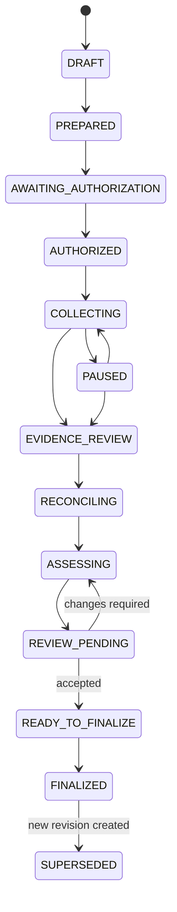

# Professional case model

_Status: normative case-lifecycle/domain contract for P0-WATER. Current executable coverage is reported only in [IMPLEMENTATION.md](../../IMPLEMENTATION.md). Physical persistence, artifact encryption and report materialization are specified separately in [EVIDENCE-DATA-MODEL.md](EVIDENCE-DATA-MODEL.md)._

The professional case is the aggregate root for an Atlas assessment. A site is context inside a case; it is not the professional record by itself. One case binds the assessment question, legal/physical context, scope, approvals, evidence methods, data handling, professional decisions, audit history and final revision.

## 1. Aggregate boundary

```text
AssessmentCase
├── identity: case ID, case number, revision, superseded snapshot
├── context: legal entity, site, process area, assessment pack
├── objective: question, requested decision, stakeholder, success criteria, evidence needs
├── scope: CIDRs, exclusions, methods, operations, interfaces/capture points/physical areas
├── data policy: classification, payload/raw-capture policy, export destination, deletion date
├── stop conditions
├── authorization: artifact hash, window, exact scope/data-policy fingerprints, approvals
├── review decision
├── append-only audit trail
└── finalized snapshot reference/material hashes
```

Evidence records are case-owned but are separate semantic layers. `CaseRecords.kt` provides typed records for sealed artifacts, expected records, observations, identity claims, reconciliation decisions, findings and object review decisions. A later layer does not overwrite an earlier one.

## 2. Typed identity

The domain uses distinct typed identifiers for cases, actors, authorizations, snapshots, artifacts, expected records, observations, claims, reconciliation decisions, findings and reviews. Storage/export adapters may serialize these as strings, but application code must not treat identifiers for different professional objects as interchangeable.

Every case has:

- a stable `caseNumber` representing the engagement lineage;
- a positive `revision`;
- a unique `CaseId` for that revision;
- for revision >1, the `SnapshotId` it supersedes.

A correction does not rewrite a finalized revision.

## 3. Lifecycle



`CANCELLED` and `EXPIRED` are terminal stop states for unfinished work. `FINALIZED` cannot resume collection or semantic mutation. Supersession appends lineage metadata to the previous case and creates a new `DRAFT` revision; the previous finalized snapshot remains unchanged.

## 4. Transition guards

The domain layer, not the UI, owns lifecycle guards.

### Prepare

A P0 case cannot become `PREPARED` unless it has:

- legal entity, site, process area and assessment pack;
- a decision-oriented assessment objective;
- at least one explicit collection boundary;
- at least one evidence method;
- explicit stop conditions;
- a data classification/policy;
- for H1, an exact CIDR scope and at least one admitted operation;
- for H2, an approved capture point.

For `P0-WATER`, the domain currently refuses active-operation scope containing anything other than `MODBUS_DEVICE_ID_BASIC`.

### Authorization

Authorization is a first-class professional object. It records:

- authorization ID and immutable authorization-artifact SHA-256;
- validity window;
- exact scope fingerprint;
- exact data-policy fingerprint;
- operational and security approvals with actor identities/roles/times.

A case cannot become `AUTHORIZED` if the authorization is expired, contains future approvals, or is bound to a different scope or data policy.

### Collection

Collection may start only in `AUTHORIZED` or `PAUSED` state, by an assessor, inside the authorization window. The case-domain operation guard additionally requires:

- `COLLECTING` state;
- operation admitted by case scope;
- target inside an allowed CIDR;
- target outside explicit exclusions.

This guard complements, rather than replaces, the signed execution-grant enforcement in [NETWORK-EXECUTION.md](NETWORK-EXECUTION.md).

### Review/finalization

The assessor moves reviewed evidence through reconciliation and assessment. Finalization requires:

1. case-level review requested;
2. an independent actor acting as `REVIEWER` records `ACCEPTED`;
3. the same reviewer finalizes the accepted revision;
4. finalization material identifies professional object hashes, tool build and content-pack hashes;
5. a `CASE_FINALIZED` audit event is appended;
6. the snapshot records the resulting audit-chain head.

A review returned as `CHANGES_REQUIRED` moves the case back to `ASSESSING`; it does not create a clean final report by deleting the review history.

## 5. Professional roles

The executable domain roles are:

| Role | Domain authority |
|---|---|
| `ASSESSOR` | Create/prepare case, request/record authorization, collect, reconcile, assess, request review, create successor revision |
| `OPERATIONAL_APPROVER` | Provide required authorization approval; may stop/pause collection |
| `SECURITY_APPROVER` | Provide required authorization approval; may stop/pause collection |
| `REVIEWER` | Accept/return the professional case review and finalize an accepted revision |
| `PACK_ADMINISTRATOR` | Supporting system/content role; not a substitute for assessor/approver/reviewer authority |

One human may hold more than one role when customer policy permits, but every professional action records the role under which it was performed.

## 6. Assessment objective

A professional case explicitly records the decision it is intended to support:

```text
question
requestedDecision
stakeholderRole
successCriteria[]
evidenceNeeded[]
```

This keeps collection tied to an evidence question rather than a generic scan. The objective is product/domain context; whether Atlas materially improves the customer's workflow remains a hypothesis to measure in evaluations.

## 7. Append-only audit chain

Material lifecycle actions create canonical audit events containing:

```text
sequence
case_id
UTC time
actor_id + actor_role
event type
object type + object id
details hash
previous event hash
event hash
```

`event_hash` is SHA-256 over a length-prefixed canonical representation of the event plus the previous hash. `AuditTrail.restore()` refuses a sequence/hash/previous-hash mismatch. The implemented chain detects alteration of retained/exported history; it does not by itself prevent physical deletion of the local database. External anchoring belongs to the signed finalized package.

## 8. Evidence/decision separation

The core domain now has separate typed records for:

```text
SealedArtifact
ExpectedRecord
ObservationRecord
IdentityClaim
ReconciliationDecision
FindingRecord
ObjectReviewDecision
```

Important invariants include:

- expected customer fields are preserved separately from normalized values;
- byte-range provenance cannot exist without an artifact reference;
- an identity claim cannot exist without evidence;
- claim confidence is explicit and separate from review state;
- reconciliation decisions retain rationale and actor role;
- finding confidence is separate from consequence/exposure;
- a finding requires evidence and does not become accepted merely because a rule emitted it.

The professional aggregate itself now has durable encrypted checkpoint persistence. Normalized evidence-record persistence, candidate scoring and reviewer UI remain separate implementation work.

## 9. Finalized snapshot and revision lineage

Finalization creates a `FinalizedSnapshot` that binds:

- case ID/number/revision;
- finalization time;
- authorization artifact hash;
- exact scope hash;
- exact data-policy hash;
- audit-chain head;
- hashes for the professional case material included in the snapshot;
- tool build identity;
- active content-pack identities;
- a deterministic snapshot content hash.

The report/export layer must render from this frozen snapshot/materialized representation rather than mutable working state. Signed JSON/CSV/HTML/PDF generation and external verification remain M6 work.

## 10. Current persistence boundary and remaining M1 work

The core-domain model deliberately retains no Android, SQLCipher or filesystem dependency. Persistence is split into a domain representation and an Android adapter.

### Executable foundation

The current code provides:

- a versioned deterministic `CaseCodec` for the complete aggregate, including authorization, review decision, finalized snapshot and exact audit events;
- explicit payload, string and collection bounds plus strict UTF-8 decoding;
- an envelope SHA-256 that detects accidental or unauthenticated payload modification before domain restoration;
- restore-time verification of audit-chain integrity, case state versus last event, authorization/scope/data-policy binding, review/finalization consistency, revision lineage and finalized-snapshot content hash;
- a SQLCipher aggregate-checkpoint repository in the Case App process;
- a random 256-bit database key wrapped with an Android Keystore AES-GCM key; the raw database key is not persisted in plaintext by the adapter;
- optimistic expected-version enforcement so stale application state cannot silently overwrite newer professional decisions;
- cross-checking of indexed row metadata against the decoded aggregate;
- SQLCipher page-integrity and SQLite logical-integrity verification paths.

The aggregate checkpoint is an implementation foundation, not the final report data model. The normalized storage contract in [EVIDENCE-DATA-MODEL.md](EVIDENCE-DATA-MODEL.md) remains authoritative for professional evidence/decision records.

### Remaining M1 work

Still required before the offline case is field-ready:

- normalized SQLCipher persistence for artifacts, expected rows, observations, claims, reconciliation decisions, findings, reviews and execution records;
- content-addressed encrypted artifact vault with per-case data keys and authenticated metadata;
- production key lifecycle, lock timeout/re-authentication policy and recovery behavior for unavailable/replaced Keystore keys;
- explicit schema migrations and migration fixtures beyond the initial aggregate-checkpoint schema;
- retention and secure-deletion workflow;
- Case App integration for role-aware authorization/reviewer actions and revision management;
- materialized finalized snapshots/export views and external anchoring.

The legacy `SiteRepository` used by existing PoC screens remains separate `SharedPreferences` state and must not be treated as professional case storage.

## 11. Persistence acceptance invariants

Persistence must preserve the domain rather than weaken it:

1. encoding the same aggregate twice produces identical bytes;
2. finalized and superseded aggregates round-trip with exact audit events and exact timestamp precision;
3. modified/truncated/oversized or semantically inconsistent payloads are rejected before use;
4. a loaded SQLCipher row must agree with the encoded aggregate identity, revision, state and version;
5. a stale expected version cannot overwrite a newer aggregate;
6. SQLCipher page integrity and SQLite logical integrity checks must pass for a healthy store;
7. the encrypted database must not expose a plaintext SQLite header on disk;
8. missing/corrupt wrapped-key metadata or an unavailable wrapping key fails closed rather than generating a replacement key for an existing store.

## 12. Domain acceptance invariants

The `core-domain` tests must maintain at least these properties:

1. complete authorized lifecycle can reach a finalized snapshot;
2. final state cannot restart collection;
3. operational and security approvals are both required;
4. authorization is bound to exact scope and data policy;
5. P0 cannot silently expand to undeclared active operations;
6. active targets must remain in scope and outside exclusions;
7. reviewer acceptance is required before finalization;
8. audit restoration rejects tampered history;
9. supersession creates a new revision linked to the previous snapshot;
10. evidence/claim/finding records enforce their provenance/evidence constraints.

Current executable coverage is summarized in [IMPLEMENTATION.md](../../IMPLEMENTATION.md); release-level proof remains governed by [TEST-AND-ACCEPTANCE.md](../poc/TEST-AND-ACCEPTANCE.md).
