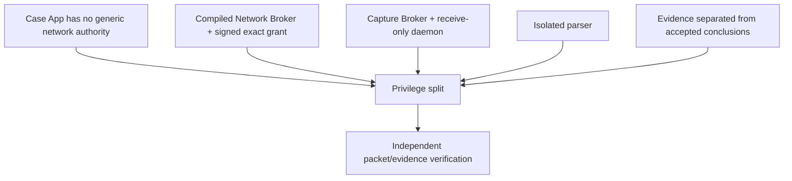

# Security architecture and threat model

_Status: P0 security model. Current implementation coverage is reported in [IMPLEMENTATION.md](../../IMPLEMENTATION.md)._

This document owns the **security argument, threat register and residual risks**. It does not redefine network packet formats, deployment topology or evidence schemas; those are authoritative in [NETWORK-EXECUTION.md](NETWORK-EXECUTION.md), [SYSTEM-AND-DEPLOYMENT.md](SYSTEM-AND-DEPLOYMENT.md) and [EVIDENCE-DATA-MODEL.md](EVIDENCE-DATA-MODEL.md).

## 1. Protected assets

| Asset | Security objective |
|---|---|
| OT availability and process safety | Atlas must not produce uncontrolled traffic or process-control actions |
| Authorization and scope | Cannot be silently widened, forged, replayed or used outside its window |
| Customer inventory/captures | Confidentiality, integrity, retention and controlled export |
| Evidence lineage | Conclusions remain traceable to unmodified source evidence and declared transformations |
| Findings and final report | Reviewable and resistant to silent alteration/substitution |
| Application/native binaries | Authentic release and reviewed dependency set |
| Industry/query content | Authentic, version-compatible and unable to inject arbitrary executable behavior |
| Device/operator identity | Prevent unauthorized case access and action |
| Passive capture path | Receive-only behavior and truthful visibility claims |

## 2. Adversaries and misuse

P0 considers:

- unauthorized physical access to the appliance;
- a malicious or compromised Android application;
- malicious PCAP/PCAPNG, CSV, image, document or content-pack input;
- malformed or oversized data from an OT endpoint;
- an assessor attempting to exceed authorized scope;
- stolen/compromised signing material or malicious update;
- alteration of inventory, findings or exported evidence;
- incorrect interface, stale authorization or operator error;
- loss/theft of a kit containing customer material.

The product does not claim to remain trustworthy under a fully compromised Android kernel. The dedicated-appliance controls reduce that risk; they do not remove it.

## 3. Primary security argument

The security case relies on **non-bypassable privilege separation plus evidence**, not on a UI warning. The Case App holds customer context but not generic socket authority; active and passive packet access are delegated to separate narrow components.

## 4. Threats and required controls

| ID | Threat | Required control | Verification authority |
|---|---|---|---|
| T-NET-01 | Case/UI code exfiltrates customer data | Case App has no Android `INTERNET`; no unapproved telemetry path | Architecture checks and offline traffic test |
| T-NET-02 | Active broker sends arbitrary traffic | Closed operation set; signed grant; no raw-byte/generic socket API | Network contract + external packet trace |
| T-NET-03 | Wrong network is used | Active socket bound to the signed Android network handle | Network contract + route/device tests |
| T-NET-04 | Grant replay | Single-use nonce consumed before execution | Policy tests and restart/replay tests |
| T-NET-05 | Grant scope/limits are modified | P-256 `SHA256withECDSA` signature over canonical grant | Domain/broker tests |
| T-NET-06 | Traffic continues after stop | Active socket registry and local emergency stop | Witnessed cancellation test |
| T-CAP-01 | Passive path transmits to OT | Receive-only daemon API, no packet-send path, no-address/no-egress appliance policy | Native syscall/physical zero-egress test |
| T-CAP-02 | Capture visibility is overstated | Visibility type and capture source are mandatory evidence; SPAN/TAP requirement explicit | Method/report review |
| T-PAR-01 | Malformed evidence compromises parser | Isolated process, bounded parsers, fuzz/malformed-input gates | Parser test plan |
| T-PAR-02 | Parser output overwhelms/corrupts case | Bounded typed results and transactional review boundary | Data-model tests |
| T-EVD-01 | Source evidence is altered | Content hash and immutable/sealed artifact model | Evidence-model integrity tests |
| T-EVD-02 | Transformation loses provenance | Parser/rule/content version and source offsets/references retained | Traceability tests |
| T-EVD-03 | Observation silently becomes fact | Analyst review separates observation, claim, asset and finding layers | UX/domain tests |
| T-EVD-04 | Final report is substituted | Final snapshot, manifest hashes and external signature verification | Export-verifier test |
| T-DATA-01 | Lost device exposes cases | Encrypted case/vault, Keystore-backed wrapping and authentication policy | Physical/device security test |
| T-DATA-02 | Report exports unnecessary secrets | Data minimization and explicit raw-capture inclusion policy | Golden privacy test |
| T-PACK-01 | Content pack adds arbitrary code/network behavior | Data-only pack format; compiled operations remain closed | Schema/static review |
| T-PACK-02 | Vulnerable/old pack is silently activated | Signed versioned packs with rollback policy | Pack tests |
| T-SUP-01 | Dependency/build compromise | Pinned build inputs, SBOM, provenance and release signing | Release gate |
| T-OPS-01 | Human authorizes unsafe scope | Exact site/process/target review and explicit stop authority | Rehearsal |

## 5. Signing roles

Different objects have different trust purposes; one algorithm is not assumed for everything.

| Object | Canonical mechanism |
|---|---|
| Android APK/system image | Android/platform release-signing process |
| Active execution grant | **EC P-256 (`secp256r1`) with `SHA256withECDSA`** as defined in [NETWORK-EXECUTION.md](NETWORK-EXECUTION.md) |
| Industry/query content | Signed versioned content; final release mechanism is governed by the pack implementation/release design |
| Final assessment package | External signature and hash verification defined by [EVIDENCE-DATA-MODEL.md](EVIDENCE-DATA-MODEL.md) and the P0 release gate |

Do not copy the execution-grant algorithm into another document as an independent definition.

## 6. Parser and evidence isolation

Untrusted captures are parsed outside the main Case App process authority. The parser receives read-only evidence and returns bounded typed observations. Raw evidence is preserved, and semantic layers are added rather than overwriting the source.

The full evidence lineage, storage and finalization model is owned by [EVIDENCE-DATA-MODEL.md](EVIDENCE-DATA-MODEL.md).

## 7. Dedicated passive-capture security

The passive path is not a general rooted shell. The target appliance confines raw receive capability to the native capture daemon and exposes only bounded Capture Broker operations to the Case App.

Required field invariants include:

- allowlisted capture interface;
- no IP address or routing role on the OT-facing capture interface;
- no packet-send operation in the capture daemon contract;
- byte/time ceilings;
- explicit capture source and visibility labeling;
- zero-egress and packet-loss verification on each supported hardware combination.

Detailed mechanics and hardware gates belong in [DEDICATED-ANDROID-APPLIANCE.md](DEDICATED-ANDROID-APPLIANCE.md).

## 8. Supply-chain and release gates

A release record must include the dependency/SBOM state, build provenance, applicable parser/fuzz results, packet-safety evidence, appliance compatibility evidence, threat-model review and open security defects. Blocking security defects prevent a field release.

Milestone status is tracked only in [ROADMAP.md](../../ROADMAP.md), and current implemented controls only in [IMPLEMENTATION.md](../../IMPLEMENTATION.md).

## 9. Residual risks

Even after the required controls:

- Android/vendor kernel compromise can undermine process boundaries;
- an allowed identity request can still trigger a defect in fragile OT firmware;
- SPAN/TAP configuration can be incomplete or incorrect;
- passive observation can miss dormant assets or encrypted semantics;
- customer documents, captures and photos can contain sensitive operational information;
- a privileged laboratory/unlocked phone is weaker than a production verified-boot appliance;
- human approvers can authorize an unsafe scope;
- correct technical output may still be misinterpreted by an assessor.

These risks are disclosed; they are not hidden by a confidence score.
