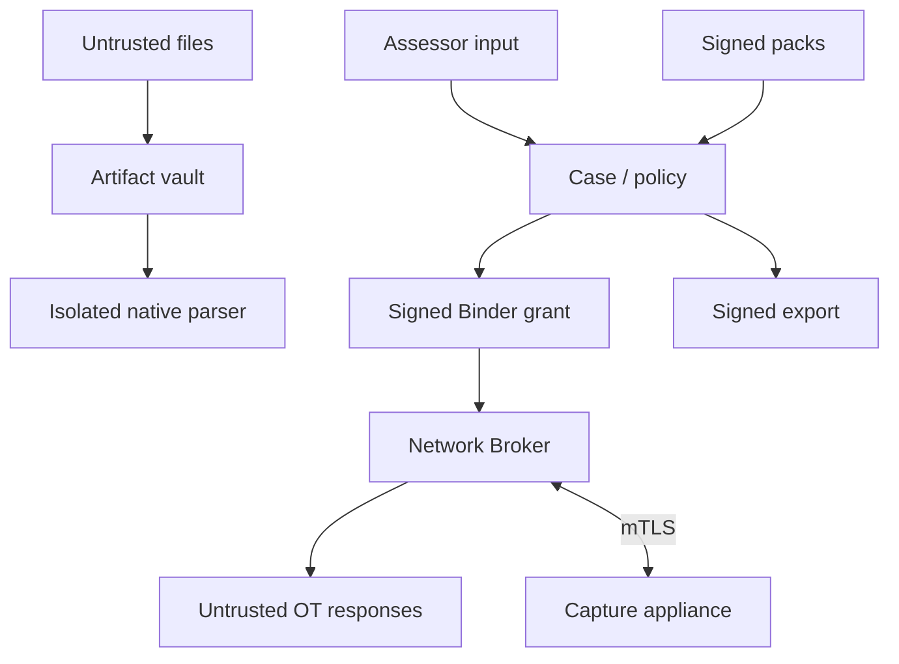
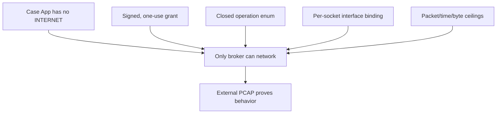
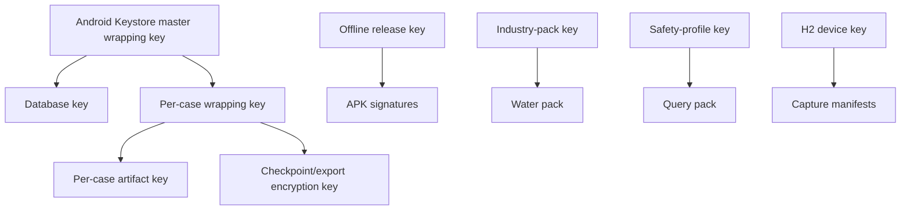
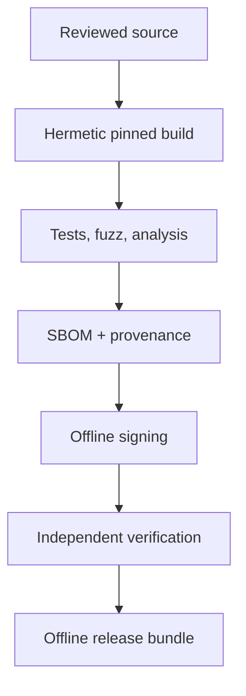

# Security Architecture and Threat Model

_Status: P0 design threat model. Must be converted into tracked security requirements and reviewed before M4._

## 1. Protected assets

| Asset | Security objective |
|---|---|
| OT availability and process safety | Atlas must not cause uncontrolled traffic or control change |
| Authorization/scope | Cannot be widened, forged, replayed or silently expired |
| Customer inventory and captures | Confidentiality, integrity, retention and controlled export |
| Evidence lineage | Facts trace to unmodified artifacts and declared transformations |
| Assessment findings | Deterministic, reviewable and resistant to silent alteration |
| App/broker/parser binaries | Authentic release and known dependency set |
| Query/industry packs | Authentic, version-compatible and rollback protected |
| Device/operator identity | Prevent unauthorized case access/action |
| Capture appliance | Receive-only behavior and authentic captured bytes |

## 2. Adversaries and misuse

- unauthorized person with temporary physical access to phone/accessory;
- malicious or compromised Android app on the same device;
- malicious file supplied as PCAPNG, CSV, image, PDF or pack;
- compromised OT endpoint returning malformed or oversized protocol data;
- assessor attempting to exceed authorized scope;
- stolen signing key or malicious update;
- network attacker on the H2 management Wi-Fi;
- customer insider altering inventory/report evidence;
- accidental misconfiguration, wrong interface or stale authorization;
- lost/stolen kit after an assessment.

P0 does not claim resistance to a fully compromised Android OS/kernel. Dedicated-device controls and integrity checks reduce, but do not eliminate, that risk.

## 3. Attack-surface map

High-risk boundaries are parser input, broker IPC, OT responses, capture-appliance channel, pack activation and exported data.

## 4. Primary security argument

A policy check inside a normal UI process would be bypassable by any compromised code in that process. P0 instead uses Android package/UID separation: the data-rich Case App has no network permission, and the data-poor Network Broker has no case database or general command interface.

## 5. Threats and controls

| ID | Threat | Control | Verification |
|---|---|---|---|
| T-NET-01 | UI/library exfiltrates customer data | Case App lacks INTERNET; no analytics/WebView | Manifest test; offline traffic capture |
| T-NET-02 | Broker sends arbitrary packets | Closed implementation enum; signed grant; no raw-byte API | API review; external packet golden tests |
| T-NET-03 | Wrong interface/cellular used | `Network.bindSocket`, interface fingerprint and route callback | Route-change instrumentation test |
| T-NET-04 | Grant replay | 128-bit nonce consumed before socket; 60 s grant life | replay/crash tests |
| T-NET-05 | Scope/profile modified | Ed25519 signature over canonical grant and hashes | mutation tests |
| T-NET-06 | Excess traffic after cancellation | FD/socket registry and broker-wide atomic stop flag | <1 s witnessed stop |
| T-PAR-01 | Malformed PCAP causes memory corruption | Rust checked parsers, isolated UID, caps, fuzzing | sanitizer/fuzz gate |
| T-PAR-02 | Parser output floods/corrupts DB | bounded protobuf batches, staging tables, output hash | oversized/out-of-order tests |
| T-EVD-01 | Artifact altered after import | append-only seal, content hash, encrypted vault | tamper test |
| T-EVD-02 | Evidence transformed without provenance | parser/rule/pack version and byte offsets | traceability test |
| T-EVD-03 | Reviewer silently changes finding | revision history and audit-chain transaction | DB/history test |
| T-H2-01 | Capture appliance bridges OT to phone | no IP on eth0, forwarding disabled, single OT port | zero-transmit and route test |
| T-H2-02 | Attacker impersonates appliance | QR-pinned device key + TLS 1.3 mutual auth | rogue AP/server test |
| T-H2-03 | Capture chunks altered/dropped | chunk hashes, signed manifest, counts/sequence | mutation/omission test |
| T-PACK-01 | Malicious pack adds code/operation | data-only packs; implementation ID closed enum | schema/static tests |
| T-PACK-02 | Old vulnerable pack installed | monotonic activation version and rollback store | rollback test |
| T-KEY-01 | Lost phone exposes cases | Keystore-wrapped keys, device credential, timeout | locked-device extraction test |
| T-KEY-02 | Signing key compromised | separated release/pack/safety keys, rotation/revocation | incident drill |
| T-EXP-01 | Report leaks payload/secrets | field allowlist, redaction policy, captures opt-in | golden privacy test |
| T-EXP-02 | Export substituted | signed manifest with all hashes and audit head | external CLI |
| T-OPS-01 | Assessor selects production accidentally | prominent site/process/interface confirmation and two approvers | human-factors rehearsal |
| T-OPS-02 | “Not observed” reported as absent | visibility type mandatory; report wording rule | report schema/golden test |
| T-SUP-01 | Dependency/build compromise | pinned hashes, hermetic CI, SBOM, signed provenance | reproducible-build comparison |

## 6. Key hierarchy

Release, industry-pack and safety-profile keys are separate. The safety-profile key cannot sign APKs; release key cannot silently produce a trusted query-pack version without the independent pack release process.

### Case key lifecycle

1. Generate random per-case key on device.
2. Wrap under hardware-backed Keystore key when available.
3. Require device credential/biometric to unwrap after inactivity.
4. Keep plaintext key only in process memory; clear buffers best-effort.
5. Finalized export may be encrypted with a customer-supplied passphrase/key using a documented KDF.
6. Retention deletion destroys wrapped case key first.

P0 does not store OT credentials.

## 7. Signing and canonicalization

| Object | Algorithm | Signer |
|---|---|---|
| APK/AAB | Android APK Signature Scheme current supported versions | Offline release key |
| Industry pack | Ed25519 | Industry-pack release key |
| Query profile pack | Ed25519 | Independent safety-profile key |
| Execution grant | Ed25519 | Case App device key |
| Broker receipt | Ed25519 | Broker installation key |
| H2 manifest | Ed25519 | Provisioned H2 device key |
| Assessment manifest | Ed25519 | Case App assessment key |

Signatures cover domain-separated bytes such as `ATLAS-GRANT-V1 || canonical_protobuf` to prevent cross-object substitution.

## 8. Broker hardening

- separate APK/UID;
- no exported activities/providers/receivers;
- one explicitly exported bound service protected by signature permission;
- caller UID/certificate verification every bind and request;
- no dynamic feature/code loading;
- R8 minification is not a security control but reduces surface;
- native code limited to OPC UA adapter only if required;
- strict network-security configuration;
- no DNS by default;
- no persistent customer data;
- journal contains only consumed nonce hashes and signed receipts;
- foreground notification names case, target and operation;
- Android component and dependency inventory reviewed per release.

## 9. Parser hardening

- isolated process with no permissions;
- seccomp/Android sandbox inherited;
- read-only input FD, write-only result pipe;
- Rust safe code by default;
- caps at every layer;
- watchdog wall/CPU time;
- one job per worker; process recycled after configured workload;
- malformed field recorded without raw payload in logs;
- host and Android corpora produce the same hash;
- native dependency count minimized.

## 10. Capture-appliance hardening

The PoC Raspberry Pi is not treated as inherently trusted:

- pin OS image hash and device public key;
- disable remote/cloud services;
- no address/transmission on OT interface;
- default-deny management firewall;
- ephemeral encrypted spool;
- no shell/API command execution;
- signed manifests;
- enclosure seal;
- reimage between unrelated customers;
- external zero-transmit test before customer use.

Commercial release requires hardened verified boot/storage or a qualified capture product.

## 11. Supply-chain architecture

Release bundle contains APKs, packs, H2 image, verification CLI, SBOM, provenance, compatibility matrix and test record. Installation verifies every checksum/signature offline.

## 12. Security gates

| Gate | Required evidence |
|---|---|
| Before M2 | parser threat model, fuzz harness and isolated-process test |
| Before M4 | broker API review, grant canonicalization review, packet golden tests |
| Before M5 | H2 zero-transmit, mTLS, image and spool security tests |
| Before M6 | privacy/redaction review and export-verifier test |
| Before customer PoC | external mobile/native review; no open Critical/High |
| Before commercial release | production capture hardware decision, key-management runbook, update/revocation service design |

## 13. Residual risks

- Android OS/vendor firmware compromise can undermine app boundaries.
- A permitted A1 identity request can still trigger a defect in a fragile device.
- SPAN configuration can be incomplete or wrong.
- Passive observation can miss dormant assets and encrypted semantics.
- Physical photos/inventory can contain sensitive operational information.
- Raspberry Pi PoC capture hardware lacks final commercial assurance.
- Human approvers can authorize an unsafe scope.

These are displayed in release and assessment documentation; none is hidden behind a confidence score.
