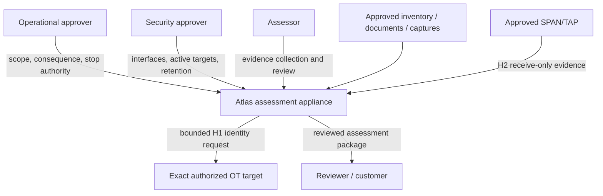
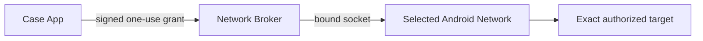
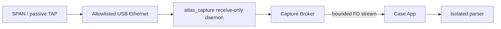
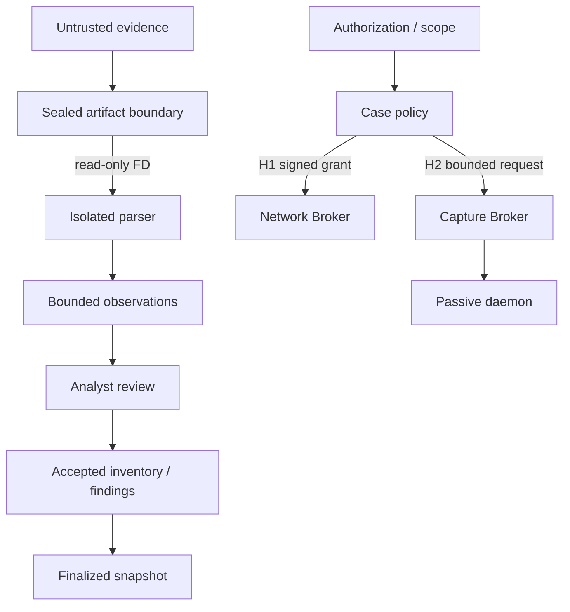

# System context and deployment architecture

_Status: normative P0 architecture. Current executable coverage is reported in [IMPLEMENTATION.md](../../IMPLEMENTATION.md)._

This document owns the **deployment topology, component privileges and trust boundaries**. Exact network operations are defined in [NETWORK-EXECUTION.md](NETWORK-EXECUTION.md), data semantics in [EVIDENCE-DATA-MODEL.md](EVIDENCE-DATA-MODEL.md), and security threats in [SECURITY-AND-THREAT-MODEL.md](SECURITY-AND-THREAT-MODEL.md).

## 1. System context

Atlas owns collection integrity, evidence lineage and deterministic product behavior. The customer owns authorization, process consequence, network configuration, authoritative records and acceptance of remediation.

## 2. Runtime boundaries

| Boundary | Identity | Permitted authority | Forbidden authority |
|---|---|---|---|
| Case App | `com.atlasot.scout` | UI, case policy, document import, evidence review, inventory and report state; high-level approved Wi-Fi/BLE observation | Android `INTERNET`, raw sockets, arbitrary network commands |
| Network Broker | `com.atlasot.netbroker` | Compiled active operations on an explicitly selected Android `Network` | Case database, generic scanner/socket API, arbitrary payloads |
| Capture Broker | `com.atlasot.capturebroker` | Inspect allowlisted passive interfaces; request one bounded receive-only capture; stream bytes by file descriptor | Internet access, packet injection, shell commands, arbitrary output paths |
| Parser worker | isolated process hosted by Case App | Parse sealed read-only evidence and return bounded observations | Network, case keys, general database access |
| `atlas_capture` daemon | platform component in a dedicated SELinux domain | `AF_PACKET` receive on an allowlisted capture interface and bounded PCAP creation | Packet-send API, general routing/IP service, application UI |

The application boundaries are separately addressable Android identities. Active and passive privilege are deliberately split: the data-rich Case App cannot open arbitrary network sockets; the active Network Broker and passive Capture Broker expose narrow typed contracts.

## 3. Deployment profiles

### Compatibility profile

A normal Android build supports H3 imported evidence and the separately constrained H1 Network Broker where platform/network policy allows it. It does not claim whole-segment live passive capture.

### Dedicated appliance profile

The target field appliance is a signed Android system image containing the Case App, Network Broker, Capture Broker, isolated parser and the confined `atlas_capture` platform daemon. The laboratory platform selection and hardware evidence are maintained under [Appliance integration](../appliance/README.md).

The dedicated appliance does not expose a general-purpose root mode to the user.

## 4. Evidence modes

### H1 — exact active identity

H1 is packet-producing and therefore governed entirely by [NETWORK-EXECUTION.md](NETWORK-EXECUTION.md).

### H2 — live passive SPAN/TAP

The capture interface must be treated as a receive-only evidence interface. Root or promiscuous mode does not defeat Ethernet switching: useful third-party visibility still requires the network to deliver mirrored/TAP traffic to that interface.

The detailed daemon/broker contract and acceptance invariants are in [Dedicated Android appliance](DEDICATED-ANDROID-APPLIANCE.md) and [Network execution](NETWORK-EXECUTION.md).

### H3 — offline evidence import

PCAP/PCAPNG and other approved evidence enter through Android file-selection APIs, are hashed/sealed and are parsed through the isolated parser. H3 has no packet-producing network behavior.

### H4 — approved radio observation

Wi-Fi/BLE evidence uses Android high-level scan APIs. P0 does not expose Wi-Fi association/deauthentication, raw monitor-mode commands, BLE connection or GATT interaction as assessment actions.

## 5. Trust flow

No later semantic layer erases the evidence layer that supports it. The canonical data relationships are in [EVIDENCE-DATA-MODEL.md](EVIDENCE-DATA-MODEL.md).

## 6. Package and IPC rules

- Cross-package broker entry points are signature-protected and callers are validated.
- The Network Broker accepts typed grant envelopes, not raw packet bytes, shell commands, port ranges or arbitrary URLs.
- The Capture Broker accepts an allowlisted interface identifier plus byte/time limits and a sink file descriptor, not arbitrary capture commands.
- The parser receives sealed evidence by file descriptor and has no network authority.
- Content/industry packs can select only behavior already admitted by the compiled product contracts; they cannot inject executable network code.

## 7. Installation and field posture

The dedicated appliance profile requires a pinned signed build, approved packages/packs, recorded device identity, no general-purpose root manager, and hardware acceptance before live passive capture is represented as supported. Laboratory platform details and exact model restrictions are maintained in [ROOTED-ANDROID-POC.md](../appliance/ROOTED-ANDROID-POC.md) and [COMPATIBILITY-MATRIX.md](../appliance/COMPATIBILITY-MATRIX.md).

No collection automatically resumes after process/device restart. Authorization, interface state and case conditions are re-evaluated.

## 8. Environment interpretation

| Environment | What it can prove |
|---|---|
| JVM/native CI | Domain, parser and native-daemon behavior |
| Android emulator | Application, IPC, policy and UI journeys |
| Isolated protocol lab | Bounded active behavior against controlled endpoints |
| Virtual SPAN test | Receive-only daemon behavior on virtual Ethernet |
| Physical compatibility bench | USB/NIC/TAP, image, power, packet-loss and interface invariants |
| Customer evaluation | Authorized workflow usefulness in a bounded customer environment |

A result from one environment must not be described as qualification of a stronger environment.
