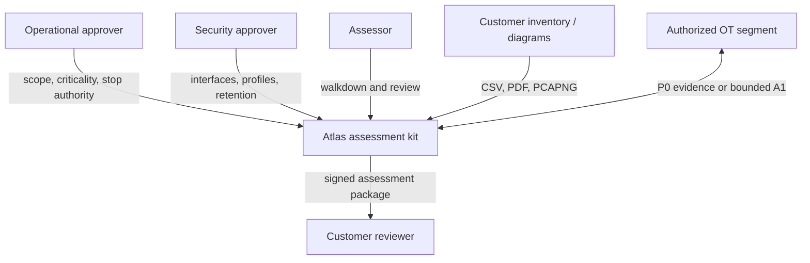
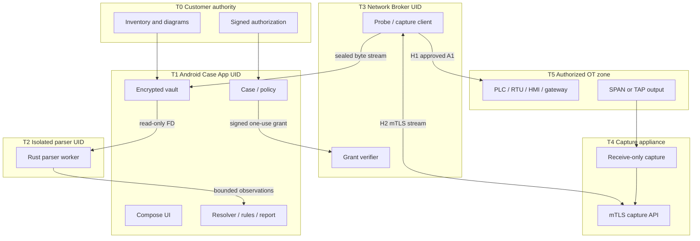
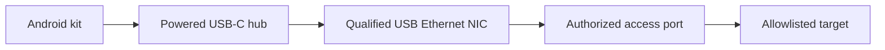
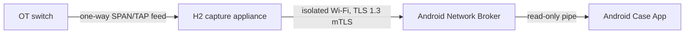
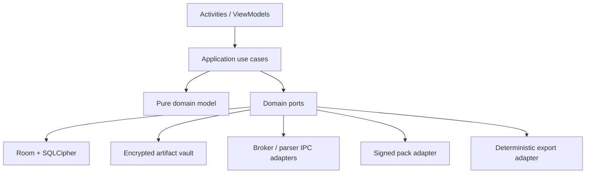

# System Context and Deployment Architecture

_Status: normative for P0-WATER._

## 1. System context

Atlas owns collection integrity, evidence lineage and deterministic analysis. The customer owns authorization, process consequence, authoritative inventory, network configuration and acceptance of remediation.

## 2. Product boundary

The deliverable is a kit with two signed Android packages and an optional capture appliance:

| Deployable | Package/process | Network authority | Sensitive storage |
|---|---|---|---|
| Atlas Case App | `com.atlasot.scout` | **No INTERNET permission**; Android Wi-Fi scan, BLE scan, camera, document import and USB enumeration only | SQLCipher case DB, encrypted artifacts, Keystore case keys |
| Atlas Network Broker | `com.atlasot.netbroker` | INTERNET/local-network plus network-state; foreground service; only compiled operations | No database, customer inventory or long-term artifacts |
| Parser Worker | isolated service hosted by Case App | No permissions; Android isolated UID | No key; receives read-only file descriptor |
| H2 Capture Appliance | Raspberry Pi reference image | Receive-only OT Ethernet; isolated Wi-Fi API to Network Broker | Encrypted temporary PCAPNG spool |

Android assigns applications distinct UIDs and sandboxes them, including native code ([Android security](https://developer.android.com/privacy-and-security/security-tips)). Cross-package broker binding is protected by a custom `signature` permission; Android grants signature permissions only to apps signed with the same certificate ([Android permissions](https://developer.android.com/guide/topics/permissions/overview)).

The split is deliberate: UI/report code cannot open a socket because its APK does not request network permission. Only the small Network Broker can transmit.

## 3. Deployment and trust boundaries

Trust does not flow automatically across a boundary. Every arrow has a typed, validated contract and an audit event.

## 4. Physical deployment

### H1 — direct identity query

- Only the Network Broker APK has socket authority.
- The socket is bound to the selected Android `Network` before connect; Android documents per-socket binding as forcing traffic through that network ([Network.bindSocket](https://developer.android.com/reference/android/net/Network)).
- No default-route or cellular fallback is allowed.
- H1 does not claim third-party passive visibility.

### H2 — passive SPAN/TAP

- Capture-appliance `eth0` has no IP configuration and must emit zero Ethernet frames.
- The Android phone is never bridged to the OT segment.
- The appliance API is reachable only on its isolated Wi-Fi management network.
- The complete reference design is [CAPTURE-ACCESSORY.md](../poc/CAPTURE-ACCESSORY.md).

### H3/H4 — offline and radio evidence

H3 imports files through Android’s Storage Access Framework. H4 records Android Wi-Fi scan results and BLE advertisements; it does not use monitor mode, deauthentication or BLE connections.

## 5. Android package permission architecture

### Case App manifest ceiling

Allowed permissions/features:

- camera, only when operator invokes physical evidence;
- Bluetooth scan with runtime permission;
- Wi-Fi state/scan permissions appropriate to target API;
- USB host feature;
- biometric/device credential;
- foreground data processing only if needed for local import;
- notifications.

Forbidden:

- `INTERNET`;
- `MANAGE_EXTERNAL_STORAGE`;
- VPN service;
- accessibility service;
- package installation;
- root/su;
- background location;
- SMS, contacts, microphone and advertising ID.

### Network Broker manifest ceiling

Allowed:

- `INTERNET`, `ACCESS_NETWORK_STATE`, local-network permission when enforced by target Android;
- foreground service for connected-device/data transfer;
- notifications;
- bound-service export protected by `com.atlasot.permission.BIND_NETWORK_BROKER` with `signature` protection.

Forbidden:

- camera, Bluetooth scan, location, contacts;
- broad external storage;
- database provider;
- exported activity;
- dynamic code loading;
- WebView;
- arbitrary URL handlers.

The broker verifies the caller’s signing certificate and package name in addition to the signature permission.

### Parser worker

`android:isolatedProcess="true"` gives the service an isolated process with no permissions of its own; communication is only through the service API ([Android service element](https://developer.android.com/guide/topics/manifest/service-element)). It receives sealed file descriptors and returns protobuf batches. It cannot open the case database or network.

## 6. Runtime nodes

Dependency rule: adapters depend inward on domain ports. Domain and use-case modules do not depend on Android networking, Room entities, SQLCipher, JNI or report-rendering libraries.

## 7. Deployable artifacts

| Artifact | Contents | Signature |
|---|---|---|
| `atlas-case.apk` | Case UI, domain, vault, rules, report, parser service declaration | Android release certificate |
| `atlas-netbroker.apk` | Grant verifier, interface selector, four compiled A1 operations, H2 client | Same Android release certificate |
| `parser-core.aar/.so` | Rust parsers and JNI bridge, bundled only in Case App | Covered by APK signature and build provenance |
| `water-pack.atlaspack` | Taxonomy, mappings, deterministic rules, references | Ed25519 pack key |
| `query-pack.atlaspack` | Query profiles referencing compiled implementation IDs | Separate Ed25519 safety key |
| H2 OS image | Minimal capture appliance image | Image signing key |
| Verification CLI | Offline manifest/hash/signature validation | Release signature/checksum |

Compromise of a content-pack key cannot add executable network behavior because profiles reference a closed enum compiled into the broker.

## 8. Installation and provisioning

1. Verify device model/build against compatibility matrix.
2. Factory-reset or enroll dedicated Android device.
3. Install Case App and Network Broker from signed offline release bundle.
4. Verify both package certificate digests and build manifest.
5. Create operator identity and hardware-backed case master key.
6. Install signed water/query packs.
7. Provision H2 appliance public key by scanning its physical QR label.
8. Run self-test: Keystore, DB, storage reserve, broker binding, parser isolation, USB, Wi-Fi/BLE permission state.
9. Export signed provisioning record.

Field mode is disabled when developer options, debugger attachment, root indicators, package-certificate mismatch, unapproved OS build or failed hardware attestation policy is detected. Lab mode remains available and is watermarked.

## 9. Availability and failure containment

| Fault domain | Cannot directly affect | Recovery |
|---|---|---|
| UI crash | Network broker grant budget; sealed artifacts | Restart app and resume from DB state |
| Parser crash | Raw artifact, network, database key | Kill isolated worker; mark batch failed; retry different worker |
| Broker crash | Case database/report | Android closes sockets; case records broker death |
| H2 appliance loss | Finalized local evidence | Seal received chunks; mark incomplete capture |
| Report renderer failure | Finalized snapshot/evidence | Retry renderer; normative JSON unchanged |
| Corrupt pack | Existing activated pack | Reject update and retain last trusted version |
| Device power loss | Previously sealed DB transactions/artifacts | Integrity check and explicit interrupted event |

No collection automatically resumes after process/device restart. Authorization and interface conditions are reevaluated.

## 10. Environments

| Environment | Real network actions | Data |
|---|---|---|
| Unit/CI | None | Synthetic |
| Emulator | Mock broker/parser | Synthetic |
| Protocol lab | Compiled A1 to simulators/physical lab PLC | Synthetic |
| Rehearsal | H1/H2 on isolated water lab | Synthetic customer-style |
| Customer PoC | Authorized H1/H2 only | Customer controlled |
| Production | Blocked until PoC release gates | Customer controlled |

The [architecture index](README.md) is the canonical route to component, data, security and deployment contracts.
