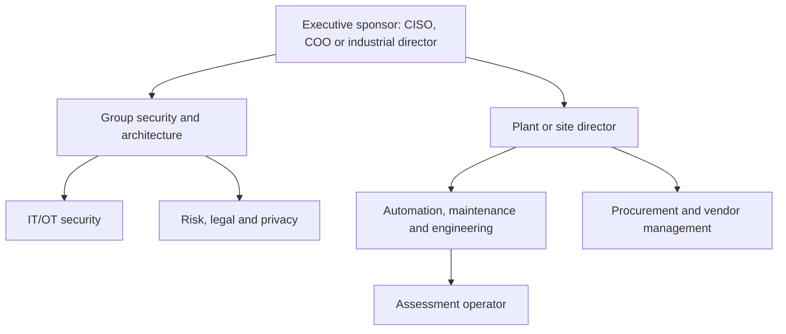

# Customer organization and ethical outreach

## Why organization mapping matters

OT assessment purchases cross safety, operations, security and procurement. A list of CISOs alone will fail because the plant controls access and production risk; a list of maintenance engineers alone may lack budget and governance authority.

## Typical enterprise buying map

## Role-level research

| Role | Authority | Core concern | Message | Evidence requested |
|---|---|---|---|---|
| Group CISO/security director | policy and budget | uncontrolled OT exposure | governed cross-site evidence | logs, architecture, integrations |
| Industrial/operations director | production outcome | uptime and standardization | baseline without permanent deployment | safety case and downtime impact |
| Plant director | site authorization | disruption and accountability | observe first, bounded scope | runbook, exclusions, stop control |
| Automation/maintenance manager | technical acceptance | accurate identity and useful detail | vendor/protocol-aware evidence | lab coverage and raw observations |
| IT/OT architect | design approval | segmentation and data flow | offline architecture/export | threat model and schemas |
| Quality/validation | regulated change | validated state and traceability | passive evidence and immutable audit | change-control mapping |
| Procurement | contract | supplier continuity and price | local partner and clear package | SLA, insurance, license |
| DPO/legal | lawful processing | capture contents and retention | minimization and controlled export | privacy impact assessment |
| Integrator/MSSP owner | route to market | margin and differentiation | repeatable branded service | service blueprint and partner economics |

## Public professional-network research protocol

For each priority account:

1. Verify the company's official website and legal/operating entities.
2. Record the official LinkedIn **company** page.
3. Search role families such as “industrial cybersecurity,” “automation,” “maintenance,” “plant director,” “OT,” “SCADA” and “digital manufacturing.”
4. Record only name, current public title, company, public profile URL, source date and relevance in an access-controlled CRM.
5. Re-verify before contact; titles change.
6. Use a corporate route, mutual introduction or platform messaging unless the individual explicitly publishes a business email.
7. Record lawful basis, do-not-contact status and retention.
8. Never infer email patterns, scrape at scale or commit personal leads to Git.

## Account research status

| Account | Official source | LinkedIn company page found | Public operational structure | Corporate contact route | Named-person research in Git |
|---|---:|---:|---:|---:|---:|
| OCP Group | yes | yes | partial through governance/business pages | yes | prohibited |
| Renault Group | yes | yes | plant and group layers visible | yes | prohibited |
| Stellantis | yes | yes, global | plant/regional layers inferable | yes | prohibited |
| Tanger Med | yes | yes | group, authority, zones and terminals visible | yes | prohibited |
| Managem | yes | yes/company search | executive operations roles published | yes | prohibited |
| Safran | yes | yes | country and multiple site/legal entities | yes | prohibited |
| Masen | yes | yes/company search | governance published | yes | prohibited |
| Cosumar | yes | yes/company search | group/site footprint | yes | prohibited |
| Holcim Maroc | yes | yes/company search | group/site structure | yes | prohibited |
| Sothema | yes | yes/company search | manufacturing/quality structure inferable | yes | prohibited |

“Found” means a public page was found during desk research, not that LinkedIn data may be bulk processed.

## Outreach sequences

### Integrator

1. Send the one-page partner economics and safety boundary.
2. Offer a 45-minute lab workflow demonstration.
3. Ask for a paid jointly delivered baseline, not an open-ended product interview.
4. Provide branded report and margin options.
5. Convert recurring use to Team/Partner licensing.

### Industrial owner

1. Lead with a trigger: handover, baseline, audit or site onboarding.
2. Provide scope and packet-behavior annex before demo.
3. Demonstrate on a lab twin or imported capture.
4. Quote a controlled outcome with exclusions.
5. After delivery, show measured reconciliation time and remaining unknowns.

## Qualification fields

Trigger, number of sites, assessment frequency, asset count band, permitted visibility method, languages, current inventory system, continuous-monitoring incumbent, procurement band, safety approver, data-retention limit and decision date.
