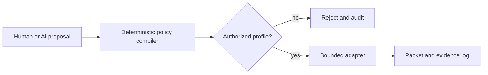

# Open-source and reuse due diligence

## Decision framework

A useful protocol library is not automatically safe or economically suitable. Evaluate protocol depth, passive parsing, ability to suppress writes, memory safety, malformed-input posture, ARM64/Android build, cancellation, maintenance, license, transitive dependencies and test corpus.

## Candidate matrix

| Project | Capability | License reported upstream | Architecture fit | Major concern | Disposition |
|---|---|---|---|---|---|
| open62541 | OPC UA client/server | MPL-2.0 | portable C; Android NDK feasible | large feature surface; certificates and parser hardening | prototype candidate, minimal client build |
| libmodbus | Modbus RTU/TCP | LGPL-2.1-or-later | small portable C | API includes writes; LGPL distribution obligations | adapter candidate behind hard gate |
| libplctag | Allen-Bradley/CIP and Modbus | MPL-2.0 or LGPL-2+ | C, ARM support | tag read/write orientation exceeds identity need | evaluate identity subset; may implement smaller parser |
| pycomm3 | EtherNet/IP/Allen-Bradley | MIT | excellent lab oracle | Python runtime/package footprint on Android | test/reference, not production core |
| PCAPdroid | Android local-device capture/export | GPL-3.0 | native Android reference | captures device traffic via VPN/root modes, not arbitrary LAN visibility; strong copyleft | architectural study or separated compatible use only |
| Wireshark | extensive dissectors | GPL-2+ | authoritative lab oracle | huge footprint and GPL product implications | lab verification; do not embed by default |
| Zeek + ICSNPP | passive OT metadata | component-specific | strong offline/backend analysis | server footprint, Zeek runtime, mobile mismatch | golden-output oracle and optional companion |
| Malcolm | integrated passive analysis | mixed components | excellent lab and interoperability environment | heavyweight container stack | lab only |
| Nmap | discovery/service detection | NPSL | technically portable | license, broad active behavior and safety | external comparison tool only |
| PentAGI | AI pentest orchestration | MIT for repository; tool licenses vary | case/task/report concepts | autonomous offensive assumptions, containers and LLM reliance | reuse patterns, never packet authority |
| SQLite | local relational store | public domain | excellent | encryption not included | use with platform/file encryption or reviewed extension |
| SQLCipher | encrypted SQLite | BSD-style upstream | Android mature | binary/source distribution and crypto config | candidate |
| libpcap | capture/filter/PCAP | BSD-style | native feasible | Android capture privileges/interface behavior | candidate where OS permits |
| Pcap4J | Java packet API | MIT | Android/Java conceptual fit | libpcap native dependency; maintenance/performance | evaluate |
| Kaitai Struct | generated binary parsers | MIT/Apache components | deterministic parser generation | runtime and generated-code review | candidate for selected passive formats |

Verify license at the exact pinned commit; this is not legal advice.

## PentAGI decomposition

Potentially reusable concepts:

- case/objective/task state;
- tool-adapter registry;
- human approval checkpoints;
- evidence attachment;
- report composition;
- model-provider abstraction for optional offline/cloud summarization.

Must be replaced:

- autonomous planning as execution authority;
- generic shell/container tool access;
- offensive tool catalog;
- unconstrained retry or target expansion;
- assumption that internet/LLM availability exists;
- storage/reporting not designed for OT chain of custody.

Required boundary:

The policy compiler accepts only predefined schemas and signed profiles. It cannot translate arbitrary natural language into packets.

## Build-spike plan

| Spike | Pass condition | Failure response |
|---|---|---|
| open62541 Android ARM64 | FindServers/GetEndpoints against lab server; cancellation and cert errors tested | isolate in native service or choose JVM client |
| libmodbus Android | function 43/14 only, packet golden match, no write symbols reachable from adapter | implement minimal identity client |
| CIP identity | ListIdentity against simulator and owned devices; malformed response corpus | small internal parser or libplctag subset |
| USB Ethernet | DHCP/static, network binding and packet import on selected Samsung/Pixel/rugged device | publish narrower hardware support |
| TAP capture | capture third-party unicast on two approved TAPs | add purpose-built accessory/companion |
| PCAP parser | 1GB rotated capture without crash/OOM; deterministic output | streaming parser and bounded reassembly |
| BLE | advertisements captured under current Android permissions/background rules | foreground-only supported workflow |

## Supply-chain acceptance checklist

- pinned commit and checksum;
- upstream license and notices;
- transitive license tree;
- last release/commit and bus-factor review;
- known-vulnerability scan;
- reproducible ARM64 build;
- compiler hardening and sanitizers;
- malformed-input/fuzz corpus;
- timeout and cancellation;
- SBOM component;
- internal owner and removal plan.
