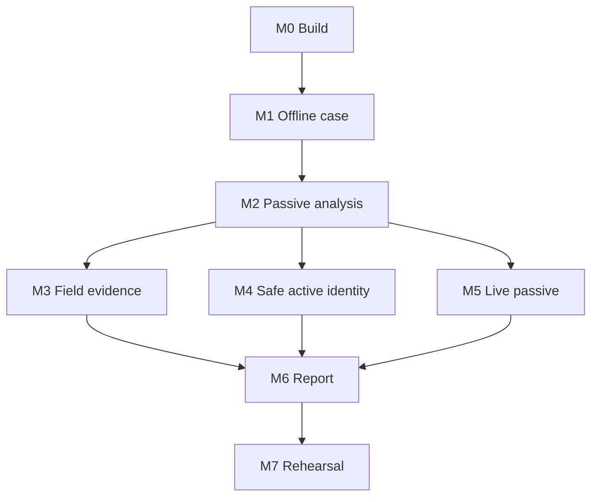

# P0-WATER implementation backlog

This file owns **work items and dependencies**, not milestone status. The canonical M0–M7 status and exit outcomes are maintained in [ROADMAP.md](../../ROADMAP.md). Tickets below are grouped by the roadmap gate they primarily enable.

## M0 — build and supply chain

- E0-01 Maintain the multi-module Gradle/native workspace.
- E0-02 Pin toolchains and dependencies; generate CycloneDX SBOM.
- E0-03 Maintain unit, instrumentation, fuzz and static-analysis CI.
- E0-04 Add production release signing and provenance workflow.
- E0-05 Maintain third-party notices and license decision records.

## M1 — professional offline case

- E1-01 Implement the professional case state machine and transition tests.
- E1-02 Implement authorization, scope and exclusion entities.
- E1-03 Integrate current `sqlcipher-android` for professional case storage.
- E1-04 Implement per-case key creation/wrapping and lock timeout.
- E1-05 Implement content-addressed encrypted artifact storage and secure deletion.
- E1-06 Implement canonical audit events and hash chain.
- E1-07 Implement migrations and corrupted/tampered database handling.
- E2-01 Storage Access Framework imports with streaming SHA-256.
- E2-02 CSV mapping UI, preview, row errors and immutable source rows.
- E2-03 PCAP/PCAPNG metadata inspection and sealing.
- E2-04 Photo capture, EXIF policy, asset-tag linking and manual transcription.
- E2-05 Export manifest and standalone verification CLI foundation.

## M2 — passive analysis and reconciliation

- E3-01 Maintain the typed parser request/result boundary.
- E3-02 Keep untrusted parsing in an isolated process using read-only file descriptors.
- E3-03 Complete bounded Ethernet/VLAN/ARP/IP/TCP/UDP parsing.
- E3-04 Complete DHCP, DNS/mDNS and LLDP metadata.
- E3-05 Complete bounded TCP flow/reassembly handling.
- E3-06 Maintain Modbus/TCP passive and device-ID response parsing.
- E3-07 Add only protocol parsers justified by the product contract and evidence priorities.
- E3-08 Expand sourced corpus, fuzz harnesses, mutation/truncation tests and parser metrics.
- E6-01 Maintain water taxonomy and normalized attribute dictionary.
- E6-02 Implement endpoint construction and strong/weak identity keys.
- E6-03 Implement deterministic candidate scoring.
- E6-04 Implement durable reviewer merge/split/conflict workflow.
- E6-05 Implement confidence reason display.
- E6-06 Implement inventory metrics and exception export.

## M3 — field evidence

- E4-01 Enumerate relevant Android network/interface capabilities.
- E4-02 Implement USB host capability and permission UI.
- E4-03 Implement qualified NIC compatibility probes and static-IP guidance.
- E4-04 Implement approved Wi-Fi observation with OS/permission limitations.
- E4-05 Implement BLE advertisement observation with no connection API.
- E2-04 Complete physical photo/nameplate evidence workflow and privacy controls.

## M4 — safe active identity

- E5-01 Maintain signed profile/pack verification and rollback controls.
- E5-02 Maintain CIDR/IP/interface/time/exclusion scope matching.
- E5-03 Harden single-use execution grants and durable audit records.
- E5-04 Harden foreground active execution and emergency stop.
- E5-05 Expand per-socket binding and alternate-route failure tests.
- E5-06 Maintain Modbus 43/14 basic device-ID serializer/parser and packet-budget proof.
- E5-07 Admit a second active protocol only through a separately reviewed network-execution change and threat review.
- E5-08 Maintain golden packet, timeout, cancellation, replay and negative-scope tests.

## M5 — live passive

- E4-06 Integrate the dedicated Android Capture Broker with the native `atlas_capture` backend.
- E4-07 Implement bounded capture progress, storage reserve, detach handling and artifact sealing.
- E4-08 Add init/SELinux policy and signed-image integration for the capture daemon.
- E4-09 Enforce no-address/no-egress interface invariants in the appliance backend.
- E4-10 Qualify supported phone, powered hub, USB Ethernet and SPAN/TAP combinations.
- E4-11 Measure sustained throughput, drops, thermal behavior, suspend/reconnect and zero egress.

## M6 — professional report

- E7-01 Implement versioned deterministic water rules and fixtures.
- E7-02 Implement WAT-ID rules.
- E7-03 Implement WAT-NET rules.
- E7-04 Implement WAT-ARC, WAT-WIR, WAT-LCM and WAT-EVD rules.
- E7-05 Implement consequence/exposure scoring with confidence kept separate.
- E7-06 Implement reviewer acceptance/rejection and corrective-action ownership.
- E7-07 Generate normative machine-readable data and human-readable HTML/PDF output.
- E7-08 Sign the finalized package and verify it externally.

## M7 — assurance and rehearsal

- E8-01 Maintain threat model and abuse cases for the current architecture.
- E8-02 Complete mobile application security review.
- E8-03 Complete parser/native external review.
- E8-04 Complete witnessed packet-safety tests.
- E8-05 Complete the compatibility matrix required by the P0 test plan.
- E8-06 Run the independent P0-WATER rehearsal.
- E8-07 Obtain legal/privacy/site-safety release approval.

## Dependency flow

## Planning boundary

Calendar and cost estimates should be based on ticket acceptance criteria and measured hardware/integration work. The repository does not treat an unvalidated estimate as a product fact.
