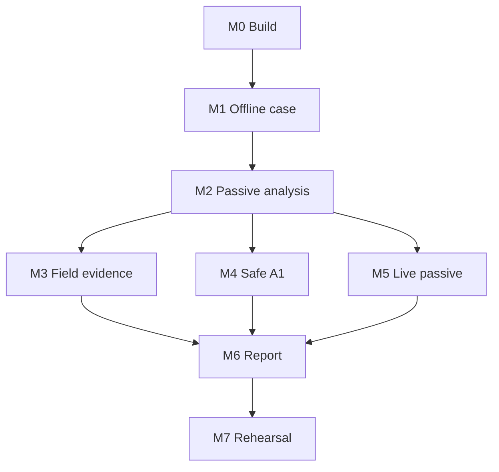

# P0-WATER Implementation Backlog

The backlog is ordered as vertical, testable slices. No active protocol work starts before the evidence and policy foundations exist.

## Milestones

| Milestone | Demonstrable outcome | Exit gate |
|---|---|---|
| M0 repository/build | Reproducible Android/Rust build and CI | Signed debug build, SBOM, unit-test report |
| M1 offline case | Create authorized case, import CSV/artifacts, hash and export | No network code; state/audit tests pass |
| M2 passive analysis | Parse golden PCAPNG and reconcile water assets | Parser fuzz baseline and golden results pass |
| M3 field evidence | Photos, Wi-Fi/BLE observations and review queues | Permission/privacy tests pass |
| M4 safe A1 | One allowlisted Modbus query, then OPC UA discovery | External packet recorder proves grant limits |
| M5 live passive | H2 SPAN/TAP PCAPNG ingestion | 100 Mbps/30-minute capture gate |
| M6 professional report | Reviewed findings and signed assessment package | Independent traceability review passes |
| M7 rehearsal | Full four-hour lab assessment | Definition of done satisfied |

## Epics and tickets

### E0 Build and supply chain

- E0-01 Create multi-module Gradle project and Rust NDK workspace.
- E0-02 Pin toolchains and dependencies; generate CycloneDX SBOM.
- E0-03 Configure unit, instrumentation, fuzz and static-analysis CI.
- E0-04 Add release signing and provenance workflow.
- E0-05 Add third-party notices and license decision records.

### E1 Domain and encrypted storage

- E1-01 Implement case state machine with transition tests.
- E1-02 Implement authorization/scope/exclusion entities.
- E1-03 Integrate current `sqlcipher-android`, not the retired legacy package; Zetetic documents the replacement and Room integration ([migration guide](https://www.zetetic.net/sqlcipher/sqlcipher-for-android-migration/)).
- E1-04 Implement per-case key creation/wrapping and lock timeout.
- E1-05 Implement content-addressed artifact store and secure deletion.
- E1-06 Implement canonical audit events and hash chain.
- E1-07 Implement migrations and corrupted/tampered database handling.

### E2 Import and evidence

- E2-01 Storage Access Framework imports with streaming SHA-256.
- E2-02 CSV mapping UI, preview, row errors and immutable source rows.
- E2-03 PCAP/PCAPNG metadata inspection and sealing.
- E2-04 Photo capture, EXIF policy, asset-tag linking and manual transcription.
- E2-05 Export manifest and standalone verification CLI.

### E3 Parser core

- E3-01 Define protobuf parser request/result and JNI boundary.
- E3-02 Isolated parser service using read-only file descriptors.
- E3-03 Ethernet/802.1Q/ARP/IPv4/IPv6/TCP/UDP bounded parsers.
- E3-04 DHCP, DNS/mDNS and LLDP metadata.
- E3-05 TCP flow table/reassembly with hard limits.
- E3-06 Modbus/TCP MBAP, function metadata and device-ID response.
- E3-07 OPC UA HEL/ACK and discovery-response metadata.
- E3-08 Corpus, fuzz harnesses, mutation/truncation tests and parser metrics.

### E4 Interfaces and capture

- E4-01 Enumerate Android `Network`, link properties and transports.
- E4-02 USB host capability/permission UI based on Android’s USB APIs ([Android](https://developer.android.com/develop/connectivity/usb/host)).
- E4-03 Pinned NIC compatibility probes and static-IP operator guidance.
- E4-04 Wi-Fi scan records with permission/OS limitation handling.
- E4-05 BLE advertisement records; no connection API exposed.
- E4-06 Capture-accessory protocol: authenticated session, stream framing, status/drop counters and detach.
- E4-07 PCAPNG rotation, progress, storage reserve and sealing.

### E5 Policy and probes

- E5-01 Ed25519 pack/profile verifier and rollback store.
- E5-02 Scope matcher for CIDR/IP/MAC/interface/time/exclusions.
- E5-03 Single-use execution grants and audit records.
- E5-04 Foreground probe service and emergency stop.
- E5-05 Per-socket network binding and alternate-route failure tests.
- E5-06 Modbus 43/14 basic device-ID serializer/parser.
- E5-07 OPC UA FindServers/GetEndpoints using a reviewed minimal open62541 subset or isolated native adapter.
- E5-08 Golden packet, timeout, cancellation and packet-budget tests.

### E6 Asset resolution

- E6-01 Water taxonomy and normalized attribute dictionary.
- E6-02 Endpoint construction and strong/weak identity keys.
- E6-03 Deterministic candidate scoring.
- E6-04 Reviewer merge/split/conflict workflow.
- E6-05 Confidence calculation and reason display.
- E6-06 Inventory metrics and exception CSV.

### E7 Rules and report

- E7-01 Versioned deterministic rule format and fixtures.
- E7-02 Implement WAT-ID rules.
- E7-03 Implement WAT-NET rules.
- E7-04 Implement WAT-ARC, WAT-WIR, WAT-LCM and WAT-EVD rules.
- E7-05 Consequence/exposure scoring with confidence kept separate.
- E7-06 Reviewer acceptance/rejection and corrective-action ownership.
- E7-07 Normative JSON, HTML and PDF generation.
- E7-08 ZIP manifest signing and external verification.

### E8 Assurance

- E8-01 STRIDE/abuse-case threat model for app, accessory and packs.
- E8-02 Mobile application security verification checklist.
- E8-03 Parser and JNI external review.
- E8-04 Packet-safety witnessed tests.
- E8-05 Two-phone/two-NIC compatibility matrix.
- E8-06 Full independent P0-WATER rehearsal.
- E8-07 Legal/privacy/site-safety release approval.

## Critical path

## Staffing assumption for planning

Minimum competent team:

- Android engineer;
- Rust/parser engineer;
- OT protocol and water-process engineer;
- security/test engineer;
- product/UX designer part-time.

A single developer may prototype M0–M2, but M4–M7 require independent OT and security review. Estimates should be produced only after E0–E2 tickets have acceptance tests and the capture accessory is selected; the current repository does not provide defensible calendar or cost estimates.
