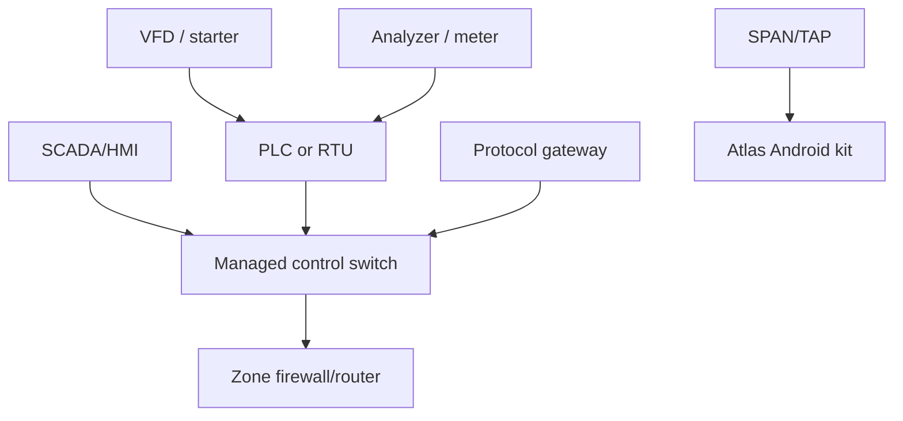

# Water/Wastewater Professional Assessment PoC

_Status: build specification. PoC code name: P0-WATER. This document is the product contract; anything not stated here is out of scope._

## 1. Outcome

An authorized assessor can use one Android kit to conduct a repeatable asset-inventory and network-exposure assessment of **one water/wastewater pumping or treatment control segment**, reconcile observations with the customer’s inventory, review evidence-linked findings, and export a signed professional report without cloud access.

This is not a penetration test, IEC 62443 certification, vulnerability exploit test or enterprise-wide monitoring deployment.

## 2. Why this industry

The first pack targets a bounded pumping/treatment segment because it has a recognizable control-system shape, safety-critical availability, distributed field assets and a credible Morocco route through ONEE Water. NIST SP 800-82 Rev. 3 explicitly requires OT security to account for performance, reliability and safety constraints ([NIST](https://csrc.nist.gov/pubs/sp/800/82/r3/final)). The PoC therefore emphasizes inventory integrity, architecture, exposed services and defensible evidence rather than aggressive discovery.

No vendor installed base is assumed. The lab uses representative devices and simulators; a customer pack is configured only from approved design records and observed evidence.

## 3. Assessment unit

One case covers:

- one legal entity and physical site;
- one named process area;
- one Layer-2 control segment/VLAN;
- up to 64 imported asset records;
- up to 256 passively observed endpoints;
- up to 16 allowlisted A1-query targets;
- one SPAN/TAP capture point or imported capture set;
- up to four hours of field collection;
- one assessor and one reviewer;
- one finalized report revision.

A larger scope must be split into cases and later consolidated outside the PoC.

## 4. Reference segment



The lab must contain at minimum:

| ID | Component | Implementation |
|---|---|---|
| LAB-PLC-01 | PLC/RTU identity target | OpenPLC or physical lab PLC exposing Modbus/TCP |
| LAB-HMI-01 | HMI/SCADA node | ScadaBR/FUXA or equivalent lab-only HMI |
| LAB-UA-01 | OPC UA server | open62541 reference server with two endpoint policies |
| LAB-SW-01 | Managed switch | VLAN + SPAN capable |
| LAB-GW-01 | Router/firewall | OpenWrt appliance with explicit test rules |
| LAB-UNK-01 | Unexpected endpoint | Linux host deliberately absent from seed inventory |
| LAB-BLE-01 | BLE beacon | Configurable advertisement payload |
| LAB-WIFI-01 | Access point | Separate lab SSID; no production credentials |
| KIT-01 | Android device | Pinned device/build in compatibility matrix |
| KIT-NIC-01 | USB Ethernet | Pinned VID:PID and powered hub |
| KIT-CAP-01 | Capture accessory | Streams PCAPNG from SPAN/TAP, or approved import during early development |

Synthetic unsafe conditions are created only in the isolated lab.

## 5. User roles

| Role | Rights |
|---|---|
| Assessor | Create draft, import evidence, collect within grant, propose matches/findings |
| Operational approver | Approve process scope, criticality and collection window |
| Security approver | Approve interfaces, query profiles, targets, retention and export |
| Reviewer | Accept/reject identity claims and findings; finalize report |
| Pack administrator | Install signed packs; cannot alter a finalized case |

One person may hold several roles in the lab, but the audit log records the role used for each approval.

## 6. End-to-end procedure

### Phase 0 — Prepare

1. Create case and select “Water/Wastewater P0.”
2. Record site, process area, safety contact, dates and data classification.
3. Import signed authorization PDF/photo and hash it.
4. Enter allowed VLAN/CIDR, explicit IP/MAC targets, exclusions and stop conditions.
5. Select H1/H2/H3/H4 capabilities.
6. Import the customer CSV using a saved field map.
7. Run preflight; no network action occurs.

Preflight passes only when approvals, time window, scope, storage, battery/power, device integrity, pack signature and interface selection are valid.

### Phase 1 — Physical walkdown

For each selected cabinet or device:

- scan customer asset tag or enter it;
- take an authorized nameplate/cabinet photo;
- record location, device class, vendor/model/serial/firmware exactly as visible;
- mark confidence and whether the device is in service;
- link the physical record to an imported asset or create an unmatched candidate.

OCR may suggest text but cannot create an accepted identity claim without review.

### Phase 2 — Passive collection

1. Connect the capture accessory to the authorized SPAN/TAP.
2. Show interface, link speed, capture source and limitation banner.
3. Capture for the approved duration; default 30 minutes.
4. Display packet rate, drops, bytes, artifact rotation and storage remaining.
5. Seal each PCAPNG artifact and parse offline.
6. Never inject packets from H2 mode.

If only H3 import is available, the report states who collected the capture, where, when, tool/version and provided hash.

### Phase 3 — Wireless observation

- Perform Android Wi-Fi scan and record SSID/BSSID, security capabilities, channel/frequency and signal; Android scanning restrictions and lack of monitor mode are reported ([Android Wi-Fi scanning](https://developer.android.com/develop/connectivity/wifi/wifi-scan)).
- Scan BLE advertisements for 60 seconds, recording address type, advertised name, service/manufacturer IDs and RSSI; do not connect to GATT ([Android BLE scan](https://developer.android.com/develop/connectivity/bluetooth/ble/find-ble-devices)).
- The operator labels whether an observation is expected, related, unrelated or unknown.

### Phase 4 — A1 identity queries

A1 remains optional. The operator selects a target already imported or passively observed, reviews the exact request, and receives a one-time grant.

PoC operations:

- Modbus/TCP Read Device Identification, basic objects only.
- OPC UA FindServers/GetEndpoints.
- Optional single-host reachability or approved-port confirmation.

The UI shows request count, timeout, interface and stop conditions before confirmation. There is no subnet scan, unit-ID sweep, register read, SNMP walk, login, browse or write.

### Phase 5 — Reconcile

The application produces four queues:

1. imported asset not observed;
2. observed candidate not in inventory;
3. imported and observed records with conflicting attributes;
4. probable matches requiring review.

The assessor must accept/reject every high-impact merge. “Not observed” is never changed to “absent” without an explicit verification action and adequate visibility.

### Phase 6 — Assess

The water pack evaluates only evidence-supported checks:

| Check ID | Condition | Output |
|---|---|---|
| WAT-ID-001 | Imported in-scope asset has no observation or physical confirmation | Inventory evidence gap |
| WAT-ID-002 | Observed OT endpoint has no accepted inventory match | Unmanaged/undocumented candidate |
| WAT-ID-003 | Serial/model/firmware conflicts across sources | Identity conflict |
| WAT-ID-004 | Asset record exceeds customer freshness threshold | Stale record |
| WAT-NET-001 | Modbus/TCP observed in cleartext | Cleartext industrial protocol exposure; not an exploit claim |
| WAT-NET-002 | OPC UA endpoint offers SecurityPolicy None | Weak endpoint option; verify actual client use |
| WAT-NET-003 | Management protocol/service observed contrary to declared policy | Service exposure exception |
| WAT-ARC-001 | Communication crosses declared zone/conduit unexpectedly | Architecture exception |
| WAT-WIR-001 | Wi-Fi/BLE item associated with the area is absent from inventory | Wireless inventory gap |
| WAT-LCM-001 | Exact model/version matches a dated vendor end-of-support record | Lifecycle finding |
| WAT-EVD-001 | Capture loss, insufficient duration or visibility limits conclusion | Evidence limitation |

A finding contains condition, affected asset(s), raw evidence references, assessor interpretation, confidence, impact, recommendation, owner, due date and review state.

### Phase 7 — Review and report

The reviewer:

- confirms scope and limitations;
- resolves or accepts all critical identity conflicts;
- accepts, rejects or defers every finding;
- verifies no prohibited action occurred;
- signs the final case.

The export is generated from a read-only finalized snapshot.

## 7. Professional report

### Executive section

- authorization and exact scope;
- process-area description;
- collection methods and limitations;
- inventory reconciliation summary;
- findings by severity and confidence;
- top five prioritized actions;
- statement of what was not tested.

### Technical section

- device and software inventory;
- asset match matrix: imported ↔ observed ↔ physical;
- network/communication summary;
- wireless observations;
- findings with evidence IDs;
- query execution ledger;
- methodology, pack versions and tool build;
- artifact hash manifest and chain-of-custody summary.

### Minimum metrics

| Metric | Definition |
|---|---|
| Inventory coverage | confirmed/probable in-scope imported assets ÷ in-scope imported assets |
| Unexpected candidate count | observed candidates with no accepted imported match |
| Conflict count | accepted asset groups containing contradictory identity attributes |
| Identification quality | confirmed, probable, tentative and insufficient counts |
| Evidence coverage | assets supported by two independent source types |
| Capture quality | duration, packets, bytes, drop count and visibility type |
| Active footprint | targets, requests, retries, timeouts and response count |
| Reviewer effort | claims/findings reviewed and elapsed review time |

## 8. Severity and confidence

Severity is not CVSS unless a real CVE match is separately proven.

```text
risk_score = consequence (1–5) × exposure (1–5)
```

Consequence is assigned by the operational owner using safety, availability, water quality/environment and financial criteria. Exposure is evidence-based: observed communication path, reachable service, segmentation context and compensating controls. Bands: Critical 20–25, High 12–19, Medium 6–11, Low 1–5.

Confidence is separate:

- High: exact protocol/physical identity plus corroborating source.
- Medium: specific network fingerprint plus consistent inventory.
- Low: OUI, hostname, open port or uncorroborated manual assertion.

A high-risk/low-confidence item is reported as “urgent verification,” not as a confirmed defect.

## 9. Functional requirements

### Case and authorization

- POC-CASE-001: create, revise, cancel, expire, finalize and export a case using the defined state machine.
- POC-CASE-002: block collection until all required authorization fields validate.
- POC-CASE-003: require explicit exclusions and an emergency contact.
- POC-CASE-004: prevent modification after finalization.

### Evidence

- POC-EVD-001: import PCAP/PCAPNG, CSV, PDF/image and JSON with SHA-256.
- POC-EVD-002: preserve capture interface, timestamps, source, parser version and byte offsets.
- POC-EVD-003: support photographs linked to a physical observation.
- POC-EVD-004: produce a verifiable hash chain and signed manifest.

### Collection

- POC-COL-001: enumerate selected Ethernet, capture accessory, Wi-Fi and BLE capability.
- POC-COL-002: live H2 capture at sustained 100 Mbps for 30 minutes with recorded drop count.
- POC-COL-003: parse a 2 GiB PCAPNG without UI failure.
- POC-COL-004: abort safely on detach, low storage, route change and expired authorization.

### Active identity

- POC-ACT-001: execute only compiled operations referenced by a valid signed profile.
- POC-ACT-002: bind every socket to the approved Android network; no cellular fallback.
- POC-ACT-003: enforce one target at a time, packet/retry/timeout budgets and cancellation.
- POC-ACT-004: prove through packet capture that no unauthorized packet was emitted.

### Reconciliation and findings

- POC-REC-001: import up to 64 assets with mapping preview and row-level errors.
- POC-REC-002: preserve conflicting claims and require review for ambiguous merges.
- POC-REC-003: execute the eleven P0 water checks deterministically.
- POC-REC-004: link every finding to evidence or mark it as assessor-authored context.

### Reporting

- POC-RPT-001: generate complete HTML/PDF/CSV/JSON offline.
- POC-RPT-002: disclose visibility limits and distinguish not-observed from absent.
- POC-RPT-003: generate the same normative JSON and finding set twice from the same finalized snapshot.
- POC-RPT-004: verify the exported signature and every included artifact hash using an external CLI.

## 10. Non-functional requirements

- Cold launch under 3 seconds on the reference phone.
- Common screens remain responsive while parsing; no main-thread I/O.
- 100,000 normalized observations and 256 endpoints per case.
- Parser memory ceiling 256 MiB; app total memory target below 768 MiB during a 2 GiB import.
- No network connection required for create/import/parse/reconcile/report.
- All app-private data encrypted at rest.
- Zero third-party analytics and zero unapproved DNS/HTTP in an offline test.
- French and English UI/report templates; Arabic layout is post-PoC.
- Accessibility: scalable text, non-color status indicators, screen-reader labels.
- Battery: four-hour walkdown with powered hub/capture accessory; phone must not be the sole power source for H2.

## 11. Acceptance dataset

The versioned lab corpus contains:

- clean baseline capture;
- truncated and malformed frames;
- duplicate IP and reused MAC scenarios;
- Modbus device-ID success, exception, timeout and malformed response;
- OPC UA endpoints with secure-only and SecurityPolicy None configurations;
- unexpected endpoint;
- cross-zone communication;
- BLE and Wi-Fi expected/unknown records;
- customer CSV with clean, duplicate, missing and conflicting fields;
- 10,000 mutation/fuzz seeds per binary parser.

Expected assets, observations, matches and findings are stored as golden JSON.

## 12. Definition of done

P0-WATER is complete only when:

1. every functional requirement has an automated or witnessed test;
2. the lab assessment produces the expected signed report;
3. an independent reviewer can trace every reported fact to an artifact and byte range or physical record;
4. a packet recorder proves the active executor stayed inside its grants;
5. emergency stop closes active sockets and capture within one second;
6. no critical/high mobile, parser or supply-chain finding remains open;
7. the device/NIC/capture matrix has at least two phones, two NICs and one H2 capture path;
8. a qualified OT reviewer signs the methodology and report template;
9. the report states limitations without claiming certification or full vulnerability coverage;
10. the full case can be completed offline.

## 13. Explicitly deferred

- Siemens S7/PROFINET active discovery;
- EtherNet/IP/CIP active identity;
- IEC 60870-5-104, IEC 61850 and DNP3 active operations;
- BACnet Who-Is;
- SNMP credentials or walks;
- serial Modbus/RS-485;
- Wi-Fi monitor mode;
- BLE GATT connection;
- vulnerability scanning/exploitation;
- credential testing;
- customer CMDB/CMMS APIs;
- cloud synchronization;
- multi-case portfolio dashboard;
- AI-generated actions or severity.

These enter later only through a new threat review, protocol specification, test corpus and signed profile.

## 14. Implementation documents

- [Technical architecture index](../wiki/Technical-Architecture.md)
- [System and deployment architecture](../architecture/SYSTEM-AND-DEPLOYMENT.md)
- [Network execution architecture](../architecture/NETWORK-EXECUTION.md)
- [Component contracts](../architecture/COMPONENT-CONTRACTS.md)
- [Evidence and data architecture](../architecture/EVIDENCE-DATA-MODEL.md)
- [Security architecture and threat model](../architecture/SECURITY-AND-THREAT-MODEL.md)
- [Assessment method and report controls](ASSESSMENT-METHOD.md)
- [Test and acceptance plan](TEST-AND-ACCEPTANCE.md)
- [H2 capture accessory reference design](CAPTURE-ACCESSORY.md)
- [Implementation backlog](IMPLEMENTATION-BACKLOG.md)
- [Product requirements](../REQUIREMENTS.md)
