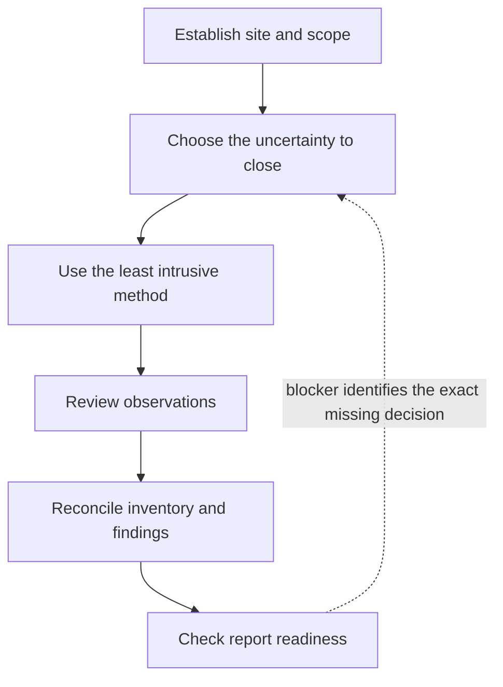

# Product UX and component-integration contract

Atlas OT Scout is a field-assessment instrument, not a generic scanner. The interface must help an authorized assessor close one uncertainty at a time while preserving scope, provenance and review state.

## UX audit and correction

| Severity | Observed usability failure | Product risk | Implemented correction |
|---|---|---|---|
| Critical | New-site setup was one long form | Abandonment, missed fields and accidental defaults | Three short steps: site → technology context → review |
| Critical | Screens exposed functions before the decision they support | Users choose a tool instead of defining the evidence gap | Collection starts with “What do you need to establish?” |
| High | Assessment progress existed only in prose cards | Users could not orient themselves after drilling into a task | Persistent five-stage rail plus bottom navigation |
| High | Dashboard presented several actions at equal weight | Unclear next step and repeated collection | One context-aware primary action; secondary shortcuts grouped |
| High | Inventory led with technical summaries | Review work was buried beneath counts and protocol text | Pending-decision state first, then search/filter and evidence coverage |
| Medium | Ten- and eleven-point labels were overused | Poor field readability and weak hierarchy | Larger navigation, status, kicker and card labels |
| Medium | Green appeared as both decoration and status | Confidence state could be misread | Navy/cobalt carry hierarchy; green means supported/confirmed only |
| Medium | Blank first-frame screenshot could enter documentation | Misleading acceptance evidence | Instrumentation waits for a rendered compositor frame |

## Primary journey

A user should always be able to answer:

1. Which site and process boundary am I working in?
2. What decision am I trying to support?
3. Will the next action transmit?
4. What evidence was produced?
5. What must I review before it changes the inventory?
6. What blocks the professional handoff?

## Screen contracts

| Screen | Primary question | Primary action | Must remain visible |
|---|---|---|---|
| Site selection | Which operating context is authorized? | Resume a site or create one | Sample status and offline statement |
| Site setup 1 | Where is the assessment occurring? | Continue to technology context | Name, process area and industry |
| Site setup 2 | What technology is expected from prior knowledge? | Continue or explicitly skip | “Context, not discovery” warning |
| Site setup 3 | Is the workspace configuration correct? | Create workspace | Scope summary, language and retention |
| Overview | What should I do next? | One context-aware continuation | Site, stage, evidence counts and open decisions |
| Collect | What uncertainty needs evidence? | Select one method | Passive/active effect and prerequisite |
| Passive result | What did this visibility sample support? | Accept selected observations | Source hash, limitations and review state |
| Active authorization | Is one exact identity request approved? | Authorize once | Target, CIDR, unit, timeout and no-read/write limit |
| Inventory | Which records need an assessor decision? | Open a review item | Review count, filters, provenance and confidence |
| Findings | What condition is supported, and what remains unknown? | Review report readiness | Evidence, consequence, confidence and next validation |
| Report | Can the assessment be issued professionally? | Resolve the named blocker | Authorization, evidence, reviewer and export gates |

## Interaction rules

- One primary filled button per screen; secondary actions use outlined treatment.
- Destructive, transmitting or irreversible actions require an explicit review step.
- Passive/active status is expressed in text, not color alone.
- Forms use progressive disclosure; optional context never blocks required safety data.
- Defaults may reduce effort but cannot silently broaden scope.
- Every empty state explains why it is empty and gives one recovery action.
- Errors preserve entered data and return the user to the exact field or decision that failed.
- Raw observations cannot silently become assets, and assets cannot silently become findings.
- Planned capabilities are disabled and visually separate from executable methods.
- Touch targets are at least 48 dp; essential body text is at least 13 sp.

## Visual system

| Token | Value | Meaning |
|---|---|---|
| Deep navy | `#0B1F33` | Primary text, trusted workspace and security boundary |
| Cobalt | `#2457D6` | Selected navigation and primary action |
| Slate | `#334155` | Technical context and secondary hierarchy |
| Verified green | `#167A5A` | Supported or confirmed state only |
| Review amber | `#AA5210` | Human decision required |
| Blocked red | `#B0232D` | Safe stop or invalid authorization |
| Background | `#F4F7FB` | Low-glare field surface |
| Card | `#FFFFFF` | Grouped content and controls |
| Border | `#CDD8E4` | Structure without decorative shadows |

Status always includes a label or icon. Wallpaper-derived dynamic colors are disabled on the dedicated appliance.

## Open-source component boundary

| Capability | Candidate | Product boundary |
|---|---|---|
| Ethernet capture | libpcap / native `AF_PACKET` | SELinux-confined system daemon; no generic root UI |
| Flow classification | nDPI, subject to license review | Optional isolated worker; classification is not a finding |
| OT parser oracle | Zeek + CISA ICSNPP | CI comparison only, not a phone runtime dependency |
| Encrypted records | SQLCipher | Case App only; brokers cannot read the database |
| Serial transport | usb-serial-for-android | Future typed broker with allowlisted adapters and operations |
| Report renderer | Typst | Future isolated renderer receiving a finalized read-only model |
| Advisory context | CISA KEV and vendor advisories | Signed offline pack; match creates a review candidate only |

Atlas owns the workflow, scope policy, evidence model, inventory decisions, finding semantics and report gates. Reused projects implement bounded technical functions; they do not define the assessment conclusion.

## Remaining usability gates

- Observe five independent assessors completing the demonstration without coaching.
- Measure time to create a site, choose a passive method, review an observation and find a report blocker.
- Verify French and Arabic layouts, including right-to-left behavior and terminology.
- Add durable merge/reject/leave-unresolved actions with undo and an audit trail.
- Replace the programmatic View layer with Compose while preserving IDs or equivalent semantic test contracts.
- Test sunlight, gloves, one-handed use and accessibility scaling on the selected physical handset.

