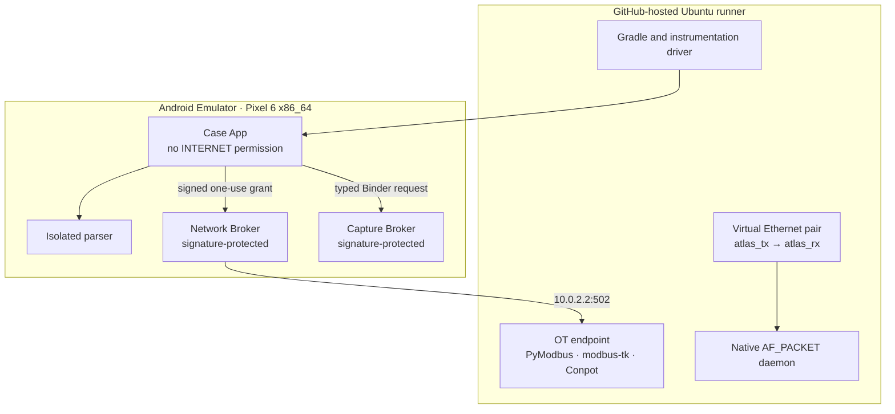
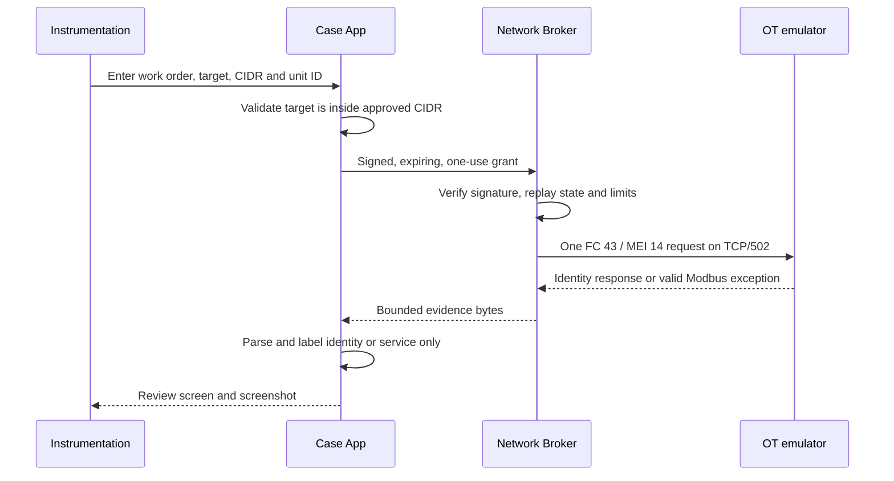

# End-to-end test architecture

This document explains the exact devices, processes, emulators and trust boundaries exercised by GitHub Actions. A green run proves the software paths listed here; it is not a claim that physical OT hardware or the proposed Samsung appliance has been qualified.

Current verified reference: [CI run #36](https://github.com/charifmahmoudi/mobile-ot-security-assessment/actions/runs/33350379673) at [`bd1860e`](https://github.com/charifmahmoudi/mobile-ot-security-assessment/commit/bd1860e9601b2433b41bf9ef42c9e09577c1aef0).

## CI topology

The Android live-capture journey and the Linux raw-capture gate are complementary tests. CI does **not** pretend that the stock Android AVD contains the final rooted system daemon:

- the AVD verifies Case App → Capture Broker → file-descriptor stream → parser → review UI;
- the Ubuntu virtual-Ethernet test verifies the native `AF_PACKET` daemon, PCAP output and zero packet-send syscalls;
- physical integration of that daemon, SELinux policy and a USB NIC remains a hardware release gate.

## Devices and software involved

| Role | CI implementation | Network position | What it validates |
|---|---|---|---|
| Build host | GitHub `ubuntu-latest`, JDK 17, Gradle 8.13 | Test controller | Reproducible build, lint, JVM tests and artifacts |
| Minimum Android device | Pixel 6 x86_64 AVD, Android 10 / API 29 | Isolated emulator | Minimum-SDK UI, storage, Binder and permission behavior |
| Target Android device | Pixel 6 x86_64 AVD, Android 15 / API 35 | Isolated emulator | Current target UI journey and screenshots |
| Case application | `com.atlasot.scout` | No Android `INTERNET` permission | Site workflow, policy, parsing requests, inventory and report gates |
| Network Broker | Separately signed Android APK/UID | Only Android component allowed to open the active socket | Grant signature, scope, replay, interface binding and resource limits |
| Capture Broker | Separately signed Android APK/UID | No Internet permission; bounded FD stream | Passive capability and stream boundary |
| Parser | Isolated Android process | No network or database permission | Bounded PCAP/PCAPNG decoding |
| PyModbus | Docker image pinned to 3.11.3 | Runner TCP/502, reached from AVD as `10.0.2.2:502` | Positive FC 43 / MEI 14 identity extraction |
| modbus-tk | Python venv pinned to 1.1.5 | Runner TCP/502 | Valid Modbus service without usable identity objects |
| Conpot | Docker image from pinned upstream commit `32fc03b…` | Container 5020 mapped to runner 502 | Independent ICS implementation and conservative service-only result |
| Native capture test | `atlas_capture` on Ubuntu | `atlas_rx` side of a veth pair | Raw receive, bounded PCAP output and absence of send syscalls |
| Research captures | Hash-pinned Modbus, DNP3, IEC-104 and BACnet files | Android content URI and JVM corpus | Passive protocol attribution and malformed-input handling |

## Active emulation sequence

There is no fallback port scan, address sweep, unit-ID sweep or register read. PyModbus must produce an identity result. modbus-tk and Conpot must remain service-only unless supported identity objects are actually returned.

## Passive test sequences

### Imported capture

1. CI fetches a hash-pinned source capture.
2. Android exposes it through a real `content://` URI.
3. The Case App opens a bounded read-only descriptor.
4. The isolated parser returns observations.
5. The UI shows capture metadata, protocols and proposed assets.
6. No observation enters inventory without explicit acceptance.

### Live passive boundary

1. Instrumentation selects **Observe a SPAN / TAP interface**.
2. The signed Capture Broker reports a labeled CI capability.
3. The Case App requests one time- and byte-bounded sample.
4. The broker streams PCAP through a file descriptor.
5. The same parser and review UI used by imported files handles the result.

### Native receive-only daemon

1. CI creates `atlas_tx ↔ atlas_rx`.
2. The daemon binds `AF_PACKET` to `atlas_rx`.
3. A separate producer injects known Ethernet frames on `atlas_tx`.
4. The daemon writes a bounded PCAP.
5. Static symbol inspection and `strace` must show no `send`, `sendto` or `sendmsg` invocation.

## Acceptance matrix

| Journey or gate | Environment | Required observable result |
|---|---|---|
| Three-step site onboarding | API 29 and 35 | Site → technology context → review → workspace |
| Guided assessor shell | API 29 and 35 | Overview → Collect → Assets → Findings → blocked Report |
| Passive upload | API 29 and 35 | Four capture types reach reviewable observations |
| Malformed passive input | JVM and Android | Safe failure; no partial inventory mutation |
| Live capture boundary | API 29 and 35 | Capability → FD stream → parser → review UI |
| Native capture backend | Ubuntu veth | Valid PCAP and empty packet-send syscall trace |
| Authorized identity | API 35 + PyModbus | Vendor/product/revision shown in evidence UI |
| Independent service handling | API 35 + modbus-tk and Conpot | Service confirmed without fabricated identity |
| Invalid scope | API 29 and 35 | Local stop before broker contact |
| Application isolation | Static and Android | Case App lacks Internet permission; brokers are signature-protected |
| Documentation evidence | API 35 | Original 1080×2400 PNG checkpoints retained as artifacts |

## Physical field architecture still to qualify

| Device | Intended field role | Required before claiming support |
|---|---|---|
| Exact supported Samsung model | Dedicated assessment handset | Device-specific signed build, boot state and four-hour stability test |
| Powered USB-C hub | Power and USB host path | Reconnect, suspend, thermal and power qualification |
| Qualified USB Ethernet NIC | Dedicated passive interface | Driver, VLAN, promiscuous receive, loss and zero-address tests |
| Passive TAP or approved SPAN port | Supplies mirrored OT traffic | Independent receive-only and visibility validation |
| Real PLC/RTU/HMI fixtures | Vendor behavior validation | Protocol- and firmware-specific safe test plan |

The stock AVD proves application compatibility. It does not prove LineageOS integration, Samsung flashing, USB host behavior, TAP visibility, packet loss or actual PLC firmware behavior.

## Evidence retained by every run

- JVM and Android XML results;
- lint and architecture reports;
- APKs and Android test APKs;
- API 29 and API 35 instrumentation logs;
- original emulator screenshots;
- PyModbus, modbus-tk and Conpot logs;
- native capture PCAP, result JSON and syscall trace.

The canonical implementation is [the workflow](../../.github/workflows/android-ci.yml), [UI runner](../../tools/run_ui_e2e.sh), [active runner](../../tools/run_active_e2e.sh) and [capture-daemon gate](../../tools/test_capture_daemon.sh).
