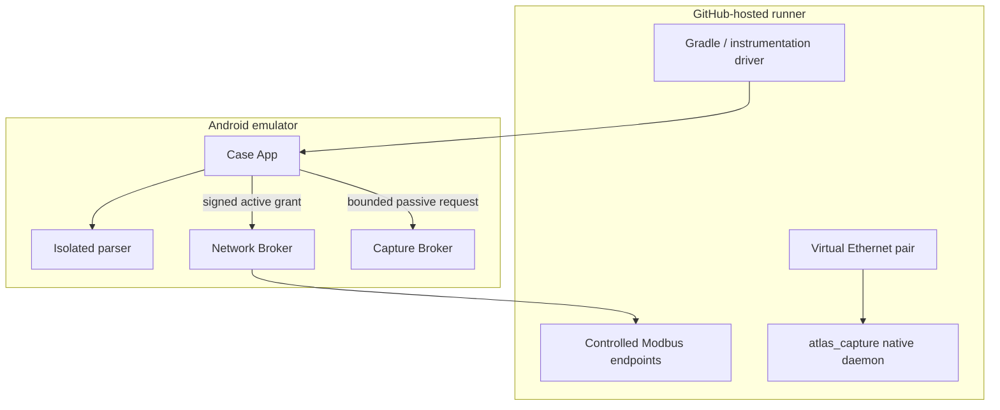

# End-to-end test architecture

This document owns the **CI proof topology and observable acceptance evidence**. It does not define product capability or architecture; those are authoritative in [IMPLEMENTATION.md](../../IMPLEMENTATION.md) and [Architecture](../architecture/README.md).

A green run proves only the software paths exercised by that run. Historical run/commit IDs belong in artifact/screenshot provenance records, not in this document as a permanent “current” reference.

## CI topology

The Android Capture Broker journey and native-daemon veth gate are complementary tests. They are not a substitute for physical appliance integration and USB/NIC/TAP qualification.

## What the Android tests exercise

| Journey | Required observable result |
|---|---|
| Site onboarding | Site → technology context → review → workspace |
| Guided shell | Overview → Collect → Assets → Findings → Report readiness |
| Passive import | Supported captures produce bounded reviewable observations |
| Malformed passive input | Safe failure without silent inventory mutation |
| Capture Broker boundary | Bounded FD stream reaches the same parser/review path as imported evidence |
| Authorized Modbus identity | One approved identity request can produce bounded evidence |
| Independent Modbus implementations | Service/identity interpretation remains conservative across PyModbus, modbus-tk and Conpot fixtures |
| Invalid scope | Request is rejected before an out-of-scope active operation proceeds |
| Application privilege | Case App remains without Android `INTERNET`; broker boundaries remain protected |

Exact active packet semantics are tested against the canonical [network-execution contract](../architecture/NETWORK-EXECUTION.md); they are not redefined here.

## Passive native-daemon gate

CI creates a virtual Ethernet producer/receiver pair, binds `atlas_capture` to the receive side, injects known Ethernet frames from the peer and validates the resulting PCAP.

The gate also inspects/traces the daemon for packet-send calls. This demonstrates the software receive boundary on virtual Ethernet; it does not prove the final Android SELinux integration or physical zero-egress behavior.

## Passive parser corpus

Research captures are hash-pinned and supplied to the application/parser through normal content/file-descriptor paths. Corpus coverage includes representative industrial protocols and malformed/truncated cases. Protocol implementation status is maintained in [IMPLEMENTATION.md](../../IMPLEMENTATION.md), not duplicated here.

## Evidence retained by CI

Depending on the workflow job, retained evidence includes:

- JVM/Android test results;
- lint and architecture reports;
- APK/test APK artifacts;
- emulator instrumentation logs;
- screenshot checkpoints;
- controlled protocol-endpoint logs;
- native capture output and zero-send evidence.

The executable source of truth for CI is [.github/workflows/android-ci.yml](../../.github/workflows/android-ci.yml) plus the referenced runner scripts.

## What CI does not prove

A green workflow does not by itself prove:

- physical Samsung/LineageOS integration;
- USB host/NIC/TAP behavior;
- production packet rates or loss;
- actual PLC/RTU firmware safety across vendors;
- production encrypted case/export readiness;
- customer-site policy or commercial usefulness.

Those claims require the physical/product gates in [TEST-AND-ACCEPTANCE.md](../poc/TEST-AND-ACCEPTANCE.md), the [compatibility matrix](../appliance/COMPATIBILITY-MATRIX.md) and the current status in [IMPLEMENTATION.md](../../IMPLEMENTATION.md).
