# Emulator acceptance screenshots

These are Android 15 (API 35) instrumentation outputs from green [GitHub Actions run #32](https://github.com/charifmahmoudi/mobile-ot-security-assessment/actions/runs/33337993093) at [`6b14a50`](https://github.com/charifmahmoudi/mobile-ot-security-assessment/commit/6b14a50ea3978b7ff69e5d60e03ec886e9602900), not design mockups. That run passed all six jobs: build/lint/unit/architecture/rooted capture, API 29, API 35, PyModbus, Modbus-TK and Conpot.

## Site-centered assessment journey

| Site selection | New-site onboarding | Site dashboard |
|---|---|---|
| 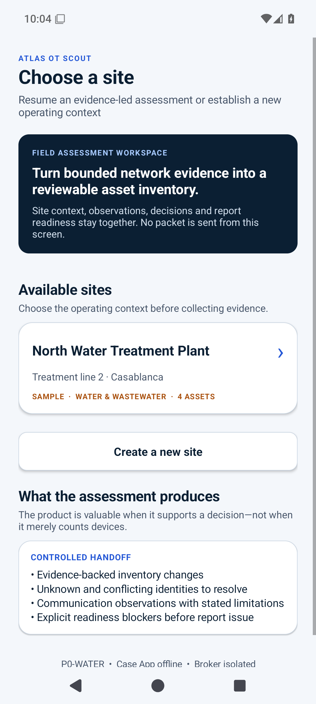 | 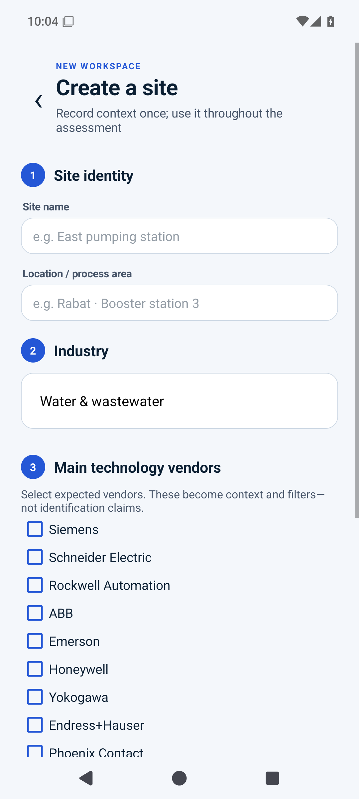 | 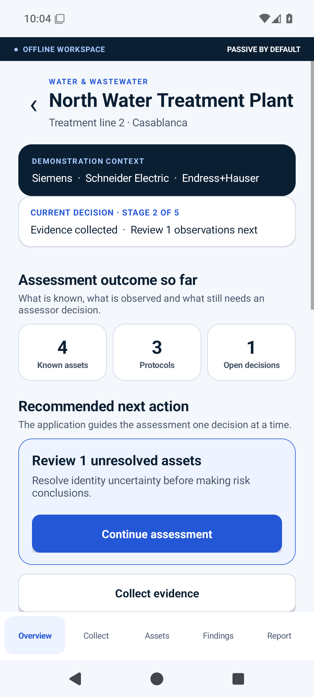 |

The instrumentation creates a site with an industry dropdown and multiple vendor selections, then reopens it from persisted application state.

## Collection and inventory

| Collection-method decision | Asset inventory |
|---|---|
| 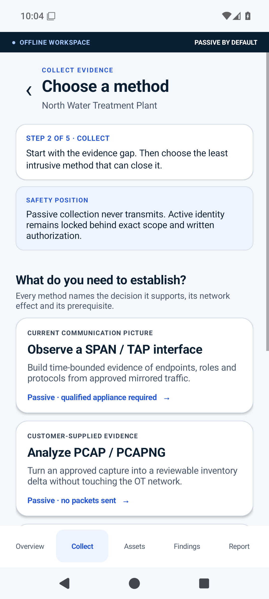 | 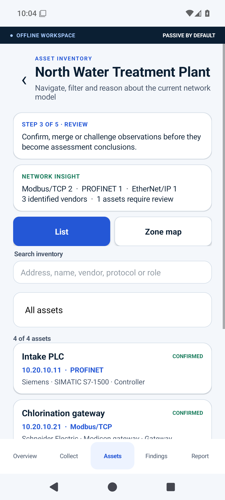 |

The test verifies search, review filtering, asset navigation, and the separation of working methods from planned Wi-Fi/Bluetooth packs.

## Rooted live-capture boundary

| Capture Broker ready | Parsed live-SPAN evidence |
|---|---|
| 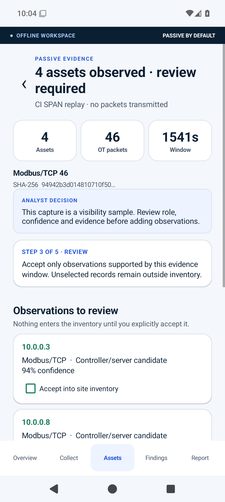 | 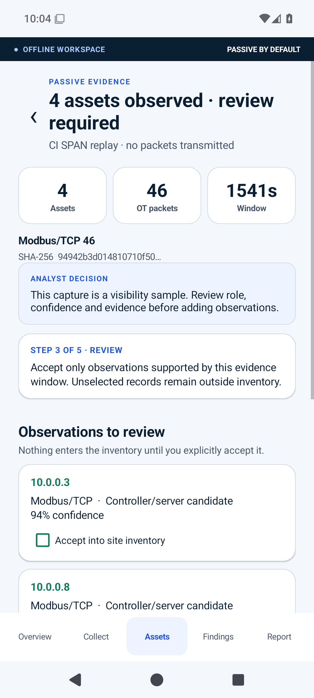 |

The Android journey crosses the signature-protected Capture Broker and file-descriptor boundary. The Linux gate independently captures injected Ethernet through the native AF_PACKET daemon while syscall tracing verifies zero `send`, `sendto` and `sendmsg` calls.

## Passive research-capture analysis

| Modbus/TCP | DNP3 |
|---|---|
|  | 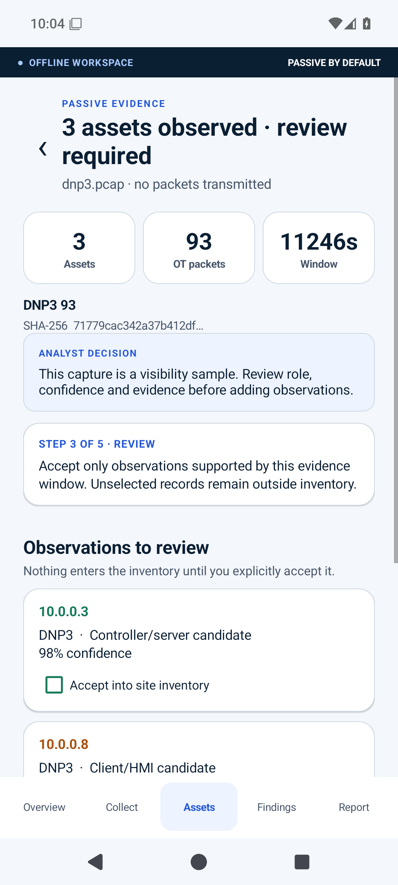 |

| IEC 60870-5-104 | BACnet/IP |
|---|---|
| 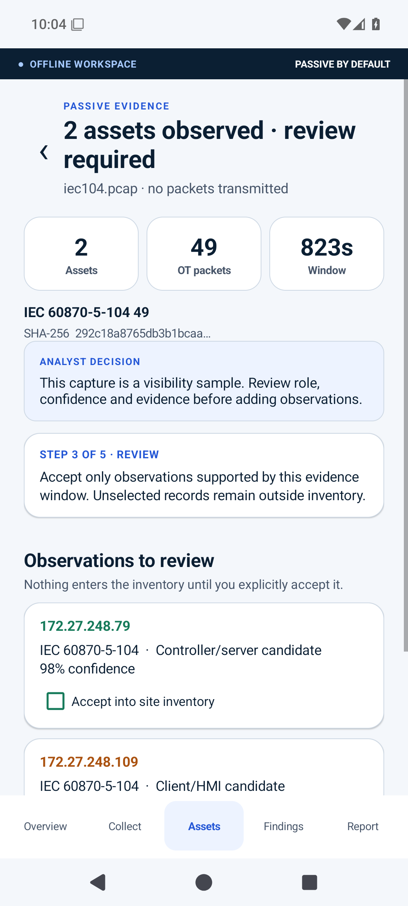 | 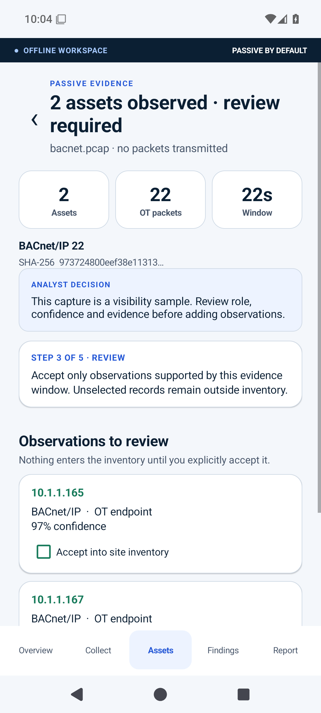 |

Each capture enters through a real Android `content://` upload. Results expose hash, packet counts, time window, endpoints, inferred roles and confidence before observations enter inventory.

## Active authorization and emulator outcomes

| Exact authorization | Out-of-scope stop |
|---|---|
| 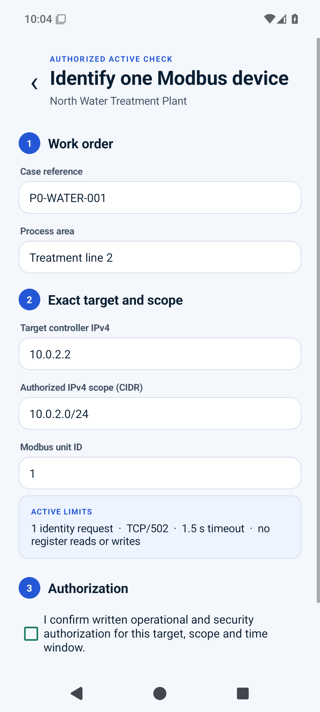 | 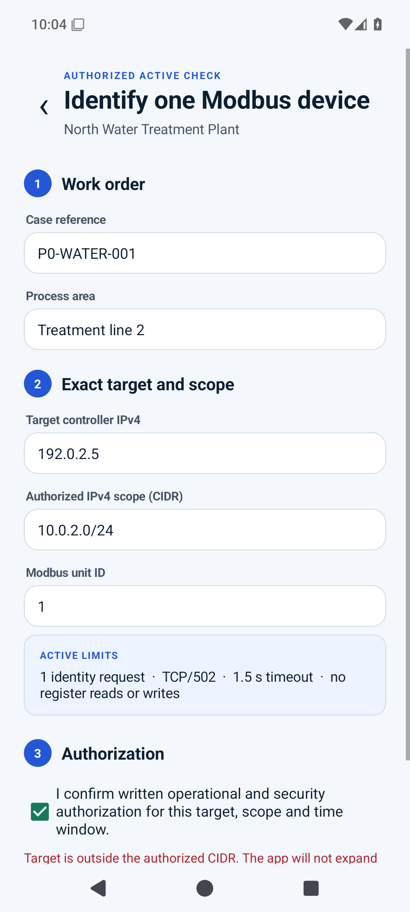 |

| PyModbus identity | modbus-tk service only |
|---|---|
| 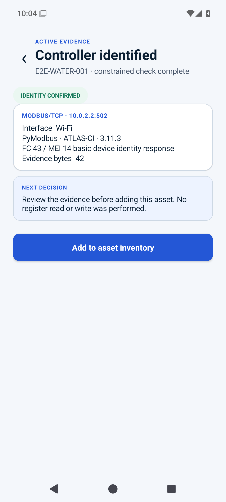 | 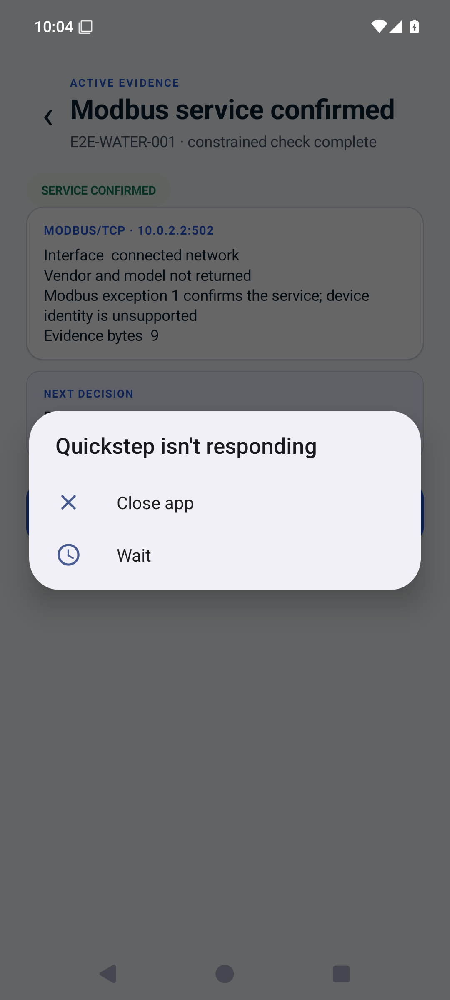 |

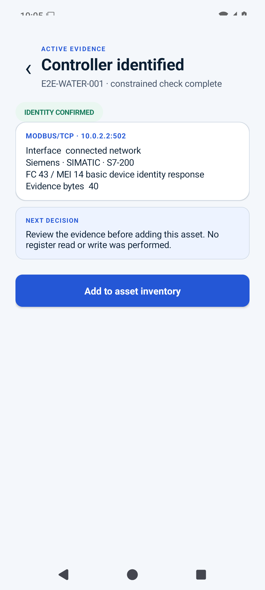

The active jobs execute the actual Case App → signed grant → Binder broker → TCP/502 → emulator → evidence UI path. PyModbus proves identity extraction; Modbus-TK and Conpot prove conservative service-only handling across independent implementations.

## Professional handoff gate

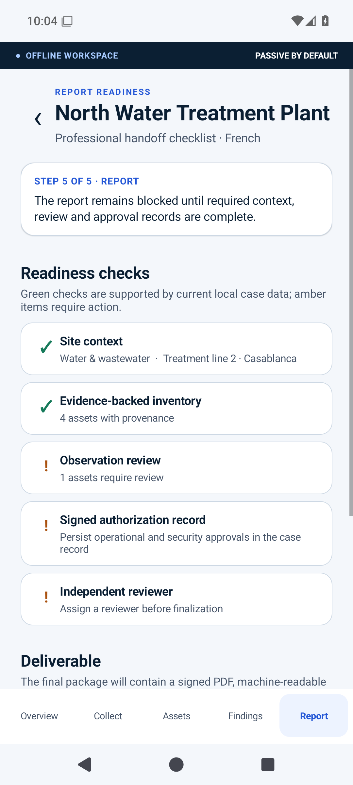

The five-stage instrumentation journey opens **Overview**, **Collect**, **Assets**, **Findings** and **Report**, then verifies that incomplete authorization and reviewer records block finalization.

## Reproduction

Instrumentation writes PNG checkpoints through Android MediaStore. `tools/run_ui_e2e.sh` and `tools/run_active_e2e.sh` pull them before emulator shutdown; CI retains the original screenshots, test reports and logs as artifacts. The documentation files above are the original run #32 PNGs.
