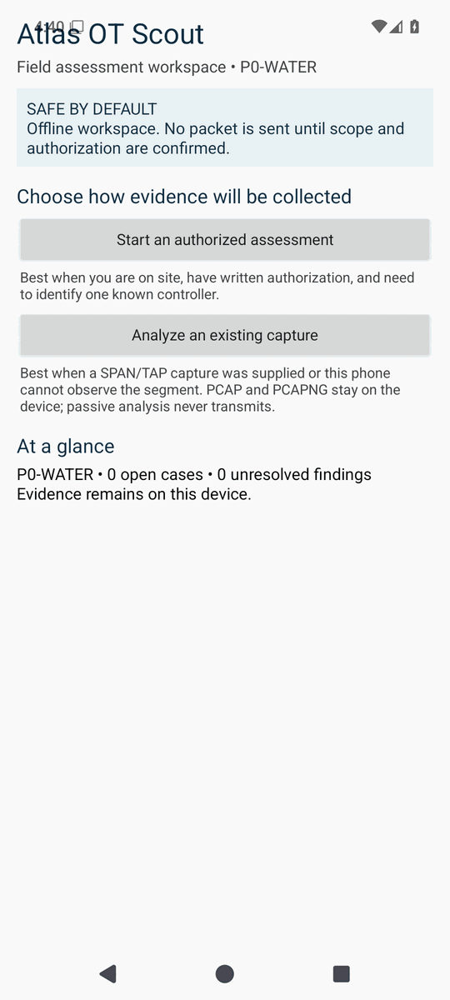
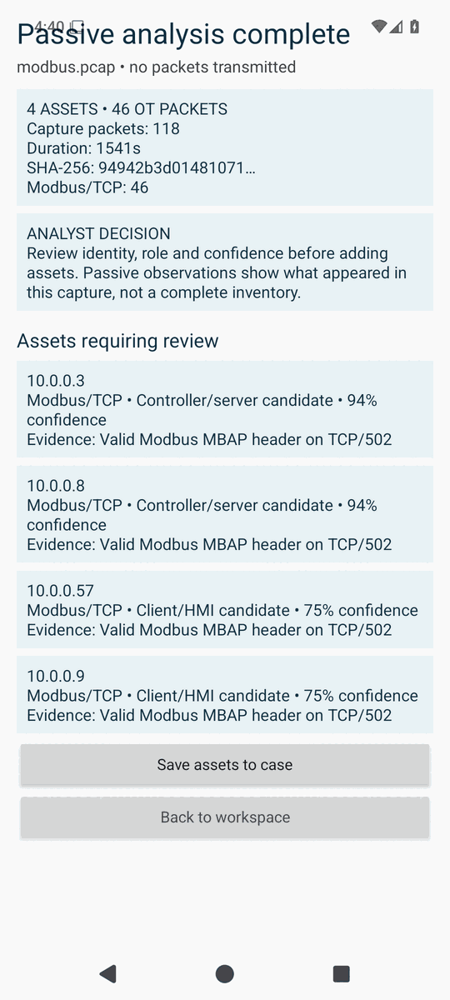
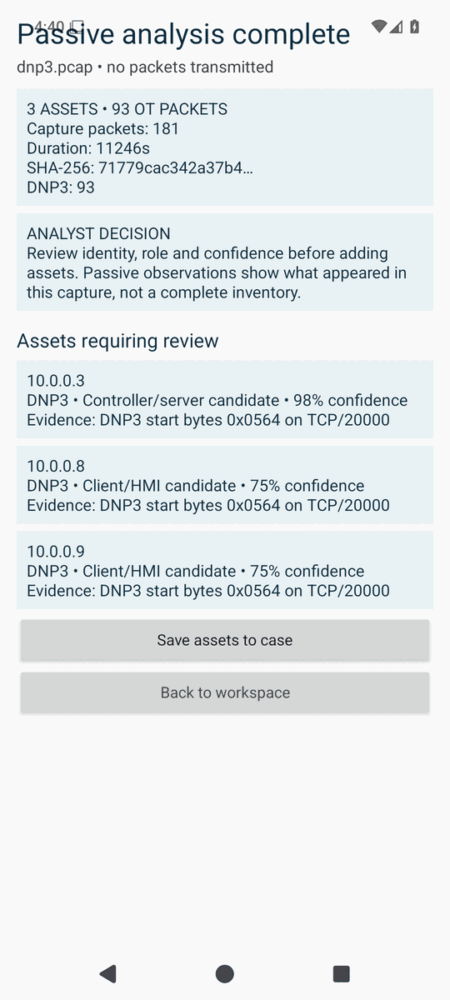
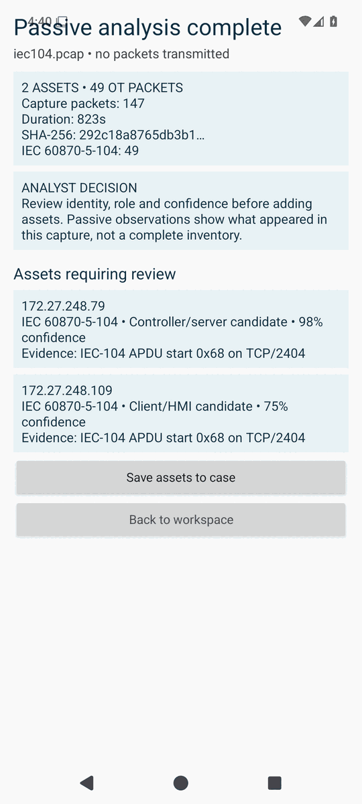
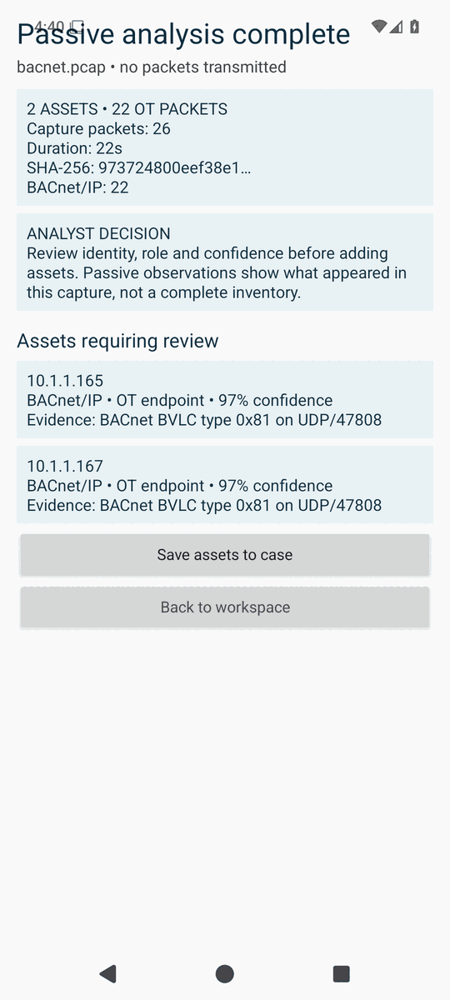
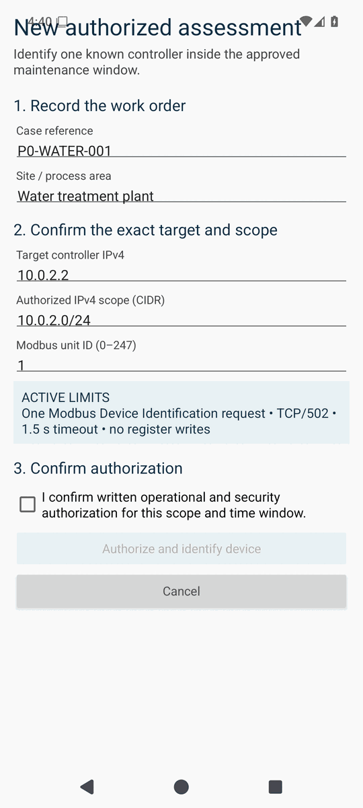
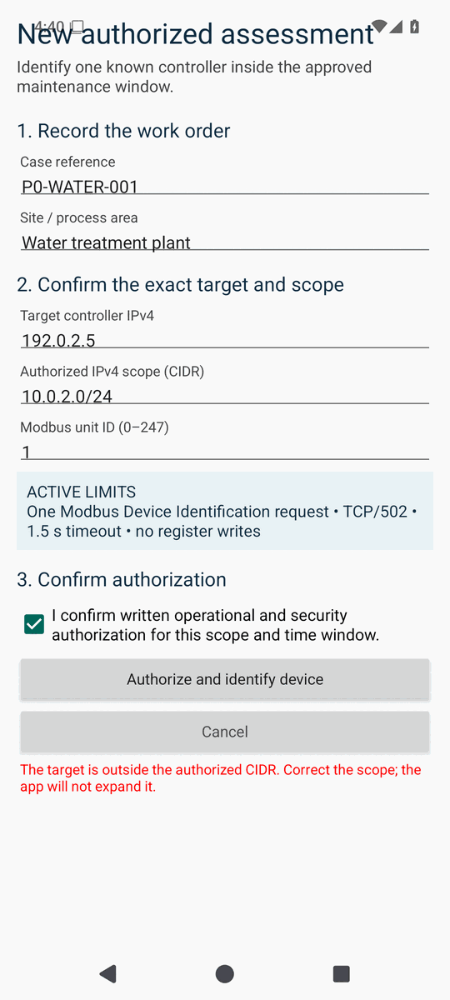
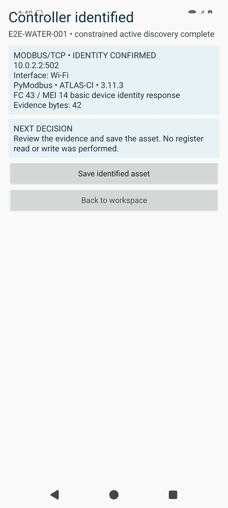
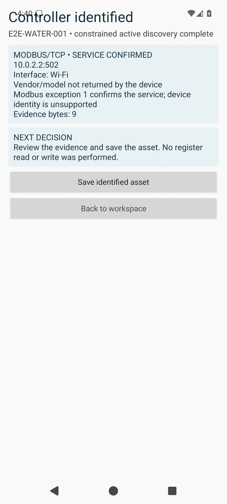

# Emulator acceptance screenshots

These images are outputs of the Android 15 (API 35) instrumentation journeys in [GitHub Actions run #16](https://github.com/charifmahmoudi/mobile-ot-security-assessment/actions/runs/33322997770), not design mockups. The same run passed Android API 29 and API 35, PyModbus, modbus-tk, and Conpot jobs.

## Collection-mode decision

The home screen keeps passive import separate from network transmission and states the safety boundary before either workflow begins.

## Passive research-capture analysis

| Modbus/TCP | DNP3 |
|---|---|
|  |  |

| IEC 60870-5-104 | BACnet/IP |
|---|---|
|  |  |

Each file entered the app as a real Android `content://` upload. The UI shows the capture hash prefix, total and supported OT packet counts, inferred endpoints, roles, confidence, and the evidence supporting classification.

## Active authorization and local scope enforcement

| Authorization checkpoint | Out-of-scope stop |
|---|---|
|  |  |

The action is disabled before authorization. A target outside the entered CIDR is rejected in the Case App before the Network Broker is contacted.

## Active emulator outcomes

| PyModbus identity returned | modbus-tk service only |
|---|---|
|  |  |

PyModbus returned vendor, product, and revision objects. modbus-tk returned a valid Modbus exception, so the application confirmed the service without fabricating device identity. Conpot also passed the signed end-to-end job; its screenshot is intentionally omitted because the captured frame contained an unrelated Android launcher dialog.

## Reproduction

The instrumentation test writes PNG checkpoints through Android MediaStore. While the emulator is still running, `tools/run_ui_e2e.sh` and `tools/run_active_e2e.sh` pull them into `build/emulator-screenshots`; the workflow publishes them with the test reports and emulator logs.

Documentation images are reduced to 540 × 1200 pixels and a 64-color palette. Their content is otherwise unchanged from the CI output.
