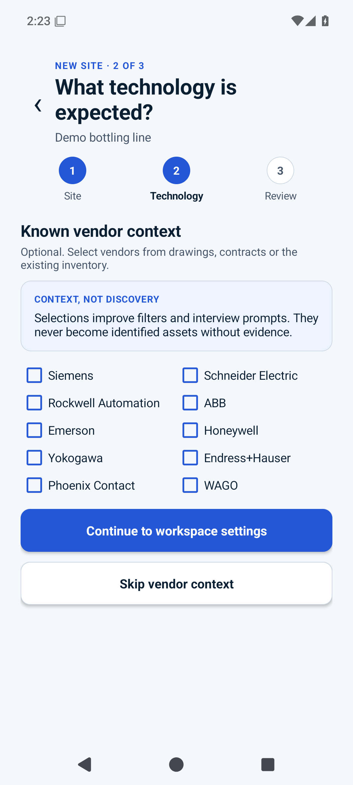
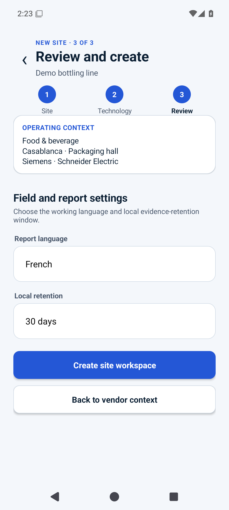

# Atlas OT Scout — guided user manual

This manual explains **how to operate the current application workflow**. It does not maintain an independent capability/status matrix. Before field or demo use, check [IMPLEMENTATION.md](../../IMPLEMENTATION.md) for what executes and [E2E-ACCEPTANCE.md](../testing/E2E-ACCEPTANCE.md) for what the test environment proves.

The working journey is:

**Prepare → Collect → Review → Reason → Report.**

Normative assessment rules are in [ASSESSMENT-METHOD.md](../poc/ASSESSMENT-METHOD.md); exact active/passive packet behavior is in [NETWORK-EXECUTION.md](../architecture/NETWORK-EXECUTION.md).

## 1. Select the correct site

Choose the authorized operating context before collecting evidence. The included North Water Treatment Plant is sample/demo data and must not be treated as field evidence.

Evidence assigned to the wrong site or process area can produce a misleading working inventory.

## 2. Create a site workspace

| Site and industry | Technology context | Review and create |
|---|---|---|
|  |  |  |

1. **Site:** enter the site name and authorized location/process area.
2. **Technology context:** select vendors only when prior drawings/contracts/inventory justify them, or explicitly skip.
3. **Review:** verify context, language and local workspace settings before creation.

Vendor context is prior knowledge, not discovery. It becomes an accepted asset fact only after evidence/review.

## 3. Use the site dashboard

The five work areas are:

| Destination | Use it for |
|---|---|
| Overview | Assessment state, evidence coverage and next decision |
| Collect | Choose the evidence method that matches the question and authorization |
| Assets | Review observations and the working inventory model |
| Findings | Review evidence-linked draft conditions |
| Report | Inspect readiness blockers and handoff state |

Use the recommended next action as guidance, not as authorization. Authorization and evidence sufficiency still control the method.

## 4. Choose an evidence method

Use the least intrusive method that can answer the question.

| Situation | Method | Network effect |
|---|---|---|
| Approved PCAP/PCAPNG is available | Analyze imported capture | No packet transmission |
| Approved SPAN/TAP passive path is available on a supported appliance | Observe passive interface | Receive-only capture path |
| One exact Modbus controller is explicitly authorized | Identify one known controller | One bounded active identity request |
| Scope, target or visibility is uncertain | Stop | Obtain the missing authorization/evidence |

Whether a live passive or other collection path is currently usable is answered only by [IMPLEMENTATION.md](../../IMPLEMENTATION.md) and the appliance compatibility evidence.

## 5. Analyze an imported capture

### Prepare the evidence

Record the original capture source, collection point/time, operator where known, authorization/handling context and source file.

### Import and review

1. Choose **Analyze PCAP / PCAPNG**.
2. Select the approved file through Android's document picker.
3. Review filename/hash, packet/time summary, protocols and visibility context.
4. Review each proposed endpoint/role/identity and its confidence.
5. Select only observations you are prepared to accept into the working inventory.
6. Add the selected observations; leave unresolved records outside accepted inventory until reviewed.

A capture is a visibility sample. Absence from a capture is not proof that an asset is absent from the process area.

## 6. Use live passive capture only with the approved path

When the dedicated passive capability is available and qualified for the environment, choose the SPAN/TAP method only after confirming the intended capture source and interface.

| Capture boundary | Result review |
|---|---|
|  |  |

The application-facing passive path is receive-only by contract, but whole-segment visibility still depends on correct SPAN/TAP delivery. An ordinary Ethernet connection does not provide arbitrary switched-network visibility.

Do not infer hardware qualification from the existence of this screen; use [IMPLEMENTATION.md](../../IMPLEMENTATION.md) and [COMPATIBILITY-MATRIX.md](../appliance/COMPATIBILITY-MATRIX.md).

## 7. Identify one authorized Modbus device

Before starting, obtain the exact authorization context required by the assessment: one target IPv4 address, approved CIDR/scope, Modbus unit ID and valid operating window.

1. Enter the case/work reference and process context requested by the UI.
2. Enter the exact target, approved CIDR and unit ID.
3. Review the displayed operation boundary.
4. Compare entered values with the authorization source.
5. Confirm and execute once.

If the target is outside the entered scope, stop rather than widening the scope to make validation pass.

The initial active operation is the bounded Modbus basic device-identification request defined in [NETWORK-EXECUTION.md](../architecture/NETWORK-EXECUTION.md). The user workflow provides no subnet sweep, port sweep, unit-ID sweep, register read/write or credential operation.

### Interpret the result

| Result class | Interpretation |
|---|---|
| Identity evidence | Supported device-identification objects were returned; corroborate before accepting the asset identity |
| Service evidence | A Modbus service response exists but reliable model identity was not established |
| Rejected/failed action | Preserve the reason and fix authorization/context if appropriate; do not broaden scope |

## 8. Review the inventory

The inventory is a reviewed evidence model, not a scan-result list.

For each relevant record ask:

- Is this a new asset candidate, corroboration or a conflict?
- What source supports each identity attribute?
- What remains unverified?
- Is the visibility strong enough for the conclusion?

Use the process/zone view as a review aid. Missing communication in the available evidence is not proof that a connection does not exist.

## 9. Review findings and report readiness

Findings keep evidence/confidence separate from operational consequence. Protocol presence alone is not automatically a vulnerability or business-impact conclusion.

The Report area shows readiness blockers. A professional handoff should remain blocked until the required authorization, evidence review and release controls exist under the P0 method.

## 10. Safe-stop rules

Stop and escalate when:

- authorization, target, scope, unit ID, operating window or interface is uncertain;
- the observed result conflicts with a physical label or authoritative record and cannot be reconciled safely;
- passive visibility is insufficient for the requested conclusion;
- the environment shows instability or a stop condition defined by the authorization/method occurs.

Never use a broader network action as a fallback for missing authorization or insufficient evidence.

## 11. Demonstration and provenance

Use the maintained [presenter script](../product/DEMO-SCRIPT.md) for a short demo. Screenshot provenance is recorded separately in [EMULATOR-SCREENSHOTS.md](../testing/EMULATOR-SCREENSHOTS.md); pinning a historical CI run there does not make that run the repository's permanent current-status authority.
