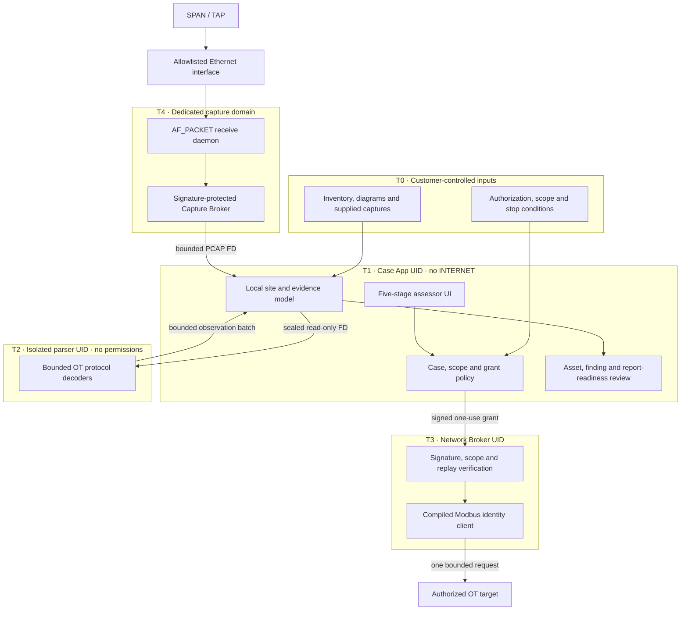
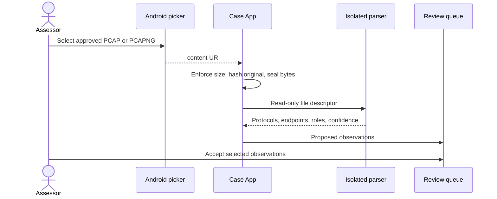
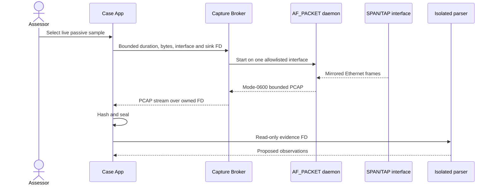
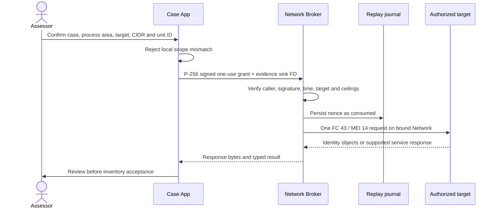
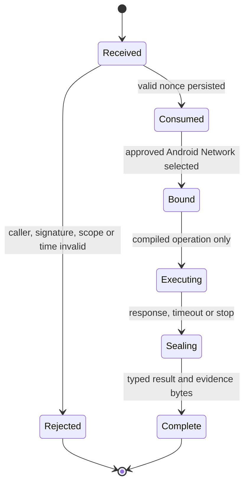
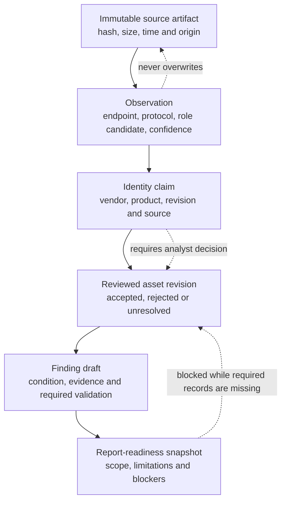

# Atlas OT Scout architecture

_Implementation overview for the executable P0-WATER baseline._

This document explains how the current Android PoC enforces safe collection, how raw evidence becomes a reviewed assessment record, and where the implementation stops. It is the starting point for architecture review; detailed contracts are linked only after the complete system model.

## 1. Architectural objective

Atlas must let an authorized assessor collect useful OT identity evidence without turning the data-rich application into a general-purpose network client or granting root to application code.

The design therefore separates four authorities:

| Authority | Component | May do | Must not do |
|---|---|---|---|
| Assessment authority | Case App | Store site context, create grants, review observations, manage inventory | Open network sockets or invoke shell/root |
| Active network authority | Network Broker | Verify a signed grant and execute a compiled operation | Read the case database or accept arbitrary packets/commands |
| Passive capture authority | Capture Broker + native daemon | Receive Ethernet from one allowlisted interface into a bounded PCAP | Configure routes, transmit packets or expose generic capture controls |
| Parsing authority | Isolated parser | Convert bounded evidence bytes into normalized observations | Access network, database keys or mutable source evidence |

This is a least-authority design: a compromise of one component does not automatically grant the capabilities of another.

## 2. System and trust boundaries



Every cross-boundary arrow is typed and bounded. There is no generic command string, socket handle, arbitrary packet byte array, output pathname or root shell in an application contract.

## 3. Deployment profiles

The same assessment workflow supports progressively stronger capture profiles.

| Profile | Passive source | Active source | Permitted claim |
|---|---|---|---|
| Compatibility Android | Imported PCAP/PCAPNG | Signed Network Broker | Offline analysis and one-target identity |
| Rooted laboratory device | Experimental USB Ethernet daemon | Signed Network Broker | Feasibility and lab validation only |
| Dedicated security appliance | Signed/locked image, confined daemon, qualified NIC/TAP | Signed Network Broker | Live field capture only after hardware acceptance |

An unlocked phone with a consumer root manager is not the production architecture. The intended appliance uses product-controlled image signing, relocked bootloader where supported, Verified Boot, SELinux enforcing and no general-purpose root surface.

## 4. Passive collection

### 4.1 Imported evidence



The original is hashed before parsing and remains separate from normalized observations. Unsupported, oversized, malformed or truncated files fail closed; partially parsed assets are not silently accepted.

### 4.2 Dedicated live capture



The native daemon opens `AF_PACKET/SOCK_RAW`, binds the exact interface index, receives in promiscuous mode and writes classic PCAP until its byte or duration ceiling. CI rejects linked transmission symbols and traces the live process to prove that `send`, `sendto` and `sendmsg` are never called.

That software proof does not establish physical receive-only behavior. A release profile must additionally qualify the OS image, USB controller, NIC, powered hub, VLAN preservation, timestamp accuracy, packet loss, suspend/thermal behavior and TAP topology.

## 5. Active identity execution

The Case App cannot contact an OT target directly. It asks the Network Broker to execute one compiled operation using a short-lived signed grant.



The implemented operation is Modbus/TCP Read Device Identification with basic objects only:

```text
TT TT 00 00 00 05 UU 2B 0E 01 00
```

The broker exposes no register read/write, unit-ID discovery, port scan, retry-on-exception, credential flow or fallback probe. The current resource ceilings are one target, one unit ID, one request, 1.5-second timeout and bounded response bytes.

### Grant lifecycle



Consumption occurs before socket creation so a broker crash cannot replay an accepted grant. Emergency stop closes all active sockets and cancels queued work; execution never resumes automatically.

## 6. Evidence and assessment model

Atlas deliberately separates facts observed in bytes from analyst conclusions.



Current persistence uses local application preferences for the PoC demonstration site and inventory. A production release requires a versioned SQLCipher schema, immutable audit events, encrypted artifact storage and deterministic signed export. The UI labels this gap and blocks final report issuance.

## 7. Enforcement and verification map

| Security property | Enforcement point | Automated evidence |
|---|---|---|
| Case App cannot transmit IP traffic | Manifest omits `INTERNET` | Architecture policy script and device test |
| Broker cannot execute arbitrary operations | AIDL accepts typed grant; compiled operation enum | Unit tests and source boundary checks |
| Grant cannot be broadened or replayed | Signature, exact CIDR/target, expiry and fsync-backed nonce journal | JVM and Android negative tests |
| Socket cannot silently use cellular/VPN | Explicit Android `Network` binding and transport checks | Code path plus emulator contract tests |
| Parser cannot reach network or database | `isolatedProcess="true"`, read-only FD input | Manifest check and device test |
| Live passive daemon cannot transmit | No send symbols/API; runtime syscall trace | Linux virtual-SPAN CI gate |
| Unsupported identity is not fabricated | Service-only typed outcome with blank identity | Modbus-TK and Conpot journeys |
| Out-of-scope request produces no broker contact | Case App pre-validation | Android negative journey |
| Observation cannot silently enter inventory | Explicit selection and acceptance action | API 29/35 UI journey |
| Incomplete assessment cannot appear final | Report-readiness blockers | Five-stage guided journey |

## 8. Failure containment

| Failure | Containment | Operator-visible outcome |
|---|---|---|
| Case App/UI crash | Broker owns its resource budgets; Android closes abandoned IPC | Assessment can reopen from persisted PoC state |
| Parser crash or malformed input | Isolated process cannot mutate source artifact | Import fails without accepted assets |
| Broker rejection | No socket is created | Typed authorization/scope correction |
| Network route/interface change | Bound socket is closed; no fallback transport | Safe-stop result |
| Capture detach or byte/time limit | Daemon closes output and broker seals received bytes | Incomplete/limited capture label |
| Unsupported Modbus identity | Raw response retained; identity fields remain empty | Service confirmed, not device identified |
| Missing approval/reviewer/storage control | Final report action remains blocked | Explicit readiness item |

## 9. Implemented baseline versus target product

| Area | Implemented baseline | Required for professional field release |
|---|---|---|
| Device | Android API 29–35 emulator-tested APKs | Signed and locked supported device image; physical matrix |
| Passive capture | Imported files; emulated broker; native Linux/veth capture | SELinux integration and qualified Samsung/NIC/TAP tuple |
| Active | One Modbus basic identity operation | Additional operations only through separate threat review and fixtures |
| Parsing | Bounded passive attribution; four sourced protocol fixtures | Larger production corpus, fuzz budgets and performance qualification |
| Persistence | Local PoC site/inventory state | SQLCipher, key lifecycle, migrations and immutable audit log |
| Findings/report | Guided drafts and readiness blockers | Deterministic HTML/PDF/JSON/CSV, reviewer signatures and verifier CLI |
| Wireless/serial | Clearly marked planned | Restricted, separately permissioned packs with hardware tests |

## 10. Architecture decisions and detailed contracts

Use these only after the overview above establishes the system model:

| Detail | Normative document |
|---|---|
| Android packages, permissions and physical deployment | [System and deployment](../architecture/SYSTEM-AND-DEPLOYMENT.md) |
| Grants, interface binding and protocol limits | [Network execution](../architecture/NETWORK-EXECUTION.md) |
| Kotlin, AIDL and IPC contracts | [Component contracts](../architecture/COMPONENT-CONTRACTS.md) |
| Evidence entities, lineage and reporting | [Evidence data model](../architecture/EVIDENCE-DATA-MODEL.md) |
| Assets, threats, controls and security gates | [Security and threat model](../architecture/SECURITY-AND-THREAT-MODEL.md) |
| Rooted image and hardware boundary | [Dedicated Android appliance](../architecture/DEDICATED-ANDROID-APPLIANCE.md) |
| Exact assessment outcome and definition of done | [P0-WATER contract](../poc/WATER-WASTEWATER-POC.md) |
| What CI proves and excludes | [End-to-end acceptance](../testing/E2E-ACCEPTANCE.md) |

When target-state documents conflict with executable status, [IMPLEMENTATION.md](../../IMPLEMENTATION.md) defines what is actually present in the repository today.
