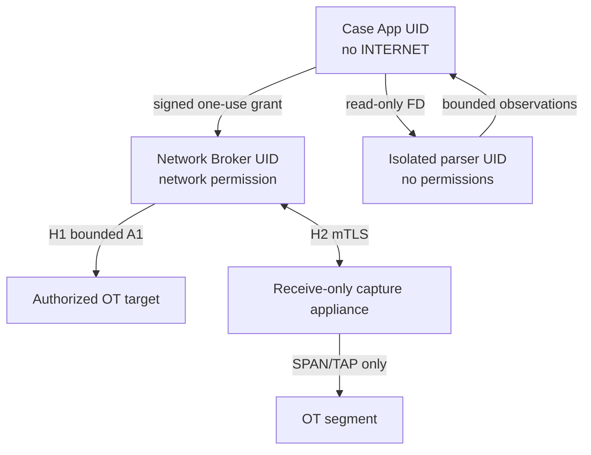
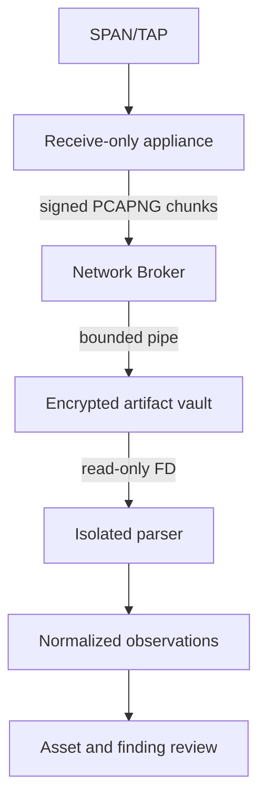
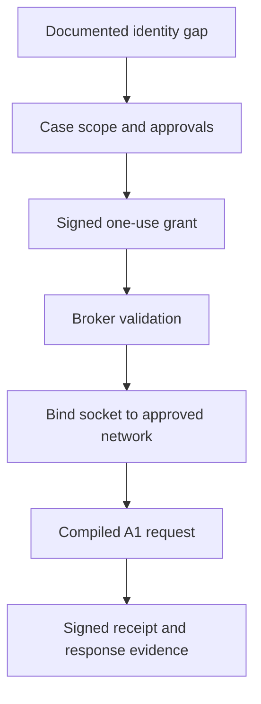
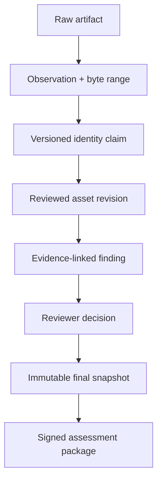

# Technical Architecture

The architecture is defined as an implementation and assurance pack, not a single overview diagram.

## Architecture map

| Document | Question answered |
|---|---|
| [System context and deployment](../architecture/SYSTEM-AND-DEPLOYMENT.md) | What is deployed, where, under which Android UID/permission and physical connection? |
| [Network execution and capture](../architecture/NETWORK-EXECUTION.md) | How can a packet be emitted or captured, and why can the UI not bypass policy? |
| [Component contracts](../architecture/COMPONENT-CONTRACTS.md) | What modules, Kotlin ports, AIDL/protobuf boundaries and error contracts are implemented? |
| [Evidence and data model](../architecture/EVIDENCE-DATA-MODEL.md) | How does raw evidence become a reviewed asset, finding and signed report? |
| [Security architecture and threat model](../architecture/SECURITY-AND-THREAT-MODEL.md) | What is protected, from whom, by which controls and verification gates? |
| [H2 capture appliance](../poc/CAPTURE-ACCESSORY.md) | How is professional passive SPAN/TAP capture achieved without rooting Android? |
| [P0-WATER product contract](../poc/WATER-WASTEWATER-POC.md) | What exact assessment must the system complete? |
| [Test and acceptance](../poc/TEST-AND-ACCEPTANCE.md) | What proves the implementation is safe and complete? |

## Core architectural decision

The earlier one-process design was rejected because a policy module inside an Internet-capable application is not a strong enforcement boundary. P0 uses two Android packages:

- the data-rich Case App has no `INTERNET` permission;
- the data-poor Network Broker has network permission but no case database, UI, generic socket API or arbitrary request-byte interface;
- binary parsing runs under an isolated Android UID with no permissions;
- whole-segment passive capture uses a receive-only appliance connected to SPAN/TAP.

## Non-negotiable invariants

1. No network packet is produced from the Case App process.
2. Network Broker accepts only signature-authorized, compiled operation IDs.
3. Every H1 socket is bound to the approved Android `Network`.
4. H2 OT-facing Ethernet transmits zero frames.
5. No parser has network permission or database key.
6. Original evidence is immutable after sealing.
7. Inference never overwrites observations.
8. A finalized report reads one immutable snapshot.
9. A pack cannot add executable code or a new network operation.
10. Active execution never resumes automatically.
11. “Not observed” is never represented as “absent.”
12. Every reportable finding resolves to evidence and a reviewer decision.

## Principal flows

### Passive evidence

### Active identity

### Evidence lineage

## Technology baseline

- Kotlin, coroutines/Flow and Compose for Android.
- Separate signed Case App and Network Broker APKs.
- Rust bounded packet parsers behind JNI in an isolated process.
- Room with current SQLCipher Android package.
- Protobuf for IPC; canonical JSON for external evidence.
- PCAPNG for capture.
- AES-256-GCM for case artifacts; Android Keystore wrapping.
- Ed25519 for packs, grants, receipts and assessment manifests.
- CycloneDX SBOM and signed build provenance.

The detailed documents above are normative when they conflict with older descriptive material elsewhere in the repository.
