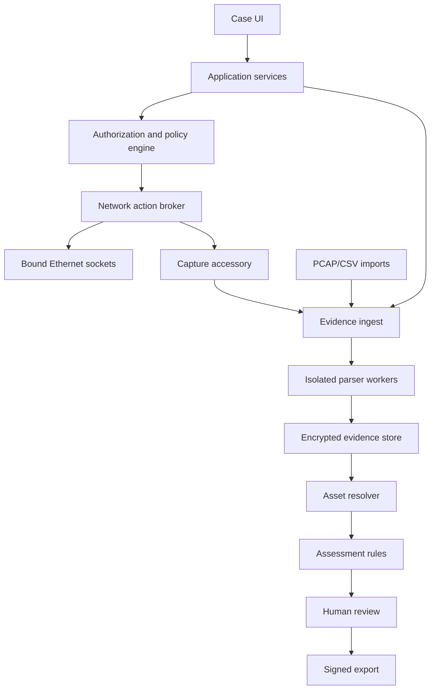
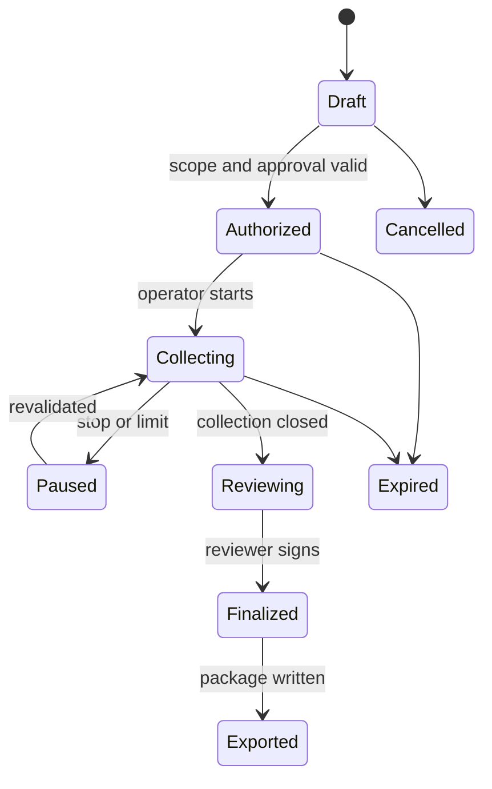

# Technical architecture

_Status: implementable PoC baseline. Target: Android ARM64, API 29+, offline-first. First industry pack: water and wastewater pumping/treatment._

## 1. Architectural decision

Atlas is an **evidence collection and reconciliation instrument**, not a general-purpose scanner. The first release performs one professional workflow: reconcile the authorized asset inventory and network evidence for one water/wastewater control segment, then produce a reviewable assessment package.

The architecture has three hard boundaries:

1. Android UI code never creates network packets directly.
2. Every packet-producing operation passes through a deterministic policy executor using a signed profile.
3. Parsed facts, inferred identities and assessor findings are separate records linked by immutable evidence references.

Android USB host APIs enumerate and communicate with USB devices, but Android does not promise promiscuous Ethernet capture to ordinary apps ([Android USB host](https://developer.android.com/develop/connectivity/usb/host)). Whole-segment capture therefore requires a SPAN/TAP capture path or imported PCAPNG. Direct USB Ethernet is used for explicitly approved socket-based identity requests and traffic addressed to the phone.

## 2. PoC deployment profiles

| Profile | Hardware | Network capability | PoC status |
|---|---|---|---|
| H1 direct assessment | Supported Android phone; powered USB-C hub; approved USB Ethernet NIC | Per-target TCP/UDP A1 identity queries; locally delivered broadcast/multicast; no claim of whole-segment visibility | Mandatory |
| H2 passive capture | H1 phone plus a capture accessory connected to a customer SPAN/TAP, streaming PCAPNG through USB or an authenticated local link | Receive mirrored Ethernet frames without placing Android in-line | Mandatory for field-quality passive evidence |
| H3 offline review | Android phone only | Import PCAP/PCAPNG and customer CSV; no network transmission | Mandatory |
| H4 Wi-Fi/BLE observation | Android built-in radios | Android Wi-Fi scan results and BLE advertisements; no monitor mode, deauthentication or GATT connection | Mandatory |

The compatibility matrix pins phone model, Android build, NIC/accessory VID:PID, driver, hub, power source and maximum sustained capture rate. “USB Ethernet connected” never implies “passive segment capture.”

## 3. Runtime decomposition



### 3.1 Android modules

| Gradle module | Responsibility | May access network? | May access database? |
|---|---|---:|---:|
| `app-ui` | Compose screens, navigation, operator prompts | No | Through use cases only |
| `domain` | Case, scope, asset, evidence and finding types | No | No |
| `case-service` | Case lifecycle, authorization, retention, status machine | No | Yes |
| `interface-broker` | Enumerate Android `Network`, USB, Wi-Fi and BLE capabilities; expose limitations | No packets | Yes |
| `action-policy` | Verify signed profile, scope, time, interface, budgets and approval | No | Audit only |
| `probe-executor` | Create per-interface sockets and execute approved request templates | Yes, only after policy grant | Audit/evidence only |
| `capture-transport` | Import PCAPNG or receive framed PCAPNG from capture accessory | Receive only | Evidence only |
| `parser-core` | Rust bounded decoders for Ethernet/IP/TCP/UDP/ARP/Modbus/TCP/OPC UA metadata | No | No direct DB |
| `asset-resolver` | Deterministic merge/split and confidence computation | No | Yes |
| `assessment-engine` | Versioned water-pack checks over normalized facts | No | Yes |
| `reporting` | HTML, PDF, JSON and CSV assessment package | No | Read-only |
| `pack-manager` | Verify and activate signed industry/query/knowledge packs | No | Yes |
| `connector-csv` | Customer inventory mapping, preview, import and exception export | No | Yes |

### 3.2 Process boundaries

- Main application process: UI, case orchestration and database.
- Parser worker process: isolated Android service. It receives read-only file descriptors and returns size-bounded protobuf messages. It has no network permission and no database key.
- Probe service: foreground service with visible notification and persistent emergency-stop action. It accepts only an immutable `ExecutionGrant` from the policy engine.
- Report worker: reads a database snapshot and writes to an app-private temporary file before user-authorized export.

A parser crash marks the evidence item `parser_failed`; it never terminates the case or silently discards the original capture.

## 4. Technology baseline

| Concern | Decision |
|---|---|
| Language/UI | Kotlin, coroutines/Flow, Jetpack Compose |
| Minimum Android | API 29; target current stable SDK at implementation start |
| Native safety boundary | Rust for packet parsers, built with Android NDK; narrow JNI wrapper |
| Local data | Room over SQLCipher-backed SQLite; file blobs encrypted separately |
| Keys | Android Keystore AES-256-GCM wrapping a random per-case data-encryption key |
| Serialization | Protobuf internally; canonical JSON for portable export |
| PDF | Generate deterministic HTML first, render PDF second; HTML is the normative report |
| Hashes | SHA-256 for artifacts; chained SHA-256 audit events |
| Signatures | Ed25519 for packs and manifest; public verification key bundled with app |
| Capture format | PCAPNG; retain interface blocks, timestamps and comments |
| Dependency policy | Pin exact versions and hashes; SBOM in CycloneDX JSON |

No Python runtime, shell, Nmap, Metasploit, PentAGI agent or arbitrary executable plugin ships inside the PoC.

## 5. Case state machine



Only `Authorized` or `Collecting` cases can request an active grant. A finalized case is immutable; corrections create a new revision referencing the previous manifest.

## 6. Authorization and action path

### 6.1 Required case authorization

A case cannot enter `Authorized` until it contains:

- authorizing legal entity and site;
- named operational approver and technical/security approver;
- signed authorization file hash;
- UTC start/end;
- allowed interfaces and capture points;
- CIDR/IP/MAC targets and explicit exclusions;
- allowed query profile IDs and versions;
- packet, target, concurrency and timeout ceilings;
- data classification, retention, export destination and emergency contact.

### 6.2 Execution grant

The policy engine produces a short-lived, single-use grant containing:

```text
case_id, authorization_hash, profile_hash, interface_id,
target, operation, max_packets, max_bytes, deadline,
nonce, issued_at, expires_at, policy_signature
```

The executor rejects the grant if any field differs from the intended socket/action. It binds each socket to the selected Android `Network`; cellular fallback is prohibited. Link loss, route change, app backgrounding, authorization expiry, packet-budget exhaustion or emergency stop closes all sockets.

### 6.3 PoC A1 operations

| Profile | Exact operation | Ceiling | Explicitly excluded |
|---|---|---|---|
| `modbus.read-device-id.basic.v1` | Modbus/TCP function 43, MEI 14, Read Device ID code 01, object 0; allowlisted IP and unit ID | 1 request + 1 retry; 1500 ms; concurrency 1 | register reads, diagnostics, writes, unit-ID sweep |
| `opcua.discovery.v1` | HEL/ACK then FindServers and GetEndpoints on allowlisted URL | one sequence; 3000 ms; concurrency 1 | session creation, browse, read, write, method call |
| `icmp.reachability.v1` | Optional single echo on an allowlisted IP | 1 request, no retry | subnet sweep |
| `tcp.connect.service-confirm.v1` | Optional connect to one approved IP:port already present in imported/passive evidence | 1 attempt; no banner commands | port range scan |

The OPC Foundation specifies FindServers and GetEndpoints as discovery services; GetEndpoints returns endpoint and security configuration, and neither service requires message security although transport security may be required ([FindServers](https://reference.opcfoundation.org/specs/OPC-10000-4/5.5.2), [GetEndpoints](https://reference.opcfoundation.org/specs/OPC-10000-4/5.5.4)).

## 7. Capture and ingest

### 7.1 Sources

- SPAN/TAP capture accessory stream;
- imported PCAP or PCAPNG;
- response capture generated by Atlas probes;
- Android Wi-Fi scan records;
- BLE advertising records;
- customer CSV inventory;
- photographs and manually entered nameplate fields.

### 7.2 Artifact protocol

Every raw artifact is written once to app-private storage:

1. create artifact UUID and temporary file;
2. stream bytes while counting length;
3. fsync and close;
4. compute SHA-256;
5. rename to content-addressed path;
6. append `ARTIFACT_SEALED` audit event;
7. enqueue parsing against that immutable hash.

Maximum PoC artifact: 2 GiB per file, 8 GiB per case, configurable downward. Capture rotates at 512 MiB or 30 minutes. Low-storage threshold stops capture safely and records the reason.

### 7.3 Visibility labels

Each observation carries one of: `imported`, `local-origin`, `delivered-multicast`, `tap-span`, `wifi-api`, `ble-advertisement`, or `manual-physical`. Findings must state whether absence means “not observed” or “tested and absent.”

## 8. Parser contract

Input: sealed artifact descriptor, byte range, link type and parser-pack version.

Output: zero or more normalized observations:

```text
observation_id, artifact_hash, byte_offset, byte_length,
captured_at, interface_id, protocol, subject_key,
field_path, typed_value, parser_id, parser_version,
parse_status, warnings
```

Rules:

- no allocation derived directly from an untrusted length without a configured cap;
- maximum Ethernet frame 16 KiB; maximum reassembled TCP flow 8 MiB;
- maximum 10,000 concurrent flow keys; LRU eviction is reported;
- malformed frames produce structured errors and retain offsets;
- TCP reassembly is bounded and time-windowed;
- all parsers have golden, truncation, mutation and fuzz corpora.

The PoC parses Ethernet II, 802.1Q, ARP, IPv4/IPv6, ICMP, TCP, UDP, DHCP, DNS/mDNS, LLDP, Modbus/TCP MBAP + function metadata, and OPC UA discovery responses. Unsupported payloads remain indexed by five-tuple and hash.

## 9. Asset model and reconciliation

An `Asset` is a reviewed grouping of endpoints and identity claims, never a parser output.

Strong keys:

- imported customer asset ID;
- exact MAC observed on the scoped segment;
- protocol identity tuple, such as Modbus vendor/product/revision;
- OPC UA application URI plus certificate fingerprint.

Weak keys—IP, hostname, OUI and display name—cannot merge assets alone.

Merge order:

1. exact imported ID mapping accepted by reviewer;
2. exact stable protocol identity;
3. exact MAC within the same case and VLAN;
4. candidate match requiring review.

Conflicts are preserved. Confidence bands: confirmed `>=0.90`, probable `0.70–0.89`, tentative `0.40–0.69`, insufficient `<0.40`. A professional report counts confirmed/probable assets separately from tentative candidates.

## 10. Industry-pack boundary

The water pack contains:

- CSV field mapping templates;
- device-class taxonomy: PLC/RTU, HMI, SCADA server, engineering workstation, historian, managed switch, firewall/router, VFD/soft starter, protection relay, gateway, analyzer/meter, wireless gateway and unknown;
- approved query profiles;
- passive parsing configuration;
- assessment rules;
- report wording and NIST mappings;
- vendor/product knowledge with source URL, retrieved date and pack version.

Industry packs are data and deterministic rules. They cannot include executable code or widen the application’s compiled network operations.

## 11. Assessment rules

Each rule declares: ID, version, title, applicability, required evidence, evaluation expression, output evidence, severity method, confidence threshold, remediation text and framework references.

PoC rule families:

- inventory missing, unexpected, duplicate or conflicting;
- unidentified OT endpoint;
- asset evidence stale relative to customer threshold;
- cleartext industrial protocol observed;
- OPC UA endpoint offering `SecurityPolicy None`;
- management service exposed inside the assessed segment;
- communication crossing the declared zone boundary;
- wireless/BLE observation not represented in the inventory;
- unsupported lifecycle only when matched to a dated vendor source;
- evidence/visibility limitation requiring manual follow-up.

Rules never claim exploitability from a port alone.

## 12. Persistence and integrity

Core tables: `cases`, `authorizations`, `scope_targets`, `interfaces`, `artifacts`, `observations`, `assets`, `endpoints`, `claims`, `claim_evidence`, `imports`, `active_executions`, `rules`, `findings`, `reviews`, `audit_events`, `pack_versions`, `exports`.

Large artifacts are files; metadata and relationships are relational. Foreign keys are mandatory. Deletion is a two-step, audited workflow: cryptographic erase of the case key, then best-effort file removal. Android backups are disabled.

Audit event hash:

```text
event_hash = SHA256(previous_hash || canonical_event_json)
```

The export manifest contains the final audit head, every artifact hash, schema versions, app build, pack hashes and report hash.

## 13. Report/export contract

One finalized export is a ZIP containing:

```text
manifest.json
authorization/
inventory/assets.csv
inventory/endpoints.csv
findings/findings.csv
evidence/observations.jsonl
evidence/active-executions.json
captures/                 # optional by policy
photos/                   # optional by policy
report/assessment.html
report/assessment.pdf
verification/README.txt
```

The package is signed. The customer can validate it without Atlas using published schemas and a verification CLI planned for the PoC.

## 14. Security and privacy controls

- Offline by default; no analytics SDK, crash upload or hidden DNS.
- Network Security Config denies cleartext Internet destinations; the probe service is the only exception for explicitly approved OT sockets.
- Screen capture disabled on sensitive screens.
- Biometric/device credential required to unlock case keys after configurable inactivity.
- Camera metadata stripped unless location is explicitly authorized.
- No credentials, packet payloads or full certificate private material in the default report.
- Pack rollback prevention and trusted-key rotation.
- Release signing, CycloneDX SBOM, SLSA-style build provenance and dependency review.
- Rooted/debuggable device blocks field mode; synthetic lab mode remains available.

## 15. Failure behavior

| Failure | Required behavior |
|---|---|
| USB detached | Close stream/sockets, seal partial artifact, audit and pause |
| Network route changes | Abort grant; never fall back to Wi-Fi/cellular |
| Authorization expires | Stop all packet actions within one second |
| Parser malformed input | Quarantine parse result, retain original, continue case |
| Storage low | Rotate/seal then stop; no overwrite |
| App killed | Foreground capture/probe service stops safely; recover sealed artifacts |
| Clock changes | Record wall clock plus monotonic elapsed time and clock-change event |
| Pack signature invalid | Refuse activation |
| Report generation fails | Preserve finalized database snapshot; retry without changing findings |

## 16. Build sequence

1. Domain model, case state machine and encrypted persistence.
2. CSV import, sealed artifacts, audit chain and deterministic export.
3. Offline PCAPNG parser and water-pack asset reconciliation.
4. Wi-Fi/BLE observation and photo evidence.
5. H1 USB Ethernet interface selection and per-socket binding.
6. Policy engine and Modbus A1 profile.
7. OPC UA discovery profile.
8. H2 capture-accessory integration.
9. Assessment rules, reviewer workflow and signed report.
10. Compatibility, performance, fuzz, safety and field-rehearsal gates.

The complete PoC scope and acceptance criteria are in [Water/Wastewater PoC Specification](../poc/WATER-WASTEWATER-POC.md).
