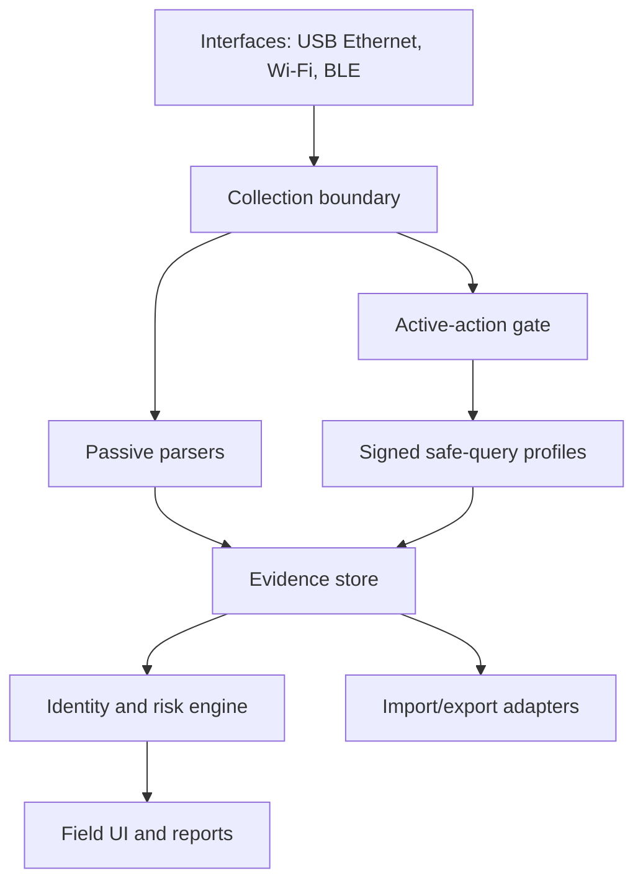

# Technical architecture

## Architecture principles

Offline first; evidence before inference; least privilege; deterministic network actions; separable knowledge packs; exportable data; no hidden cloud dependency.

## Modules

| Module | Responsibility |
|---|---|
| Interface manager | bind to selected network, record link state and capabilities |
| Capture service | PCAP/PCAPNG rotation, BPF filters, timestamps and hashes |
| Passive parser | bounded parsers producing observations, never changing traffic |
| Action gate | scope, authorization, risk class, budget and emergency stop |
| Query adapters | narrowly implemented identity requests |
| Evidence store | encrypted cases, assets, observations, provenance and chain of custody |
| Knowledge pack | signed vendor IDs, OUIs, product mappings, rules and citations |
| Correlator | asset merge/split with confidence and conflict handling |
| Reporter | offline HTML/PDF/JSON/CSV output and executive/technical views |
| Connector SDK | read-only imports first; explicit mappings and provenance |

## Data model

Core entities: Case, Authorization, Interface, Capture, Observation, Asset, Endpoint, IdentityClaim, EvidenceReference, QueryExecution, Finding, Recommendation, KnowledgePack, ImportJob and AuditEvent.

Every IdentityClaim includes value, normalized type, confidence, rule ID/version, evidence references, observed time and contradiction status.

## Capture modes

| Mode | Capability | Requirement |
|---|---|---|
| Local-origin | capture app-generated assessment traffic | ordinary sockets/VPN design |
| Broadcast/multicast | observe traffic delivered to interface | OS/interface behavior |
| Mirrored wired | third-party traffic | TAP/SPAN/capture accessory |
| Wi-Fi management/raw | 802.11 frames | specialized supported hardware/firmware |
| Imported PCAP | analyze evidence collected elsewhere | file import |

## Security design

- Hardware-backed keys where Android device support permits.
- Case encryption, configurable retention and secure deletion.
- Signed knowledge/query packs with rollback protection.
- No credentials in reports or debug logs.
- SBOM, reproducible builds, dependency pinning and vulnerability response.
- Rooted devices unsupported for production assurance unless a separately hardened edition is designed.
